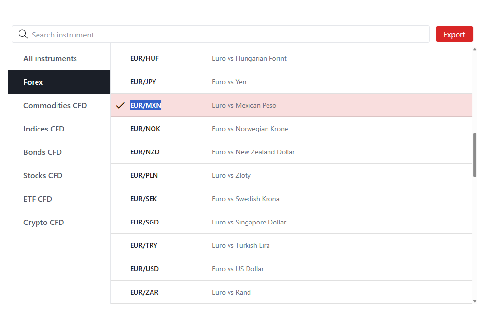
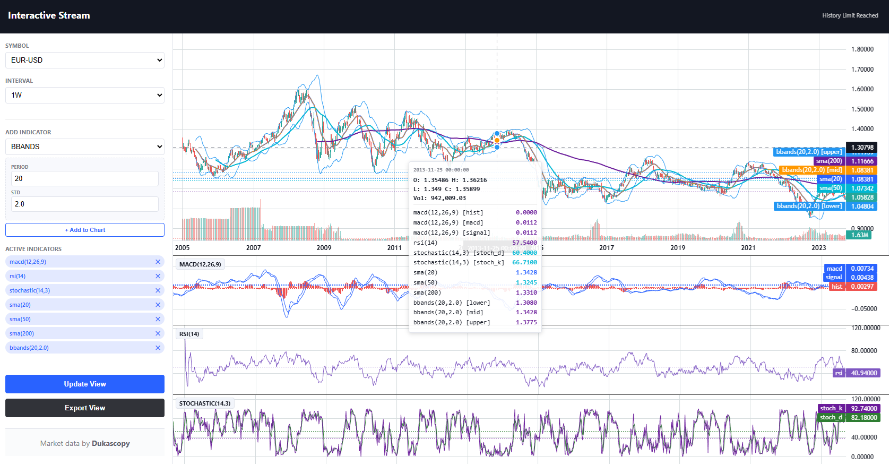

## Table of Contents

- [Notice (Important)](#notice)
- [What Is This Tool Used For?](#what-is-this-tool-used-for)
- [Target audience](#target-audience)
- [Server Kindness](#server-kindness)
- [Key Design Principles](docs/architecture.md#key-design-principles)
- [Quick Start](#quick-start)
  - Dependencies & Installation
  - Directory Permissions
  - First Run & Incremental Mode
  - Automatic Updates (cron)
- [Symbols Configuration](#symbols-configuration)
  - Adding New Symbols
- [Pipeline Configuration](docs/configuration.md#pipeline-configuration-v03-and-above)
  - Overriding timeframes, etc
- [Output schema](docs/architecture.md#output-schema)
  - Details on generated files
- [Quick Check](#quick-check)
- [Parquet converter](docs/tools.md#parquetcsv-export-v04-and-above)
  - Details on CSV->Parquet conversion
- [Performance Benchmarks](docs/benchmarks.md#performance-benchmarks)
  - Cold Run (Full History)
  - Incremental Daily Update
  - TMPFS Pro Tip
- [Fail-Fast](docs/architecture.md#fail-fast)
- [Directory Structure](docs/architecture.md#directory-structure)
- [Troubleshooting](docs/troubleshooting.md)
  - Stale Locks
  - Full Rebuild
  - Alignment
  - **Rate limits applied**
- [Future Work](docs/future.md)
- [DuckDB (Advanced)](docs/tools.md#duckdb-advanced-users)
- [Final Word](#final-word)
- [Terms of use](#terms-of-use)
- [License](#license)


## Notice

If your pipeline has broken after a ```git pull``` or receive the warning "Notice, there were breaking config changes! See README for more information!", perform (if using default configuration, except for symbols.user.txt):

```sh
./setup-dukascopy.sh
```

This will prevent breaking-change issues on configuration in the future.

>Do not run this when you have custom configuration. If you have custom configuration, create a ```config.user``` directory, copy your current config in there and adjust the "includes" paths in config.user.yaml to point to their new locations. Advice is to merge your own configuration with the configuration provided by the system.

- [General notices, latest updates, caveats, etc](docs/notices.md) (updated 20 DEC)
- [Limitations](docs/limitations.md) (updated 20 DEC)


**From Portfolio Project to Platform**

What started as a personal project (private use-case) to tackle the intricate problem of temporal alignment in financial data has evolved into a robust, crash-resilient OHLCV resampling system. It now handles global trading sessions, multiple DST transitions, and aligns with real-world platforms like Metatrader.

---

## What Is This Tool Used For?

>This tool builds a high-quality historical OHLCV dataset and maintains it automatically with efficient incremental updates. 

Historical market data can be leveraged in multiple ways to enhance analysis, decision-making, and trading performance:

- **Backtesting** → Evaluate and refine trading strategies by simulating them on past market conditions. This helps determine whether a strategy is robust, profitable, and resilient across different market environments.

- **Technical Analysis** → Use historical charts to identify trends, chart patterns, support- and resistance levels. You can also perform correlation studies to compare long-term relationships between currency pairs or other assets.

- **Seasonal Analysis** → Detect recurring market behaviors or unusual pricing patterns that tend to appear during specific months, weeks, or seasons.

- **Volatility Assessment** → Analyze historical volatility to adjust risk parameters, optimize position sizing, and set more accurate stop-loss levels.

- **Computational Intelligence** → Build machine-learning or statistical models trained on historical price data to forecast potential market movements.

- **Economic Event Impact** → Study how past economic releases, geopolitical events, and news shocks influenced currency pairs — helping you prepare for similar situations in the future.

---

## Target audience

This tool was built for independent traders and quants—like myself—who need to analyze market data daily and absolutely hate manually downloading files. It's ideal for laptop users running Windows (and WSL2) with around 32GB of RAM and a Ryzen 7/9 or Intel equivalent, having NVMe storage. Designed for simplicity, it automatically updates your data, so you can open your laptop, grab your coffee, and know you're ready for the day's market without any extra steps.

>Storage requirements are about 1 GB per configured symbol.

The code-base is small and heavily documented.

---

## Server Kindness

[Dukascopy SA](https://www.dukascopy.com) has been providing this priceless data **for free since 2003** with no paywall and no API key. This entire pipeline only exists because of their generosity.

If you find this tool useful, please consider:

- Trying their platform (I’ve been a happy client for years — support is actually human and fast)
- Running the script no more than once per hour unless you truly need minute-level updates

These two small acts keep the data flowing for everyone, forever.
Thank you — and thank you, Dukascopy.

---

## Quick start

Clone the repository

```
git clone https://github.com/jpueberbach4/bp.markets.ingest.git
cd bp.markets.ingest/dukascopy
```

Make sure python version is 3.8+. 

```sh
python3 --version
```

For this Dukascopy Data Pipeline project, the Python dependencies that need to be installed via pip are:

| Package    | Version    | Purpose                                                                      |
|----------- |----------- |---------------------------------------------------------------------------- |
| `pyyaml`   | >= 6.0.1   | To work with YAML-alike syntaxes                                            |
| `zoneinfo` | backport   | To work with timezones efficiently                                          |
| `duckdb`   | >=1.3.2    | Analytical database layer on top of CSV + parquet building helper           |
| `pandas`   | >=2.0.3    | CSV I/O, data manipulation, aggregation, and incremental loading           |
| `numpy`    | >=1.24.4   | Vectorized numeric computations, cumulative OHLC calculations              |
| `orjson`   | >=3.10.15  | Fast JSON parsing for delta-encoded files                                   |
| `requests` | >=2.22.0   | Download Dukascopy JSON via HTTP                                            |
| `tqdm`     | >=4.67.1   | Progress bars for download, transform, and aggregate loops                  |
| `filelock` | >=3.16.1   | File-based locks to prevent race conditions in parallel processing          |


Install with:

```sh
./setup-dukascopy.sh
```

---

**Permissions**

These scripts read from and write to both the data directory and the cache directory. If your system uses strict permission settings, ensure that the ./data and ./cache directory are created in advance.

```sh
mkdir -p ./data ./cache
chown -R $USER:$USER ./data ./cache
chmod u+rwx ./data ./cache
```
---

Configure your symbols as shown in the next section of this readme.

>[Symbols Configuration](#symbols-configuration)

Next, run the pipeline with:

```sh
./rebuild-full.sh
```

Optionally, configure a cronjob for periodical execution: 

```sh
crontab -e
```

Add the following line, adjust path accordingly:

```sh
* * * * * sleep 5 && cd /home/repos/bp.markets.ingest/dukascopy && ./run.sh
```

---

## Symbols Configuration

This project includes a symbols.txt file, which is a single-column CSV containing symbol identifiers.
If you wish to override this default list of symbols

```sh
cp symbols.txt symbols.user.txt
```

Next edit symbols.user.txt to include your symbols of interest (symbols.user.txt is in .gitignore). 

---

All symbols supported by the Dukascopy API are available, with no restrictions. 

Please see here for a complete symbol list:

[Dukascopy historical download](https://www.dukascopy.com/swiss/english/marketwatch/historical/)

**Example**. Suppose we want to add **EUR/MXN** to our setup. We visit the link above and copy the symbol name exactly as shown in the screenshot below.



We stop our crontab service for a moment or comment the line for run.sh in crontab. Next, we add the symbol as a new row in symbols.user.txt. Next, run the pipeline using:

```sh
START_DATE=2005-01-01 ./run.sh
```

The pipeline will begin downloading the symbol's historical data (this may take some time) and then execute the remaining steps.

The new symbol is now added and will be updated automatically during each incremental run.

>When you don't stop the crontab periodic execution before changing the symbol list, you will need to ```rebuild-full.sh```!

---

## Quick check

For users who are just getting started, or for those who want a quick way to validate their generated data:

**Example**. Suppose you’ve added **EURUSD** to your setup. All processes have run and completed, and now you want a quick look at the daily data it produced—perhaps to compare it against a source like Investing.com.

A simple way to do this is by using [csvplot.com](http://www.csvplot.com).

>In order to open the data directory in your Windows explorer, type ```explorer.exe ./data``` inside WSL.

Open the site in your browser and drag the daily EURUSD CSV file — found in **data/resample/1d** — into the CSV Plot window.

On the left side of the interface:

- Drag the **time** column to the x-axis

- Drag the **close** column to the y-axis

The chart will generate immediately. Use the control in the upper-right corner to change the display to a line chart. The result should resemble the following.



In the resampled output files, the final candle should be interpreted as an open candle. As new data enters the 1-minute aggregated file, it cascades into the higher-timeframe series, updating their respective open candles. This behavior is intentional, as tracking the open candle can be beneficial for certain trading strategies.

The open candle will always be the last row in the CSV. If you prefer not to include it for backtesting, simply omit this final row from your analysis.

---

## Final word

Thank you for using this toolkit. The goal of the project is simple: provide a fast and fully transparent pipeline for high-quality historical market data. **This architecture prioritizes speed and simplicity via CSV output over the analytical performance of enterprise binary formats.** If you have ideas, find issues, or want to contribute, feel free to open a GitHub issue or pull request.

A more advanced, tick-ready successor—planned as a C++ DuckDB extension—is under development and will be announced when ready.

## Terms of Use

**Acceptance Required Before First Use**

### 1. Data Source & Attribution
- Data originates from Dukascopy Bank SA ([www.dukascopy.com](https://live-login.dukascopy.com/rto3/))
- You must respect [Dukascopy's Terms of Service](https://www.dukascopy.com/swiss/english/legal-pages/terms-of-use/)

### 2. Strict Usage Restrictions

- **PERSONAL, NON-COMMERCIAL USE ONLY**
- **NO REDISTRIBUTION** in any form (raw, processed, aggregated, derived, Parquet, CSV, etc.)
- **NO INCORPORATION** into commercial products, services, or platforms
- **NO PUBLIC HOSTING** (GitHub, Hugging Face, Kaggle, cloud storage, torrents, datasets)
- **NO AUTOMATED BULK EXTRACTION** (wildcards intentionally disabled)

### 3. Your Responsibilities

- You accept ALL liability for your usage
- You indemnify the developer against any claims
- You use at your own risk
- You respect server resources (rate limits enforced)

### 4. Developer Disclaimer

- Not affiliated with Dukascopy Bank SA
- Software provided "as is" - no warranty
- For educational/research purposes only
- Not trading/investment advice

### 5. Consequences of Violation

- Repository takedown
- Loss of free data access for everyone

---

## License

This software is licensed under the MIT License.

Copyright JP Ueberbach, 2025

Permission is hereby granted, free of charge, to any person obtaining a copy of this software and associated documentation files (the "Software"), to deal in the Software without restriction, including without limitation the rights to use, copy, modify, merge, publish, distribute, sublicense, and/or sell copies of the Software, and to permit persons to whom the Software is furnished to do so, subject to the following conditions:

The above copyright notice and this permission notice shall be included in all copies or substantial portions of the Software.

THE SOFTWARE IS PROVIDED "AS IS", WITHOUT WARRANTY OF ANY KIND, EXPRESS OR IMPLIED, INCLUDING BUT NOT LIMITED TO THE WARRANTIES OF MERCHANTABILITY, FITNESS FOR A PARTICULAR PURPOSE AND NONINFRINGEMENT. IN NO EVENT SHALL THE AUTHORS OR COPYRIGHT HOLDERS BE LIABLE FOR ANY CLAIM, DAMAGES OR OTHER LIABILITY, WHETHER IN AN ACTION OF CONTRACT, TORT OR OTHERWISE, ARISING FROM, OUT OF OR IN CONNECTION WITH THE SOFTWARE OR THE USE OR OTHER DEALINGS IN THE SOFTWARE.


[](https://github.com/jpueberbach4/bp.markets.ingest)


