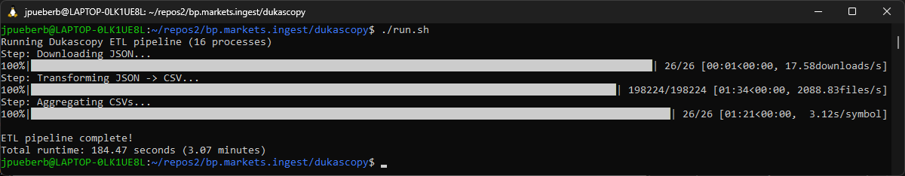
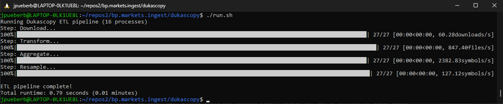

# Dukascopy Data Pipeline

Python toolkit to download, transform, load, and resample 1-minute OHLC data from Dukascopy into efficient, appendable CSV files.

**Process 520 years of market data in 5 minutes. Updates all symbols in about 2 seconds.**

High-performance Python pipeline for Dukascopy OHLC data with:

- ⚡ **1.6-second incremental updates** (26 symbols × 10 timeframes)
- 🔄 **Crash-resistant** offset-based checkpoints
- 📊 **Cascading resampling** (1m → 5m → ... → 1Y)
- 🚀 **1M+ candles/second** throughput
- 💾 **Zero-database** architecture

Converts Dukascopy's delta-encoded HST format into appendable CSV files 
with offset-based resumption and incremental updates.

---

## Key Design Principles

- **CSV-based storage** → Simplifies resume logic via file offsets
- **Incremental processing** → Only new/missing data is handled
- **Pointer tracking** → Enables precise continuation across runs
- **Cascaded resampling** → Minimizes row processing at each timeframe
- **Filesystem-native** → No database required
- **NVMe/SSD Preferred** → High IOPS critical for performance

---

## Quick start

Make sure python version is 3.8+. 

```sh
python3 --version
```

For this Dukascopy Data Pipeline project, the Python dependencies that need to be installed via pip are:

| Package    | Purpose                                                                                  |
|----------- |------------------------------------------------------------------------------------------|
| `pandas`   | CSV I/O, data manipulation, aggregation, and incremental loading                        |
| `numpy`    | Vectorized numeric computations, cumulative OHLC calculations                            |
| `orjson`   | Fast JSON parsing for HST/delta-encoded files                                             |
| `requests` | Download Dukascopy JSON via HTTP                                                          |
| `tqdm`     | Progress bars for download, transform, and aggregate loops                                |
| `filelock` | File-based locks to prevent race conditions in parallel processing                        |

Install with:

```sh
pip install pandas requests numpy orjson tqdm filelock
```

Set START_DATE in run.py to (for initial cold run):

```python
START_DATE = "2005-01-01"
```

Next, run the pipeline with:

```sh
./run.sh
```

When completed, update START_DATE in run.py to:

```python
START_DATE = None
```

This will enable incremental updates. Make sure you run it at least once a week to not miss out on any data.

Optionally, configure a cronjob for periodical execution: 

```sh
crontab -e
```

Add the following line, adjust path accordingly:

```sh
* * * * * cd /home/repos/bp.markets.ingest/dukascopy && ./run.sh
```

---

## Pipeline (Run Sequentially)

| Script | Purpose |
|-------|--------|
| `download.py` | Downloads missing HST files; **always updates today** |
| `transform.py` | Converts HST → full CSV; **always processes today** |
| `aggregate.py` | Merges new rows from `data/temp` and `data/transform` into `aggregate/` using **pointer files** |
| `resample.py` | Cascaded resampling: 1m → 5m → 15m → ... → 1M using **resample pointers** |
| `run.py` | Runs pipeline components **in correct order** |

OR

Run all via:

```sh
./run.sh
```

---

## Performance Benchmarks

### Cold Run (Full Update)

> **Hardware:** AMD Ryzen 7 (8C/16T) · 1 TB NVMe SSD · WSL2 (Ubuntu)  
> **Workload:** 20 years of 1-minute OHLC data · **26 symbols** (~520 years total)

| Script        | Time     | Unit/s (unit) | Candles/s (read)    | Data Written | Write Speed |
|---------------|----------|---------|---------------|--------------|-------------|
| `transform.py`| **89 s** | > 2,000 (files) | **1.35 M**   | 7.3 GB       | **82 MB/s** |
| `aggregate.py`| **37 s** | > 2,000 (files) | **3.26 M**   | 6.7 GB       | **170 MB/s** |
| `resample.py`| **122 s** | 0.21 (symbols) | **1 M**   | 2.3 GB       | **19 MB/s** |


**Total pipeline time:** **~4.2 minutes**  
**Throughput:** **> 1 million candles processed per second (78 million per minute)**

### Incremental Run (Daily Update)
> **Workload:** 26 symbols × 1 day of new data

| Stage | Time | Throughput | Notes |
|-------|------|------------|-------|
| Download | 1.33s | 19.6 downloads/s | Network limited |
| Transform | 0.01s | **2,439 files/s** | Pure I/O speed |
| Aggregate | 0.01s | **2,122 symbols/s** | Pointer-based append |
| Resample | 0.22s | 118 symbols/s | 10 timeframes cascaded |
| **Total** | **1.57s** | - | **Sub-2-second updates** ⚡ |

This enables:
- ⚡ Real-time trading workflows (run every minute)
- 🔄 Fresh backtesting data in under 2 seconds
- 📊 Near-zero latency for strategy development


Full 20 year run on 26 symbols:

After that, incremental updates on 26 symbols:


⚠️  Performance scales linearly with symbol count and dataset size; results may differ on HDDs or older SSDs. 

---

### Key Takeaways

- **I/O bound, not CPU bound** for aggregate and transform → NVMe is the hero.
- **CPU bound, not I/O bound** for resample → CPU is the hero (will be fixed using vectorizing).
- **I/O (network) bound** for download → Connection is the hero.
- **> 2,000 files/sec** → Proves efficient file handling.
- **> 80 MB/s sustained write** → Excellent for CSV appends.
- **WSL2 performs near-native** on NVMe (minimal overhead).

> **Reproducible on any modern Ryzen 7 + NVMe setup.**

---

## Directory Structure

```sh

project_root/
├── symbols.txt                                # List of trading symbols
├── download.py                                # Download Dukascopy JSON data
├── transform.py                               # Transform JSON -> OHLC CSV
├── aggregate.py                               # Aggregate CSVs per symbol
├── resample.py                                # Cascaded resampling to other timeframes
├── run.py                                     # Runs all stages of the pipeline within a single pool, in correct order
├── run.sh                                     # Runs run.py
├── cache/                                     # Cached historical JSON data
│   └── YYYY/
│       └── MM/
│           └── SYMBOL_YYYYMMDD.json
├── data/
│   ├── aggregate/1m/                          # Aggregated CSV output
│   │   ├── index/                             # Pointer/index files for incremental loading
│   │   │   └── SYMBOL_YYYYMMDD.idx
│   │   └── SYMBOL.csv                         # Final aggregated CSV per symbol
├── ├──locks/                                     # File-based locks for concurrency control
│   │   ├── run.lock                               # Protection against simultaneous run.py's  
│   │   └── SYMBOL_YYYYMMDD.lck
│   ├── resample/5m/                           # Resampled CSV output (5m, 15m, 30m, 1h, ...)
│   │   ├── index/                             # Pointer/index files for incremental loading
│   │   │   └── SYMBOL_1m.idx
│   │   └── SYMBOL.csv                         # Final resampled CSV per symbol
├── └──temp/                                      # Live/current day data (JSON, CSV, or index)
│   │   ├── SYMBOL_YYYYMMDD.idx
│   │   ├── SYMBOL_YYYYMMDD.json
│   │   └── SYMBOL_YYYYMMDD.csv
│   └── transform/1m/                          # Transformed CSV output
│       └── YYYY/
│           └── MM/
│               └── SYMBOL_YYYYMMDD.csv
└── README.md                                  # Project documentation

```

---

## Troubleshooting

### Stale Locks
If pipeline was interrupted (laptop sleep, SIGKILL), remove stale locks:
```bash
rm -rf data/locks/*.lck
```

### Rebuild from scratch?

Set START_DATE in run.py to 2005-01-01

```bash
rm -rf ./data/*
./run.sh
```

Set START_DATE in run.py to None (enables incremental mode)

### Performance Issues
- **Slow first run?** Normal - processing 20 years of data takes time
- **Slow incremental?** Check if NVMe/SSD. HDDs will be 10-50x slower
- **High CPU?** Reduce `NUM_PROCESSES` in scripts
- **Out of memory?** Reduce `BATCH_SIZE` in resample.py (default: 500K)

---

## BUG Tracking

| ID | File | Description | Severity | Status |
|--------|------|-------------|----------|--------|
| 001 | transform.py | Dukascopy filters out rows with zero volume in its historical data and charting tools to focus on periods with actual trading activity, as zero volume indicates a lack of transactions at that price level or time period. This is a standard practice to clean up data for analysis and trading, as a zero-volume row would not provide meaningful insights into market behavior. Today's data contains 0 volume candles, historic data does not. Leading to pointer file imbalance during rollover. Solution is to filter out 0 volume candles in today's CSV. | SEVERE | SOLVED |
| 002 | aggregate.py | When f_out write is interrupted (SIGTERM, OOM, ...), the idx file may not get written and/or aggregate file may get partially updated, leading to invalid data in aggregate file. Solution is similar to resample.py solution. But. We need to keep a third record since there is a many-to-one relationship between transform.py and aggregate.py. We will need to store the input date as well to the idx file. So idx file will contain date, input_position, output_position. This will solve it. Expect it to be solved soon. This will make the complete pipeline crash-safe. **NOTE** YOU WILL NEED TO REINDEX. INTERMEDIATE STRUCTURE CHANGED. FOLLOW REBUILD FROM SCRATCH STEP.| LOW | SOLVED |

## Notes and Future Work

Add unit-tests. Vectorized resampling (using numpy instead of pandas, expected 20x-50x perf increase).

We will parameterize or convert this stuff into packages/classes when cascaded resampling and live-tick tracking for recent minute is done.

We will implement GPU processing as well. Automated detection of capable GPU's.

Build an API on top of it to support HTTP fetching of OHLC data for all timeframes (w/ from-to support).

Pull requests welcome :)

## License

This software is licensed under the MIT License.

Copyright JP Ueberbach, 2025

Permission is hereby granted, free of charge, to any person obtaining a copy of this software and associated documentation files (the "Software"), to deal in the Software without restriction, including without limitation the rights to use, copy, modify, merge, publish, distribute, sublicense, and/or sell copies of the Software, and to permit persons to whom the Software is furnished to do so, subject to the following conditions:

The above copyright notice and this permission notice shall be included in all copies or substantial portions of the Software.

THE SOFTWARE IS PROVIDED "AS IS", WITHOUT WARRANTY OF ANY KIND, EXPRESS OR IMPLIED, INCLUDING BUT NOT LIMITED TO THE WARRANTIES OF MERCHANTABILITY, FITNESS FOR A PARTICULAR PURPOSE AND NONINFRINGEMENT. IN NO EVENT SHALL THE AUTHORS OR COPYRIGHT HOLDERS BE LIABLE FOR ANY CLAIM, DAMAGES OR OTHER LIABILITY, WHETHER IN AN ACTION OF CONTRACT, TORT OR OTHERWISE, ARISING FROM, OUT OF OR IN CONNECTION WITH THE SOFTWARE OR THE USE OR OTHER DEALINGS IN THE SOFTWARE.


[](https://github.com/jpueberbach4/bp.markets.ingest)