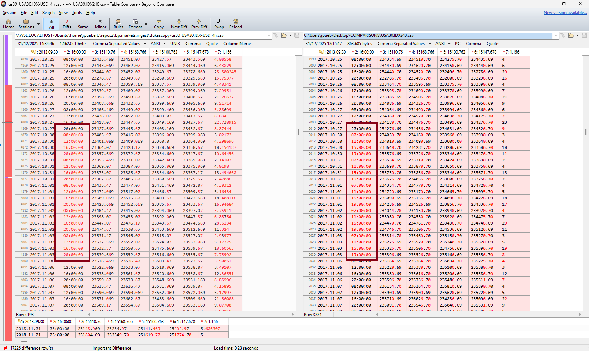

# FORENSICS US30

## Prices PRE-2019-12-27

```sh
US:

2019.12.26	16:00:00	28538.57	28595.67	28527.07	28569.67	4.17852
2019.12.26	20:00:00	28569.67	28635.67	28551.17	28631.67	2.91559
2019.12.27	00:00:00	28612.97	28669.47	28607.47	28667.97	1.56073
2019.12.27	04:00:00	28668.47	28690.47	28664.47	28678.47	1.0294
2019.12.27	08:00:00	28677.97	28715.07	28671.47	28693.81	2.674225
2019.12.27	12:00:00	28693.81	28731.88	28691.89	28693.9	1.34359
2019.12.27	16:00:00	28693.9	28704.1	28616.0	28683.49	2.275188

MT4

2019.12.26	16:00	285385.70	285956.70	285280.70	285696.70	12798
2019.12.26	20:00	285701.70	286356.70	285511.70	286316.70	8833
2019.12.27	00:00	286119.70	286694.70	286074.70	286674.70	4799
2019.12.27	04:00	286669.70	286904.70	286644.70	286794.70	3141
2019.12.27	08:00	286789.70	287150.70	286714.70	286938.10	8368
2019.12.27	12:00	28693.81	28731.88	28691.89	28693.90	6422 < SWITCH POINT
2019.12.27	16:00	28693.90	28704.10	28616.48	28664.45	8168

NOTICE: Factor 10 on MT4, raw 1m data contains correct values.
``` 

## Proposed configuration for maximum MT4 alignment

### How to do this

1. Export the data from MT4 and install **Beyond Compare**.

2. In `symbols.user.txt`, remove all assets except the one you want to configure.

3. Dump H4 data: ```./build-csv.sh --select USA30.IDX-USD/4h --output us30.csv --mt4```

4. Drag the generated `us30_*.csv` files to the **left** side of Beyond Compare, and the MT4 export to the **right** side.

5. Start scrolling **from the bottom upward**. Check the *open prices*, but pay close attention to the *timestamps*.

6. For every block where the data changes, apply adjustments similar to the example below.

Fortunately, the underlying DST/STD shifts on the MT4 side are correct for this asset—no ASX-style weirdness here.

7. After making changes, run: ```./rebuild-resample.sh```. Then dump the data again with `--mt4`, reload the files in Beyond Compare, and repeat the process as needed.

8. Once everything looks good, restore your original `symbols.user.txt` and run: ```./rebuild-resample.sh``` once more.

**How much time does this take?**

Constructing the configuration below took me about 45 minutes—so roughly 45 minutes to get seven years of Dukascopy MT4 data fully aligned. After a few implementations, you’ll notice the process is largely copy-paste work with minor adjustments to the from and to dates. The config file consists of two main sections: Block A and Block B.

As for the dates: set them all to a Saturday or Sunday. All of the switches below occur over the weekend, except for the final one. Keep it simple.

```yaml
USA30.IDX-USD:
  timezone: America/New_York
  sessions:
    # This is an extreme example on how to get 7 years of data aligned. 
    # Use it for reference and extend this one to get a grasp of the concept.
    # This is a very obsessive configuration. Every shift, even if only a week is
    # misaligned, is handled. 
    ancient-2018-03:
      # Block A
      to_date: "2018-03-11 00:00:00"
      ranges:
        24h:
          from: "00:00"
          to: "23:59"
      timeframes:
        4h:
          origin: "epoch" 
    2018-03-2018-03:
      # Block B
      from_date: "2018-03-11 20:00:00"
      to_date: "2018-03-25 00:00:00"
      ranges:
        24h:
          from: "00:00"
          to: "23:59"
      timeframes:
        4h:
          origin: "03:00"     
    2018-03-2018-10:
      # Block A
      from_date: "2018-03-25 00:00:00"
      to_date: "2018-10-25 00:00:00"
      ranges:
        24h:
          from: "00:00"
          to: "23:59"
      timeframes:
        4h:
          origin: "epoch" 
    2018-10-2018-11:
      # Block B
      from_date: "2018-10-27 00:00:00"
      to_date: "2018-11-04 00:00:00"
      ranges:
        24h:
          from: "00:00"
          to: "23:59"
      timeframes:
        4h:
          origin: "03:00" 
    2018-11-2019-03:
      # Block A
      from_date: "2018.11.04 00:00:00"
      to_date: "2019-03-09 00:00:00"
      ranges:
        24h:
          from: "00:00"
          to: "23:59"
      timeframes:
        4h:
          origin: "epoch"  
    2019-03-2019-03:
      # Block B
      from_date: "2019-03-09 00:00:00"
      to_date: "2019-03-30 00:00:00"
      ranges:
        24h:
          from: "00:00"
          to: "23:59"
      timeframes:
        4h:
          origin: "03:00" 
    2019-03-2019-10:
      # Block A
      from_date: "2019-03-30 00:00:00"
      to_date: "2019-10-26 00:00:00"
      ranges:
        24h:
          from: "00:00"
          to: "23:59"
      timeframes:
        4h:
          origin: "epoch"      
    2019-10-2019-11:
      # Block B
      from_date: "2019-10-26 00:00:00"
      to_date: "2019-11-03 00:00:00"
      ranges:
        24h:
          from: "00:00"
          to: "23:59"
      timeframes:
        4h:
          origin: "03:00"    
    2019-11-2020-02:
      # Final Block A (with a ghost candle cleanup since shift happens during the day)
      from_date: "2019-11-03 00:00:00"
      to_date: "2020-02-06 13:00:00"
      ranges:
        open:
          from: "00:00"
          to: "23:59"
      timeframes:
        4h:
          origin: "epoch"
          post:
            merge-step:
              action: merge
              ends_with:
              - "2020-02-06 20:00:00"
              offset: -1
    # Only from here, we start acting "normal"
    2020-02-now:
      # Block C
      from_date: "2020-02-06 13:01"
      ranges:
        open:
          from: "00:00"
          to: "23:59"
      timeframes:
        4h:
          origin: "01:00"
```

## More examples

I will be posting more examples, in-time. 

## Performance? 

1 second extra for above configuration on a rebuild for this symbol. Vectorization is blazing fast.

## Screenshot

Often a screenshot says more than a 1000 words



It's a matter of taste if you want to change these single weeks - or so. You might prefer only to implement the prolonged periods that are off.