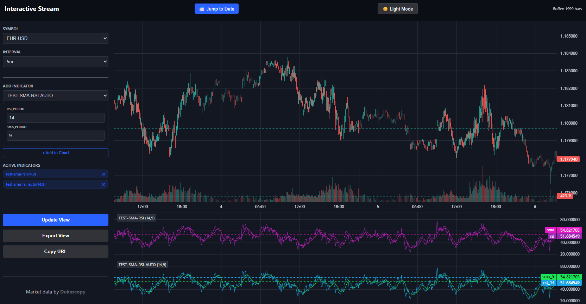
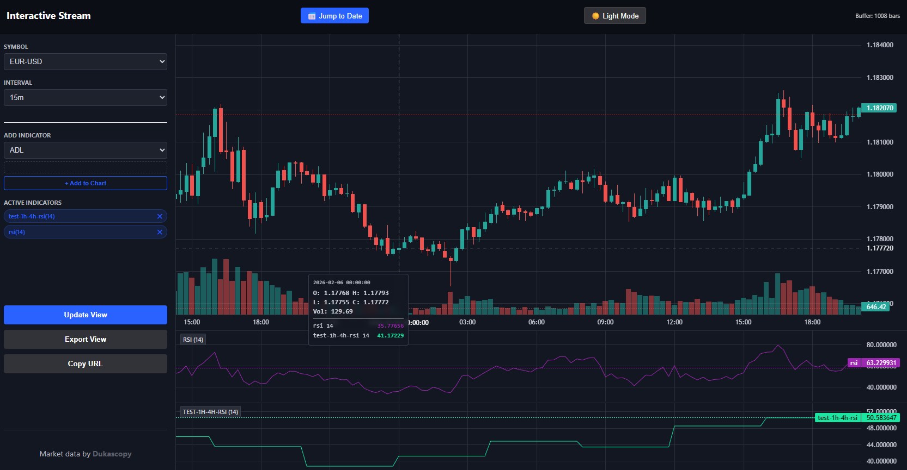
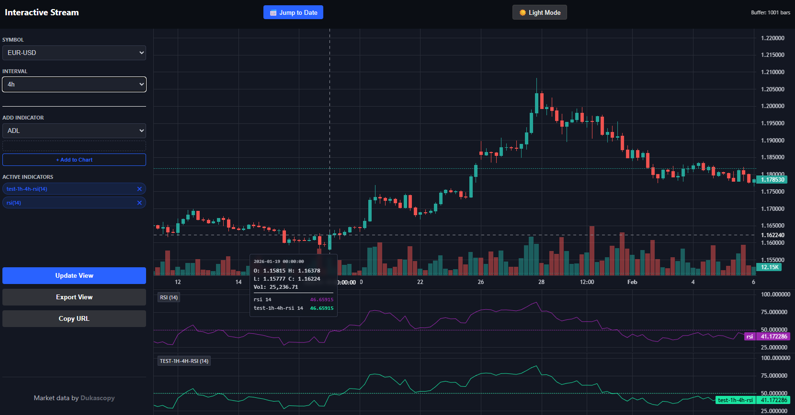
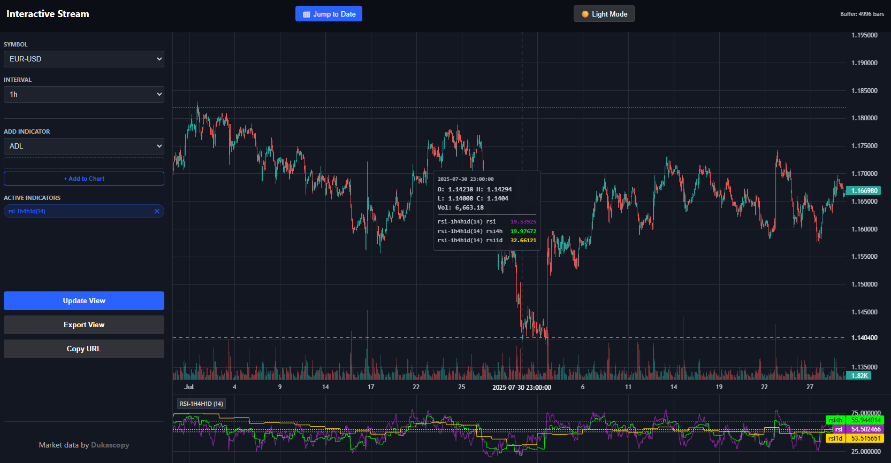
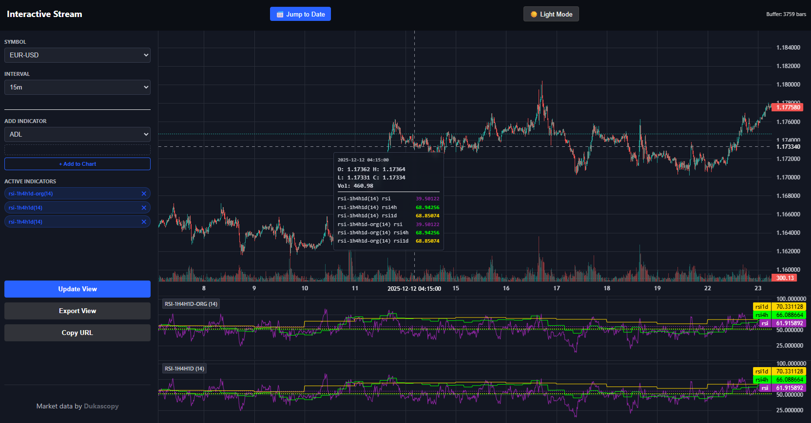

# Building Custom Technical Indicators: A Developer's Guide

Extending our technical analysis engine with custom indicators is straightforward. Each indicator exists as a standalone Python plugin. To build one, you need to implement a specific set of functions that the engine uses for metadata, parameter mapping, and high-performance calculations.

**Plugins should be stored in your `config.user/plugins/indicators` directory**

**When plugin names collide with system ones, the system ones will get preference. Use unique names.**

**Do not use '_' in indicator filenames. Use a '-' (dash) or a '.' (dot) if you need to seperate**

---

## 1. The Plugin Architecture

**Note:** The plugin engine now supports hybrid-execution of both pandas-based and polars-based indicators. General advice is when you build indicators that do not rely on UDF (User-Defined-Functions), use the Polars way (use Gemini to support you) for the highest possible performance. IF heavily dependent on UDF or for quick-iteration: use the pandas way. NON-UDF versions: generally you would want to implement them both and test which one gives the best performance. Eg use a million+ rows for performance tests.

Every plugin must be a valid Python file (e.g., `my_indicator.py`) containing the following core functions:

### `description() -> str`
This returns a human-readable string. It is used by the UI and API documentation to explain what the indicator does and how to interpret its signals.
> **Tip:** Keep it concise but mention the core mathematical logic (e.g., "Uses a 14-period EMA").

### `meta() -> Dict`
Returns a dictionary of metadata. At a minimum, include `author` and `version`. This is useful for tracking updates and credits in the indicator library.

### `warmup_count(options: Dict) -> int`
This function tells the engine how many historical bars are needed before the indicator becomes "valid." 
* **SMA:** Needs at least `period` bars.
* **Recursive (EMA/RSI):** Usually needs `period * 3` bars to allow the smoothing algorithm to converge.

### `position_args(args: List[str]) -> Dict`
This maps URL-style positional arguments into a clean dictionary. 
* *Input:* `['14', '2.0']` (from a request like `/api/bbands_14_2.0`)
* *Output:* `{'period': 14, 'std': 2.0}`

### `calculate(df: pd.DataFrame, options: Dict) -> pd.DataFrame`
The heart of the plugin. It receives a Pandas DataFrame with OHLCV data and must return a DataFrame of the same length containing the calculated values.

make sure to set `polars:0` in the meta section OR leave it out.

**OR/AND**

### `calculate_polars(indicator_str: str, options: Dict[str, Any]) -> pl.Expr|List[pl.expr]`
The high-performance heart of the plugin for the Polars engine. Unlike the Pandas version, this does not receive a DataFrame; instead, it returns one or more Polars Expressions (pl.Expr) that are injected into the engine's lazy execution graph. This allows the IndicatorEngine to optimize the entire calculation across all requested indicators in a single pass.

make sure to set `polars:1` in the meta section.

---

## 2. Implementation Template

Using the **Bollinger Bands** plugin as a reference, here is the standard structure:

```python
import pandas as pd
import numpy as np
from typing import List, Dict, Any

def description() -> str:
    return "Bollinger Bands measure volatility using a central SMA and SD bands."

def meta() -> Dict:
    return {"author": "DevTeam", "version": 1.1}

def warmup_count(options: Dict) -> int:
    period = int(options.get('period', 20))
    return period * 3

def position_args(args: List[str]) -> Dict:
    return {
        "period": args[0] if len(args) > 0 else "20",
        "std": args[1] if len(args) > 1 else "2.0"
    }

def calculate(df: pd.DataFrame, options: Dict) -> pd.DataFrame:
    period = int(options.get('period', 20))
    std_mult = float(options.get('std', 2.0))
    
    # Use Vectorized Operations for speed
    mid = df['close'].rolling(window=period).mean()
    std = df['close'].rolling(window=period).std()
    
    return pd.DataFrame({
        'upper': mid + (std * std_mult),
        'mid': mid,
        'lower': mid - (std * std_mult)
    }, index=df.index)

def calculate_polars(indicator_str: str, options: Dict[str, Any]) -> List[pl.Expr]:
    """This is for speed. Lazy execution"""
    try:
        period = int(options.get('period', 20))
        std_dev = float(options.get('std', 2.0))
    except (ValueError, TypeError):
        period, std_dev = 20, 2.0

    mid = pl.col("close").rolling_mean(window_size=period)
    std = pl.col("close").rolling_std(window_size=period)

    upper = mid + (std * std_dev)
    lower = mid - (std * std_dev)

    return [
        upper.alias(f"{indicator_str}__upper"),
        mid.alias(f"{indicator_str}__mid"),
        lower.alias(f"{indicator_str}__lower")
    ]

```

**Note:** When you are building an oscillator or panel-indicator, specify `panel:1` in the meta section.

```python
def meta() -> Dict:
    return {"author": "DevTeam", "version": 1.1, "panel": 1}
```

**Note:** When you are building a complete chart-overlay, specify `chart:1` in the meta section. Note that this is currently unsupported but this is coming (example eg is a renko chart).

```python
def meta() -> Dict:
    return {"author": "DevTeam", "version": 1.1, "chart": 1}
```


## 3. Pro-Tip: Accelerate Development with Gemini

The most efficient way to build new plugins is to leverage Google Gemini as a pair programmer. Because the engine follows a strict functional contract, you can "train" the AI on the structure once and generate dozens of indicators.

The "Pre-build" Workflow:

* Upload a Reference: Upload an existing, working script (like bbands.py or sma.py) to the chat.

* Define the Pattern: Tell Gemini: "Use this file as a template for the function signatures and coding style."

* Request New Indicators: Simply say: "Give me the indicator script for [Indicator Name]" (e.g., "Give me the indicator script for Keltner Channels").

Gemini will automatically generate the warmup_count, the vectorized calculate logic, and the position_args mapping based on the standard library pattern.

## 4. Best Practices

Vectorization: Always use pandas or numpy vectorized functions. Avoid for loops inside calculate unless the indicator is highly path-dependent (like Renko).

Precision: Use the first row of data to determine the asset's precision and round your outputs accordingly to keep the API responses clean.

Stability: If your indicator uses division, always use .replace(0, np.nan) on the denominator to avoid Inf errors.

Performance: NON-UDF implementations should be in Polars expressions. Polars may be slower when using UDF.

Generic: implement both the `calculate` and `calculate_polars` methods. Implement in pandas, convert to polars using Gemini.

For inter-data/indicator querying within indicators, consult [this documentation](interdata.md).

## 5. Debugging

You can just print(df) from your Pandas based indicator and have that print showup in your console where you started the webservice with `./service.sh start`-if testing via the web-interface. If using the direct get_data approach, then i probably don't need to say anything else. You know.

For profiling, performance bottleneck finding in your indicators, use cProfile. At the start of your indicator enable the cProfile profiler and just before the end of the function, disable the profiler and print its stats. 

eg

```python

def calculate(df: pd.DataFrame, options: Dict) -> pd.DataFrame:
    import cProfile
    import pstats
    import io
    pr = cProfile.Profile()
    pr.enable()

    ## YOUR HEAVY CODE GOES HERE ##

    pr.disable()
    s = io.StringIO()
    sortby = 'cumulative'   # Can also use 'tottime' to see self-time
    ps = pstats.Stats(pr, stream=s).sort_stats(sortby)
    ps.print_stats(30)      # Show top 30 most time-consuming calls
    print(s.getvalue())     # See console

    return df
```

Its generally good practice to profile your code after your first working implementation. Especially if you use your custom indicator for later feature-extraction for ML.

## 6. One more thing, your custom indicators in an external path?

Solve this by creating a config.users/plugins directory and then "symbolic link" your indicators path in there. 

eg

```sh
mkdir -p config.user/plugins
# delete the existing default one, be careful if you have something in there
rm -rf config.user/plugins/indicators
# now link your external path
ln -s /path/to/my/private/repo/indicators config.user/plugins/indicators
# your custom indicators are now linked to an path outside of the project
# config.user is excluded in .gitignore so you can put in there what you want.
ls -l config.users/plugins/indicators
# It should show an arrow pointing to your private repo: indicators -> /path/to/my/private/repo/indicators
```

This solves any version control issues or at least make it easier.

One last piece of advice. When using this for feature engineering. Use custom indicators to build your features. You can then just use the get_data internal API to get the dataframe with your computed indicators and push that directly, together with all the other indicators, into a model. This is a better way-performance-wise-than building a custom set of "feature classes". 

I am currently converting my feature-classes to indicators-polars where possible.

eg Write features once → Use everywhere (API, web, ML, backtesting)

Last example: i have features A,B,C implemented as indicators(features). I trained my model by querying get_data with indicators A,B,C(features). Now, i have an indicator which uses the model and needs A,B,C features. I do in that indicator a get_data_auto(df,[A,B,C]) and then call the model with that dataframe and get it's confidence and signals. This is high performant and works. I tested.  This way you eliminate any feature-replication between training and inference. 

Be careful for recursive patterns though. Unlimited loops. 

eg If Indicator A requires B, and B requires A, the system will enter an infinite recursion until the stack overflows.

## 7. Testing your recursive indicators for unlimited loops (stack overflow protection)

Since there is currently no "run-time" protection for recursion loops caused by custom indicators, i have added a unit-test which does the checking for recursion loops. This is a V1 version of the recursion guard, a V2 is coming. The V1 version does not yet take the indicator options into account. Eg first loop you call test-sma_20 and second recursive call you call test-sma_50... this is currently caught as an unlimited loop call when calling with same timeframe and symbol. 

How to test your indicators? Simple. Just run `./run-tests.sh` regularly when developing complex recursive indicators.

Eg this is covered now: 

```python
# this indicator name = test-sma, we call it with EUR-USD/1m
def calculate(df: pd.DataFrame, options: Dict[str, Any]) -> pd.DataFrame:
    """
    High-performance vectorized Simple Moving Average (SMA).
    """
    # This will error after the second recursive call 1m->5m->5m->error
    df = get_data( \
        timeframe="5m", symbol="EUR-USD", \
        after_ms=0, until_ms=132896743634786, limit=1000, \
        indicators=['test-sma'] \
    )

    # This will error after first call 1m->1m->error
    df = get_data_auto(df, indicators=['test-sma'])

    ...
```

PS: do not use `_` (underscore) in indicator file-names. Use a dot or a dash. Group them logically with a prefix. I will add a searchbox for the indicators to the web-interface soon.\

## 8. 📋 Common Indicator Patterns

This section was moved to the [templates.md](templates.md)

## 9. Additional examples

### Putting an SMA over the RSI - both with configurable periods

```python
import pandas as pd
import numpy as np
import polars as pl
from typing import List, Dict, Any

def description() -> str:
    """
    Returns a human-readable description for the API and UI.
    """
    return (
        "RSI with SMA Overlay: Returns both the 14-period RSI and its 9-period "
        "Simple Moving Average. Ideal for identifying momentum divergences."
    )

def meta() -> Dict:
    """
    Metadata for the dual-engine orchestrator.
    """
    return {
        "author": "Google Gemini",
        "version": 1.6,
        "panel": 1,
        "verified": 1,
        "talib-validated": 0, 
        "polars": 1 
    }

def warmup_count(options: Dict[str, Any]) -> int:
    """
    Calculates the required warmup rows. 
    RSI requires roughly 2.5x its period for convergence.
    """
    rsi_period = int(options.get('rsi_period', 14))
    sma_period = int(options.get('sma_period', 9))
    return (rsi_period * 3) + sma_period

def position_args(args: List[str]) -> Dict[str, Any]:
    """
    Maps positional URL arguments. 
    Format: /plugin-rsi_sma/14/9
    """
    return {
        "rsi_period": args[0] if len(args) > 0 else "14",
        "sma_period": args[1] if len(args) > 1 else "9"
    }

def calculate_polars(indicator_str: str, options: Dict[str, Any]) -> List[pl.Expr]:
    """
    High-performance Polars-native calculation for the CUDA execution path.
    Returns both RSI and SMA columns.
    """
    rsi_period = int(options.get('rsi_period', 14))
    sma_period = int(options.get('sma_period', 9))

    diff = pl.col("close").diff()
    gain = pl.when(diff > 0).then(diff).otherwise(0)
    loss = pl.when(diff < 0).then(-diff).otherwise(0)

    # Wilder's Smoothing for RSI
    avg_gain = gain.ewm_mean(alpha=1/rsi_period, adjust=False)
    avg_loss = loss.ewm_mean(alpha=1/rsi_period, adjust=False)
    
    rs = avg_gain / avg_loss
    rsi = 100 - (100 / (1 + rs))
    
    sma_rsi = rsi.rolling_mean(window_size=sma_period)

    return [
        rsi.alias(f"{indicator_str}__rsi"),
        sma_rsi.alias(f"{indicator_str}__sma")
    ]

def calculate(df: pd.DataFrame, options: Dict[str, Any]) -> pd.DataFrame:
    """
    Legacy Pandas fallback for validation during environment resets.
    """
    rsi_period = int(options.get('rsi_period', 14))
    sma_period = int(options.get('sma_period', 9))

    delta = df['close'].diff()
    gain = delta.where(delta > 0, 0)
    loss = -delta.where(delta < 0, 0)

    avg_gain = gain.ewm(alpha=1/rsi_period, adjust=False).mean()
    avg_loss = loss.ewm(alpha=1/rsi_period, adjust=False).mean()

    rs = avg_gain / avg_loss
    df['rsi'] = 100 - (100 / (1 + rs))
    df['sma'] = df['rsi'].rolling(window=sma_period).mean()

    return df[['rsi', 'sma']]
```

Wall-time 1000 records, random timerange: 0.00743865966796875s (7.4ms)

### Putting an SMA over the RSI - the get_data_auto variant - both with configurable periods

```python
import pandas as pd
import numpy as np
import polars as pl
from typing import List, Dict, Any

def description() -> str:
    """
    Returns a human-readable description for the API and UI.
    """
    return (
        "Non-Talib RSI with SMA Smoothing. Uses get_data_auto to fetch the base "
        "RSI and applies a vectorized SMA overlay."
    )

def meta() -> Dict:
    """
    Metadata for the dual-engine orchestrator.
    """
    return {
        "author": "Google Gemini",
        "version": 1.8,
        "panel": 1,
        "verified": 1,
        "polars": 0
    }

def warmup_count(options: Dict[str, Any]) -> int:
    rsi_period = int(options.get('rsi_period', 14))
    sma_period = int(options.get('sma_period', 9))
    return (rsi_period * 3) + sma_period

def position_args(args: List[str]) -> Dict[str, Any]:
    return {
        "rsi_period": args[0] if len(args) > 0 else "14",
        "sma_period": args[1] if len(args) > 1 else "9"
    }


def calculate(df: pd.DataFrame, options: Dict[str, Any]) -> pd.DataFrame:
    """
    Vectorized Pandas implementation using get_data_auto for modularity.
    Returns both RSI and SMA for panel plotting.
    """
    from util.api import get_data_auto

    rsi_period = int(options.get('rsi_period', 14))
    sma_period = int(options.get('sma_period', 9))
    
    rsi_col = f"rsi_{rsi_period}"
    sma_col = f'sma_{sma_period}'
    ex_df = get_data_auto(df, indicators=[rsi_col])

    ex_df[sma_col] = ex_df[rsi_col].rolling(window=sma_period).mean()

    return ex_df[[rsi_col, sma_col]]
```

Wall-time 1000 records, random timerange: 0.01924872398376465 (19ms) (threadpool initialization overhead since its an pandas connector, which uses a threadpool. This will get optimized. Eg if asking for one or two indicators, no threadpool, serial execution).

The result of above two examples, side-by-side comparison:



**Note:** The above examples are examples. Generally you should stay within Polars because of it's performance benefits. General advice is to only use recursive calls for inter-asset, inter-timeframe querying.

### Plotting the H4 RSI onto a lower eg 1H timeframe - using get_data and merge_asof

For example, select the 1H timeframe and view the corresponding H4 RSI without lookahead bias. When this indicator is set to the H4 timeframe, it produces the same result as applying the RSI directly on the H4 chart. You can compare. On H1 it should show "step"-alike behavior. Which is correct.

```python
import pandas as pd
import numpy as np
from typing import List, Dict, Any

def description() -> str:
    # This function returns a short human-readable description.
    return (
        "Multi-Timeframe RSI: Joins 4H RSI data onto the 1H timeframe. "
        "Uses backward-looking merge_asof to eliminate lookahead bias."
    )


def meta() -> Dict:
    # Metadata used by the platform / orchestrator.
    return {
        "author": "Google Gemini",  # Author name
        "version": 2.0,             # Plugin version
        "panel": 1,                 # UI panel number
        "verified": 1,              # Whether the plugin is verified
        "polars": 0                 # Whether Polars engine is used
    }


def warmup_count(options: Dict[str, Any]) -> int:
    # Get the RSI period from options.
    # If the user does not provide one, default to 14.
    rsi_period = int(options.get('rsi_period', 14))

    # RSI needs several candles before it becomes stable.
    # A common rule of thumb is ~3x the period.
    return rsi_period * 3


def position_args(args: List[str]) -> Dict[str, Any]:
    # This function parses arguments from the indicator name.
    # Example name: plugin-1h-4h-rsi_14
    # The "14" would be passed in args[0].
    return {
        "rsi_period": args[0] if len(args) > 0 else "14"
    }


def calculate(df: pd.DataFrame, options: Dict[str, Any]) -> pd.DataFrame:
    # Import here to avoid loading the API unless calculation is run
    from util.api import get_data

    # Read RSI period again (same logic as before)
    rsi_period = int(options.get('rsi_period', 14))

    # Extract the trading symbol from the incoming 1H DataFrame
    # Assumes all rows belong to the same symbol
    symbol = df['symbol'].iloc[0]

    # Fetch 4H data for the same symbol
    df_4h = get_data(
        symbol=symbol,             # Market symbol (e.g. BTCUSDT)
        timeframe="4h",            # Higher timeframe (4-hour candles)

        # Start earlier than needed to allow RSI warmup.
        # time_ms is in milliseconds, so we subtract extra hours.
        after_ms=df['time_ms'].min() - (warmup_count(options) * 3600000 * 24), # This is just brute-force

        # Stop at the latest timestamp in the 1H data
        until_ms=df['time_ms'].max(),

        # Ask the API to compute RSI directly on the 4H candles
        indicators=[f"rsi_{rsi_period}"],

        # Safety limit in case the platform underestimates required bars
        limit=len(df) + 50000
    )

    # Ensure time_ms is an unsigned integer.
    # This is important because merge_asof requires sorted numeric keys.
    df_4h['time_ms'] = df_4h['time_ms'].astype('uint64')

    # Build the original RSI column name returned by the API
    rsi_col_4h = f"rsi_{rsi_period}"

    # Keep only the timestamp and RSI column,
    # then rename RSI to make its timeframe explicit
    df_4h = df_4h[['time_ms', rsi_col_4h]].rename(
        columns={rsi_col_4h: f"rsi_4h_{rsi_period}"}
    )

    # Merge the 4H RSI into the 1H DataFrame
    merged_df = pd.merge_asof(
        df,          # Left DataFrame: 1H candles
        df_4h,       # Right DataFrame: 4H RSI values
        on='time_ms',

        # "backward" means:
        # for each 1H candle, use the most recent 4H RSI
        # that occurred at or before that time.
        # This prevents lookahead bias.
        direction='backward'
    )

    # Return only the final 4H RSI column
    # The platform will automatically align this with the 1H data
    return merged_df[[f"rsi_4h_{rsi_period}"]]
```

Wall-time 1000 records, random timerange: 0.0229465961456299 (23ms) (same threadpool overhead. Will get better soon).

Example image printing H4 RSI onto M15 chart:



Example image printing H4 RSI onto H4 chart (should be equal):



### Plotting the RSI, H4-RSI AND 1D-RSI for a timeframe - using get_data and merge_asof

```python
def calculate(df: pd.DataFrame, options: Dict[str, Any]) -> pd.DataFrame:
    from util.api import get_data, get_data_auto
    
    rsi_period = int(options.get('rsi_period', 14))
    symbol = df['symbol'].iloc[0]
    rsi_col = f"rsi_{rsi_period}"
    
    # Get LOCAL RSI (Base Timeframe)
    df = get_data_auto(df, indicators=[rsi_col])
    df['time_ms'] = df['time_ms'].astype('uint64')

    # Fetch 4H RSI
    df_4h = get_data(
        symbol=symbol, timeframe="4h",
        after_ms=df['time_ms'].min() - (warmup_count(options) * 3600000* 24), # This is just brute-force
        until_ms=df['time_ms'].max()+1,
        indicators=[rsi_col],
        limit=len(df) + 50000
    )
    
    # Fetch 1D RSI
    df_1d = get_data(
        symbol=symbol, timeframe="1d",
        after_ms=df['time_ms'].min() - (warmup_count(options) * 3600000 * 24 * 2), # This is just brute-force
        until_ms=df['time_ms'].max()+1,
        indicators=[rsi_col],
        limit=len(df) + 10000
    )

    # Uint64 type setting (merge_asof needs it)
    for frame in [df, df_4h, df_1d]:
        frame['time_ms'] = frame['time_ms'].astype('uint64')

    df = df[['time_ms', rsi_col]].rename(columns={rsi_col: f"rsi"})
    # Merge 4H Data
    df_4h = df_4h[['time_ms', rsi_col]].rename(columns={rsi_col: f"rsi4h"})
    df = pd.merge_asof(df, df_4h, on='time_ms', direction='backward')

    # Merge 1D Data
    df_1d = df_1d[['time_ms', rsi_col]].rename(columns={rsi_col: f"rsi1d"})
    df = pd.merge_asof(df, df_1d, on='time_ms', direction='backward')

    # Return the three columns for the shared panel
    return df[['rsi', f"rsi4h", f"rsi1d"]]
```

Wall-time 1000 1h records, random timerange: 0.0551369190216064 (55ms) (same threadpool overhead x N. Will get better soon).

Wall-time 60000 5m records, random timerange: 0.101244688034058 (100ms) (non-lineair)

Example image:



### Tuned version of the above - plus is-open example implementation

Code example moved [here](templates.md)

Tip: when optimizing for performance, always make sure you can validate the new-optimized-version against the original working version. Aka build a side-connector. Keep the original one intact until the responses match exactly.

Tip: when using this for ML-feature engineering, be OBSESSIVE-like me-on performance. Even shaving off a few milliseconds can result into minutes of saved time. Optimize until you can't anymore. Do a manual pass first, then when no-more... start using AI. Or use AI from the start but query it in the correct way. Tell it EXPLICITLY to not change functionality or drop code from your working version. Pass it stacktraces too. 

Generally the workflow is like this (my workflow):

- Create a working pandas indicator
- Test it in the web-interface
- Use Gemini to convert to Polars dataframe version (or the fully native expression version, if not recursive) by passing in an example. Eg the example above. Generally you paste two snippets. First the example, then you add a line, use this for coding style and function signatures. Then you paste YOUR pandas implementation. You end with: Now convert last code snippet to an optimized version, using code style of first snippet. Dont drop any functionality, code and comments. Return full code. It will convert.
- Paste it to a new indicator.py file. Test it, in the webinterface, compare old to new
- When all OK. Performance optimization. Add the profiling blocks to your code.
- Press update view. Grab profile output from your console window.
- Paste your code PLUS the profiling output to Gemini and say: Identify bottlenecks based on the profiling output and optimize my code. DONT drop any functionality, profiling blocks and comments. Here is my code: paste your latest snippet WITH the profiling block-so it can see what was profiled. End with: Return FULL corrected code.
- Apply the changes. Compare performance. Repeat.

It is not flawless and it can be frustrating. It tells you in a very convincing way about the suggested performance optimizations while it actually slows stuff down (sometimes dramatically). It's also a bit about knowing what you are doing/interpreting its response.

For custom color-coding, see [here](templates.md)



**Note:** Live-edge handling is now handled in a pretty robust way.
