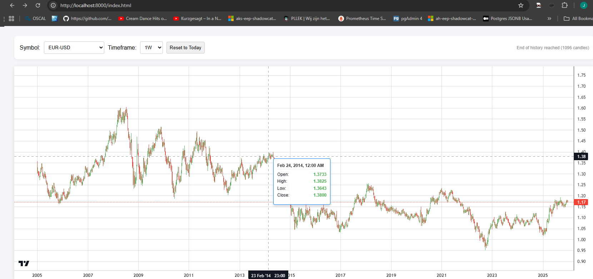
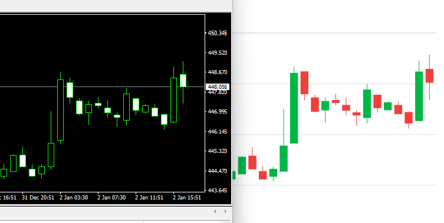

<u>MT4 is decoded.</u>


## Notice: Backfilling. Exact example.

I am currently abstracting the IO layer and ofcourse checks are needed to validate correct operation. I use my favorite asset for validation, the SGD index. I noticed one tiny 5m candle looking a tiny bit different and went on the research rampage. This is what i found.

Incoming 1m data from Dukascopy. Notice the liquidity gaps eg between 13:05 and 13:08 no data.

```sh
2026-01-07 12:40:00,462.544,462.559,462.444,462.444,0.0048
2026-01-07 12:43:00,462.599,462.599,462.599,462.599,0.0012
2026-01-07 12:47:00,462.656,462.656,462.556,462.647,0.006
2026-01-07 12:48:00,462.556,462.699,462.556,462.556,0.0036
2026-01-07 12:49:00,462.65,462.65,462.65,462.65,0.0012
2026-01-07 12:50:00,462.759,462.759,462.759,462.759,0.0012
2026-01-07 13:02:00,462.656,462.656,462.656,462.656,0.0012 <
2026-01-07 13:04:00,462.753,462.753,462.753,462.753,0.0012 <
2026-01-07 13:05:00,462.699,462.75,462.647,462.647,0.0036 <
2026-01-07 13:08:00,462.75,462.75,462.75,462.75,0.0012 <
2026-01-07 13:10:00,462.656,462.656,462.656,462.656,0.0012 <!-- here we are in-sync again
2026-01-07 13:11:00,462.759,462.759,462.641,462.65,0.0048
2026-01-07 13:12:00,462.756,462.756,462.756,462.756,0.0012'
```

Since the data is gapping, i decided to check for backfills. So i ran the `./rebuild-weekly.sh` script. 

This is how the input changed:

```sh
2026-01-07 12:33:00,462.447,462.447,462.447,462.447,0.0012
2026-01-07 12:40:00,462.544,462.559,462.444,462.444,0.0048
2026-01-07 12:43:00,462.599,462.599,462.599,462.599,0.0012
2026-01-07 12:47:00,462.656,462.656,462.556,462.647,0.006
2026-01-07 12:48:00,462.556,462.699,462.556,462.556,0.0036
2026-01-07 12:49:00,462.65,462.65,462.65,462.65,0.0012
2026-01-07 12:50:00,462.759,462.759,462.759,462.759,0.0012
2026-01-07 12:57:00,462.656,462.656,462.656,462.656,0.0012 <
2026-01-07 12:59:00,462.753,462.753,462.753,462.753,0.0012 <
2026-01-07 13:00:00,462.699,462.75,462.647,462.647,0.0036 <
2026-01-07 13:03:00,462.75,462.75,462.75,462.75,0.0012 <
2026-01-07 13:10:00,462.656,462.656,462.656,462.656,0.0012 <!-- here we are in-sync again
2026-01-07 13:11:00,462.759,462.759,462.641,462.65,0.0048
2026-01-07 13:12:00,462.756,462.756,462.756,462.756,0.0012
2026-01-07 13:15:00,462.856,462.856,462.741,462.741,0.0048
```

This is not a bug on this pipeline's end. I checked the original source files and compared them. The 1m input file changed on broker end.

This is why you need to run the `./rebuild-weekly.sh` script regularly-if you are dealing with illiquid assets.

The move to binary will make a rebuild a walk-in-the-park. A matter of a minute-unless you have a crazy rain-forest of symbols-for which this software originally was not intended.

**Note:** Now i have seen exactly what a broker does when "backfilling", i am certain i can "detect" it. What to do when we detect it? At minimum notify the user on it in the web-interface. My initial conclusion was that during backfilling only candles get updated or inserted. Now we see, that candles are actually moved around-the timestamp.

## Notice: Data

The data portion is now (fairly) complete. Naturally, some QA issues remain, particularly in the builder component, which will be addressed over time. Ensuring optimal QA for the ETL process takes priority over the extraction utility itself.

**Note:** I’ve addressed the main issue with replay, but I believe it’s prudent to start abstracting the I/O layer first. As more features are added, an increasing number of components are being built on the current I/O implementation. To avoid a large-scale refactor later, it makes sense to tackle the [I/O layer](io.md) now. We’re moving toward a binary format with fixed-length records, while keeping a configurable fallback to CSV to avoid breaking existing installations.

Output from the builder tool will remain the same - CSV/Parquet.

This is pretty fast already but will become extremely fast.

**Update**: transform is 2.8x as fast in binary mode.

## Notice: Configuration validation - 2025-01-06

Configuration is now checked against the schema defined in `etl/config/schema.json`. When you `git pull`, execute `pip install -r requirements.txt`.

## Notice: Bugfixes - 2025-01-04

Several bugs were fixed today—some from the to-do list, and others discovered during integration testing and manual verification.

- **Severe:** The reference date was set to datetime.now(). Since origins are determined relative to this reference date, a DST/STD transition would shift datetime.now(), causing the origins to lose their offsets. This would corrupt alignment and, consequently, the data. This is a critical fix that must be deployed before March 2026.

- Medium: The API limits were overly restrictive, causing the 1-minute and 5-minute timeframe charts to reach an artificial “end of history” and display gaps. This issue has now been fixed.

- Medium: ApexCharts had certain limitations, so it was replaced with TradingView charts to provide a better user experience.

- Medium: HTTP-docs were not "truly offline capable". Localized the JS files.

- Low: MT4 support has been added, [see here](http.md).

As always: 

```sh
git pull origin main && ./setup-dukascopy.sh
```

(only if not using custom configuration settings)

**Note:** I am experimenting with EA's. To see on how to support the MT4 flag on the API URI in a most sensible way.

**Note:** Additional API calls will be added, eg to get a date-range for a specific symbol. To eliminate the initial searching.

## Notice: HTTP service live

[HTTP API](http.md) service is implemented. It follows more or less the same syntax as the builder component. You can also define your own HTML pages, eg to render charts. Example is added to the ```config/dukascopy/http-docs``` directory.



You can now visually compare your data, example SGD:



**Note:** Performance is not bad but, in my world, it should be faster. Especially on 1m, 5m charts. Will be taken care of eventually. I think most will think its good performance.

## Notice: New Year Update

Happy New Year! 🎉

Data for all configured indices has now been compared using Beyond Compare.

Configuration files for indices have been updated—run ```./setup-dukascopy.sh``` to apply the changes - only if you dont have custom configuration. The fixes primarily focus on improvements to DST/STD switching.

Aside from the ASX anomaly (see forensics/ASX.MD) and the one-week STD-switch delay on the MT4 side that occurs only in leap years, I’m <u>extremely</u> pleased with the results. The indices are looking really good now.

## Notice: Panama backadjustment "Public beta" live

**Update:** Assuming the rollover values from the broker are correct, this is acceptable. I checked one year of BRENT data. In some cases, a gap remains because applying the broker-specified adjustment can leave a gap—October 2025 is an example—whereas November and September are superbly corrected. You can verify the rollover values in your ```data/rollover``` folder; those are the values being used. I still need to check it against an other datasource with continuous prices. eg to confirm the October one. If that one checks out, i will remove the "beta status".

I’ve implemented an initial version of the Panama backadjustment logic. It’s now available for you to try, although I’m still rigorously testing it myself. At the moment, rollover adjustments are supported for *-USD commodities, *-USX soft-commodities and *TR* bonds. I have tested it with:

- BRENT.CMD-USD
- GAS.CMD-USD
- LIGHT.CMD-USD
- DIESEL.CMD-USD

For these symbols, the adjustment works beautifully. Since Dukascopy applies rollovers at the end of the day, implementing this solution turned out to be much simpler than expected.

I cannot guarantee flawless performance for symbols outside of those tested, which is why the feature is currently in a “public beta” state.

Below is a general explanation of Panama backadjustment and why it is widely used by retail traders, generated with the help of AI:

Panama backadjustment is a method used mainly for futures contracts to create a continuous price series across contract rollovers. When one futures contract expires and trading moves to the next, there is often a price gap caused by differences in contract pricing, not real market movement. Panama backadjustment removes these artificial gaps by calculating the price difference at each rollover and applying cumulative offsets to historical prices.

This is important to traders because it produces clean, continuous charts that preserve true price action, trends, and technical indicator behavior. It is commonly used for technical analysis, backtesting trading strategies, risk modeling, and signal generation, where unadjusted rollover gaps would otherwise distort indicators, trigger false signals, or break historical comparisons.

**Note:** Panama backadjustment modifies the 1-minute base data and resamples all higher timeframes to ensure they align with the adjusted base. The process takes some time, but for most symbols it typically completes in under 30 seconds, depending on your hardware.

Examples:

```sh
./build-csv.sh --select BRENT.CMD-USD:panama/1m --output panama-test.csv
```

Before Panama


After Panama


Completely different perspective. As you can see.

**Note:** This only applies to futures traders. Commodities, Bonds, Indices. For Forex and Crypto it will just skip the logic if you specify it. The ```panama``` modifier will then only just print a warning - that you are trying to apply it for an instrument where its not necessary. 

**Note:** Panama-adjusted data may show negative prices in the distant past. This is normal and expected. Please ensure your backtesting framework can handle such values. If you want to know how to deal with this/when this is a problem, just copy the previous sentence to Gemini and it will guide you.


## Notice: Pre- and Post Processing steps now "session-bound"

You’re now able to configure pre- and post-processing steps within sessions that are constrained by the session’s logical boundaries (weekdays and date ranges). This is a general code improvement that should have been done anyway, regardless of whether the AUS.IDX issue was the original motivation.

Config example:

```yaml
AUS.IDX-AUD:
  timezone: Australia/Sydney
  skip_timeframes: []
  sessions:
    my-very-special-aussie-handler:
      # This is a special candle-alignment handling for the AUS.IDX. 
      weekdays: [0] # 0=monday, 1=tuesday, and so on..
      to_date: "2024-06-22 01:00:00"  # In Australia/Sydney time
      ranges:
        day: 
          from: "09:50"
          to: "17:09"
      timeframes:
        4h:                     
          origin: "epoch"
          post:
            # On Mondays, and up to 2024-06-24, candles must be aligned to 00:00 (epoch).
            # The 08:00 candle on these Mondays spans 6h10m instead of 4h, due to data
            # existing between 12:00 and 14:10. This creates a “ghost” H4 candle at 10:10,
            # which must be merged into the previous candle (the 08:00 H4 candle).
            # MT4 charts are fragile, but this ensures exact alignment for users who
            # choose to enable it. When DST has shifted, also a 09:10:00 candle needs to 
            # get cleaned.
            merge-step:
              action: merge
              ends_with:
              - "09:10:00"
              - "10:10:00"
              offset: -1  
```

The software is become more and more powerful to handle edge-cases and MT4-anomalies. This is a change for the better.

**Note:** I removed a previous notice, which should have been kept in. The above example can easily be verified. I claim that the 2024-06-17 08:00 H4 candle is actually 6h10m long. I want to show this, because it needs to be very clear what this means. You can load the H4 AUS.IDX and browse to that candle by holding down page-up. When you have found it, look at it's closing price. It's 7691.221. Now open-up the H1 chart. Locate the H1 candle 2024-06-17 13:10, which closes at 14:10, It's close price is 7691.221. Conclusion, this "H4" candle is actually 6h10m long and contains liquidity and price action which falls outside of an regular H4 boundary. I consider this stuff "spooky".

## Notice: Backfilling

Backfilling is not currently supported, as our pipeline processes data strictly forward. Because of this, historical data—particularly for illiquid pairs and at the highest granularity—may be skewed. Backfilling has been identified as a must-have feature.

We'll provide a script that should be executed once every seven days (run on saturdays). It will re-download the past week of data for all configured symbols and perform a full rebuild. This captures any backfills within that window, effectively addressing ~99.94-99.97% of all backfill issues.

For reference, running this on 26 symbols takes about five minutes (or around 2 minutes 30 seconds if you’re up to date and use the rebuild script)—a small price to pay for accuracy.

```python
Major FX         █░░░░░░░░░ 0.01%  (1 in 7,000-12,500 symbol-days)
Major Crosses    ███░░░░░░░ 0.05%
Illiquid FX      ██████████ 1.1%
Indices          ██░░░░░░░░ 0.09%
Major Crypto     ██████████ 1.3%
Altcoins         ████████████████ 3.5%
```

```sh
crontab -e
```
Add the following line, adjust path accordingly:

```sh
0 1 * * 6 cd /home/repos/bp.markets.ingest/dukascopy && ./rebuild-weekly.sh
```

This configuration triggers the rebuild script at 01:00 each Saturday. It will not conflict with the per-minute ./run.sh cron entry (due to locking). For additional assurance, you may choose to run it daily. Overall, the setup is now far more robust in terms of integrity.

>This is a universal challenge in market-data engineering. Even when working with top-tier, premium data vendors, the moment you download or extract data and begin using it, some portion of it may already be stale due to backfills. It’s an inherent property of financial datasets, not a limitation of this tool. There is no central log or official feed that reliably exposes all historical corrections, making automated detection non-trivial. As a result, every data pipeline—paid or free—must contend with this reality.

The quality of this dataset is on par with what you would receive from commercial providers. The difference is simply that this one is free.

## Notice: What about MT5?

There will be some exploratory research in January. Low priority.

## Hall of Fame

List of the most "interesting stuff" encountered, during development of this project

**ASX is record holder**
- Monday-specific EPOCH-based candles only during day-session - resolved
- H4 candles spanning 6h10m - resolved
- 2020 severe DST/STD switch issues MT4-side - unresolved (still debating if should solve) \
  **The debate is:** our data is actually better, should I replicate a likely bug that will give worse data? \
  **The decision is:** We are going to replicate the behavior through date-range bound, custom,  timeshift support in transform. There are changes for leap-years needed anyhow. The two complement each other.
- Sub-hourly intraday candle offsets at HH:51 and HH:10 - resolved

**SGD**
- Only in winter merge of a 11:51 candle, not in summer, while similar behavior - resolved
- Similarly to ASX, sub-hourly intraday candle at HH:51 - resolved

**MT4 general**
- Leap-year only lag of STD switch - unresolved (will solve in boundaries logic)
- Interesting DST/STD switch logic, based on NY DST state either GMT+2/GMT+3 - resolved
- 4x DST/STD annual switches per timezone-dependent asset - resolved

**AI**
- AI CANNOT be used for complex logic - it hallucinates and fails on edge cases
- AI CAN be used for docstring and inline commenting of code - it excels at that
- AI CAN be used for QA purposes - it actually found a bug that really mattered
- AI CAN be used for generic HTML and Javascript implementations - it excels at that
- AI CAN be really funny - especially Grok!

I think the solution came out really really well.

"In the intricate tapestry of apparent chaos, true mastery lies not in imposing order upon the unknown, but in patiently decoding its hidden patterns—until one day, with quiet revelation, we declare: the enigma is unveiled, and what was once obscure now illuminates the path for all."

Wishing you all a highly profitable 2026! 🚀
