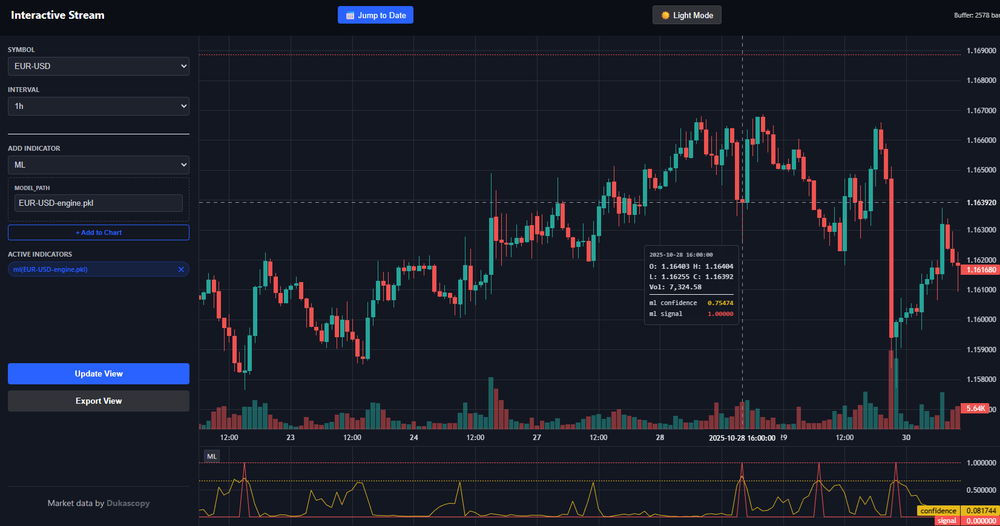
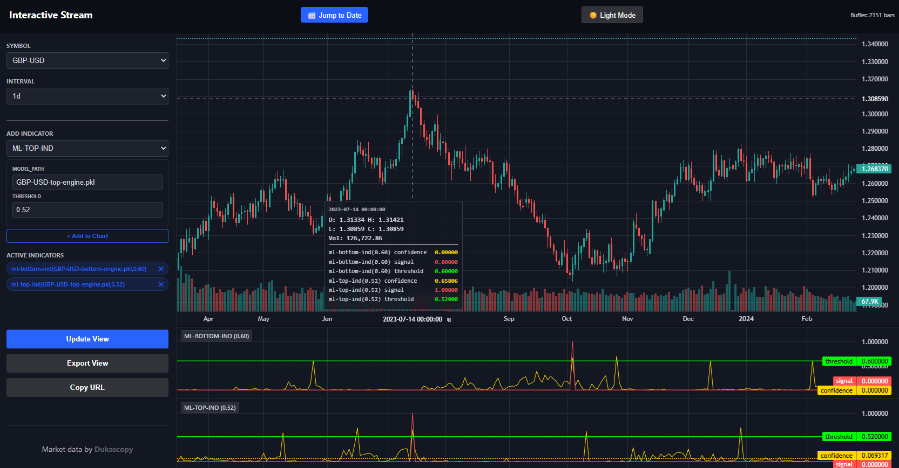

<u>MT4 is decoded.</u>

What's next?

- Replay/Market simulation
- Write-up

## **Notice:** this goes private 

**Note:** This project will be taken offline and development will continue privately. This all is about P/L and not about fancy clone statistics. 

Will you completely take it offline or will there be some other repo, containing a locked, stable version? Yes. That is the plan. This one will dissapear, another, thoroughly tested repo, having below functionalities stabilized will be put up. However, there will be no maintenance on that stabilized product and it will be as-is. That project could be considered as a "stable data foundational layer with an API on top of it". And nothing more than that. So after one more development round, this migrates.

What am I using this system for? A background process that deeply analyses incoming 1h "ticks". Generates signals, those get exported, read and paper-traded atm. Signals and results get compared. 

The last public development round will include:

- DAG execution of indicators, virtual indicators
- drawing options to the index.html + split of js to libs
- internal API layer for indicators to support high performance cross-asset cross-timeframe querying
- ONE example cross-asset/cross-timeframe indicator-Pearson correlation between bond and EUR-USD
- unit-tests
- load-tests
- complete strip of CSV support (base-data part)
- perhaps other polish stuff

How long until migration? ASAP.

I won't leave this project with everyone empty-handed. There will be a stable version which can be used to do awesome things with-trust me it works. 

In short. Basically this project becomes a gift to the community. People may fork, takeover, continue development. There will be no functionality strips, other than the CSV datalayer (which nobody wants).


### Bonus ML Example: Bottom Detection with Random Forest

Included as a starter demo to show ML integration.

- Features: ATR range, SMA distance, RSI  
- Model: RF classifier (trained on historical bottoms)  
- Signal: Confidence > threshold + RSI < 40 + green candle  
- See `examples/mltrain.py` etc. for training/evaluation.
- Example output (precision by threshold):

```sh
~/repos2/bp.markets.ingest/dukascopy$ python3 examples/mleval.py
========================================
     SNIPER MODEL EVALUATION REPORT
========================================

[CONFUSION MATRIX]
True Negatives (Correctly Ignored): 2778
False Positives (Fake Signals):     0
False Negatives (Missed Bottoms):   49
True Positives (Sniper Hits):       26

[SNIPER ACCURACY]
Precision: 100.00%
~/repos2/bp.markets.ingest/dukascopy$ python3 examples/mloptimizer.py
Optimizing: ~repos2/bp.markets.ingest/dukascopy/EUR-USD-engine.pkl
Optimizing Thresholds for EUR-USD...

==================================================
THRESHOLD  | SIGNALS    | PRECISION  | WINNERS
==================================================
0.50       | 59         | 89.83%     | 53
0.60       | 43         | 100.00%    | 43
0.65       | 26         | 100.00%    | 26
0.70       | 12         | 100.00%    | 12
0.75       | 5          | 100.00%    | 5
0.80       | 1          | 100.00%    | 1
0.85       | 0          | 0.00%      | 0
```



Run on EUR-USD 1d to see it in action. Fork and experiment — it's a learning tool!

Assuming you have EUR-USD and 1d TF:

```sh
pip install --upgrade pip setuptools wheel
pip install scikit-learn==1.3.2
python3 -c "import sklearn; print('Scikit-learn version:', sklearn.__version__)"
cp examples/mlind.py config.user/plugins/indicators/ml-example.py
python3 examples/mltrain.py
python3 examples/mleval.py
python3 examples/mloptimize.py
```

Test on your localhost, select EUR-USD 1d graph. See recent years history. Its not perfect, but as a demo. Pretty neat.

PS: This is an exact showcase on how i use this system. The API calls are pulled by EA's.

