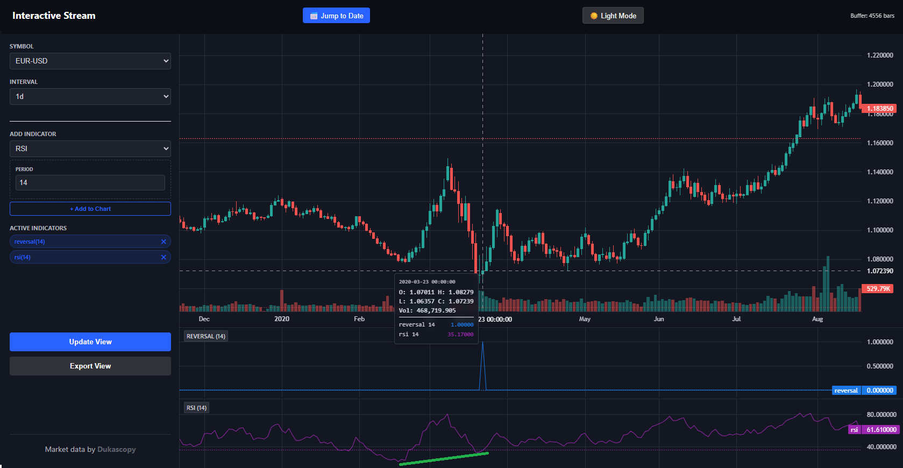
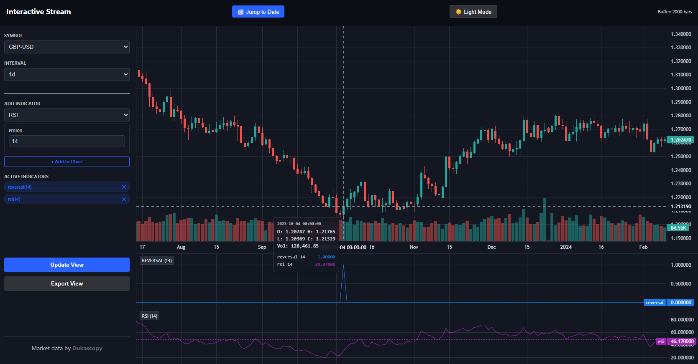

<u>MT4 is decoded.</u>

What's next?

- Evening off
- Replay/Market simulation
- Optionally reaching out if problems persist longer than expected
- Write-up

## **Notice: Endpoint issues - 503**

What's up?

A "Error from Cloudfront".  Because of the inconsistent behavior my best guess is technical issues.

What's likely up?

This is now certain: Technical issues. Specifically the jetta subsystem.

The freeserv and datafeed subsystem are unaffected. I will reach out, if needed. 

Monday is MLK (Martin Luther King Jr) day, being a major market holiday.

## Notice: hot-reload of CUSTOM indicators is now done - 2025-01-18

Hot-reload of custom indicators has now been implemented. No more webservice restarts needed if you ADD/CHANGE an indicator. Goal of these changes is to support "rapid prototyping", ease the developer experience. 

**Important:** Do not use `_`-underscore-in indicator file-names. If you need to seperate, use a `-`-dash- or a `.`-dot.

**Update:** The chart-web-UI has been updated to reload indicators on "Update view". So if you add/modify an indicator, press "Update view" to reload its settings/newly added indicators. `index.html` has changed once more, copy over the file manually to `config.user`. Note that it only works for CUSTOM indicators. The system ones will not be refreshed without a webservice restart. You shouldnt change them anyways.

**Note:** Sometimes with "dragging" the chart, it flips a bit. Use pagedown/pageup/end keys. Still needs some polishing. But is of later concern. I am not so great at frontend development. It's not so "strict" as backend. The asynchronous stuff with JSONP. Brrr. 

## Notice: been playing around with custom indicators - 2025-01-18

You can really write neat stuff using custom indicators. Positive divergence (bullish) example-with doji detection.

Honestly, its not flawless yet. But for a first attempt? Pretty good.

This is 100 percent without lookahead bias. Imagine this filtering out false-positives and then monitoring all assets on a daily basis. The few signals you might see in these screenshots, when applied to many assets, you would get a signal every so many days. 

I realize myself now, how powerful this actually has become. Python for custom indicators? Pure gold. Moondust.

When feed access is restored, nomatter in what way, and replay is done, the next logical step would be an "alert-system". Thinking out loud: runs periodically. Queries the API. You have business rules setup that looks for combinations of values, in either combined or single feeds, when the conditional rules match fields -> email (or popup with star wars sound, whatever).

## Notice: support for cache-only rebuilds - 2025-01-17

If the download endpoint is unavailable but you have a cache folder and want to modify timeframes and rebuild using those new timeframes, this is now supported. Before running any rebuild scripts, set `orchestrator.disable_downloads` to 1 in `config.user.yaml`.

Important is that your cache folder doesnt have any gaps. If you use an originally constructed cache-folder made by this application, this shouldnt be an existing issue. 

## Notice: buffered interface is now supported - 2025-01-17

I have updated the interface to not keep everything in memory when browsing history-this smooths the UX. It keeps a record of maximum 5000 bars. This is optimized for a laptop 1680x1050. If you have a "wider-screen" you might wanna set the bufferLimit higher in `config.user/dukascopy/http-docs/index.html` (you might need to copy over the new file). Just CTRL+F 5000 and change it to a value that matches your setup.

## Notice: abstracting the IO layer for download

This would be a logical step now this happened but I dont want to start with that just yet.