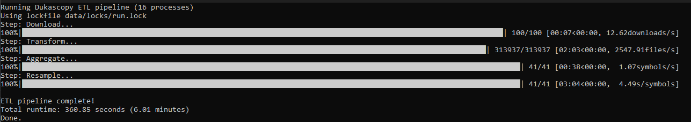
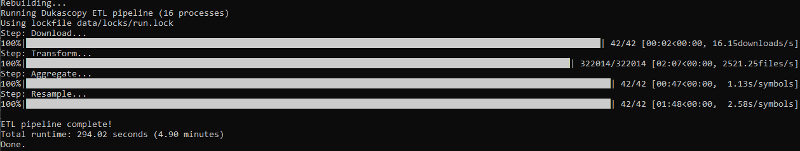
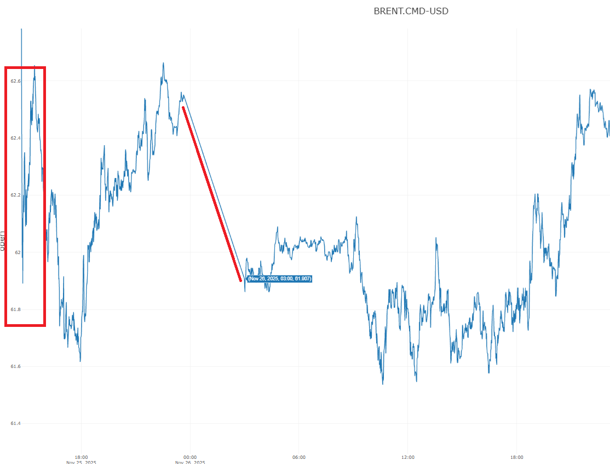
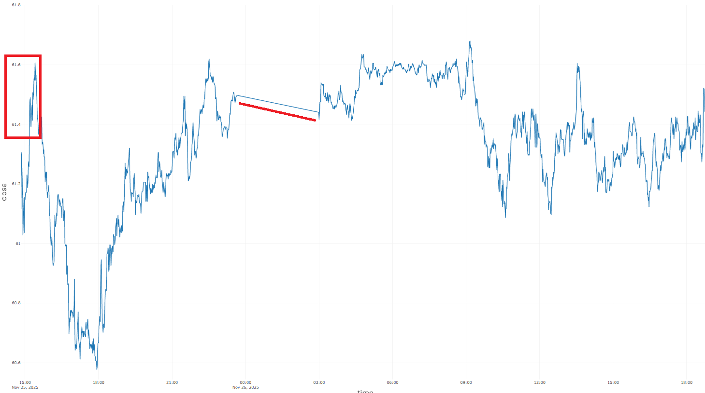

MT4 is decoded.

**Notice:** For very recent cloners and pullers, there was a small bug where running run.sh could fail. The issue was related to using a from–to date range on the DataFrame for DST calculations. During incremental updates, it’s possible to have only a single candle, which means there is no valid range. In that case, I now explicitly simulate a range, which fixes the problem.

Sorry for any inconvenience or breakage. I didn’t catch this earlier because I was only using ```./rebuild-resample.sh``` for verification, which almost never results in a single candle. If you cloned or pulled today, please pull again.

>Many things are preconfigured, but I can’t guarantee at this point that all quirks have been fully uncovered, detected, and eliminated—through configuration. That said, the tool is capable of handling almost anything MT4 can throw at you; it’s mainly a matter of effort. I plan to reduce that effort by building a program that compares timestamps against MT4 exports and automatically adjusts the configuration to match the output. I only have a few days left to wrap up this data-related work. Panama also still needs to be finalized.

So, what has this code solved, so far:

- **"100%" Platform Alignment:** Achieves parity with MetaTrader 4/5 bar generation by implementing specific server-time logic (GMT+2 with US DST), eliminating the "Sunday candle" and 6-day week errors common in other tools.

- **Vectorized DST Handling:** Uses high-performance windowed masking to handle biannual Daylight Savings Time transitions, ensuring session origins are dynamically adjusted without the overhead of row-by-row iteration.

- **Crash-Safe Idempotency:** Employs an atomic persistence strategy using byte-offset index files and file truncation, allowing the engine to resume exactly where it left off after a crash without corrupting or duplicating data.

- **Memory-Efficient Big Data Processing:** Utilizes a batch-oriented StringIO buffer system and file-handle seeking to process massive historical datasets that exceed system RAM.

- **Multi-Stage Dependency Resampling:** Orchestrates a cascading pipeline (e.g., 1m → 5m → 1h) where higher timeframes are derived from lower ones in a verified, sequential order.

- **Edge-Case Boundary Logic:** Solves subtle data gaps at DST transition points for sparse high-timeframe data (like 1h or Daily bars) using a robust boundary-buffering technique.

- **Session-Aware Aggregation:** Supports complex, symbol-specific trading sessions with unique origins, from-date/to-date ranges, and weekday filters applied during the resampling process.

- **Truth:** Uncovers truth

## Notice: Pre- and Post Processing steps now "session-bound"

You’re now able to configure pre- and post-processing steps within sessions that are constrained by the session’s logical boundaries (weekdays and date ranges). This is a general code improvement that should have been done anyway, regardless of whether the AUS.IDX issue was the original motivation.

Config example:

```yaml
AUS.IDX-AUD:
  timezone: Australia/Sydney
  skip_timeframes: []
  sessions:
    my-very-special-aussie-handler:
      # This is a special candle-alignment handling for the AUS.IDX. 
      weekdays: [0] # 0=monday, 1=tuesday, and so on..
      to_date: "2024-06-22 01:00:00"  # In Australia/Sydney time
      ranges:
        day: 
          from: "09:50"
          to: "17:09"
      timeframes:
        4h:                     
          origin: "epoch"
          post:
            # On Mondays, and up to 2024-06-24, candles must be aligned to 00:00 (epoch).
            # The 08:00 candle on these Mondays spans 6h10m instead of 4h, due to data
            # existing between 12:00 and 14:10. This creates a “ghost” H4 candle at 10:10,
            # which must be merged into the previous candle (the 08:00 H4 candle).
            # MT4 charts are fragile, but this ensures exact alignment for users who
            # choose to enable it. When DST has shifted, also a 09:10:00 candle needs to 
            # get cleaned.
            merge-step:
              action: merge
              ends_with:
              - "09:10:00"
              - "10:10:00"
              offset: -1  
```

The software is become more and more powerful to handle edge-cases and MT4-anomalies. This is a change for the better.

**Note:** Some people might call me “obsessed” with this MT4 alignment topic, but there’s a philosophy behind it. If I can support all MT4 quirks, then there’s effectively nothing left that can’t be handled—regardless of the exchange, broker, or price behavior. This work is also part of my learning process for the C++ version.

One more thing: if you define a post-processing rule at the Symbol level (the level above sessions), that rule is copied into each defined session. Make sure that any symbol-wide post-processing rules do not interfere with session-specific ones. Otherwise, this can lead to hard-to-debug behavior—especially if you’re not familiar with the codebase.

## Notice: Performance

Two performance improvements have been implemented:

- Streamlined I/O – Replaced IO.tell() in text mode by switching the input stream to binary mode, bypassing Python’s text-IO translation layer.
- Vectorized session handling – Origins are now assigned using vectorized operations instead of line-by-line computation.

At this stage, further performance gains in Python are minimal. Any additional optimization would require switching from CSV to a custom binary format. However, this would sacrifice the transparency and human-readability of CSVs, so it will not be pursued in the Python version. Such optimizations are reserved for the high-performance, tick-ready, C++ variant.

For reference, resampling 42 symbols takes about 1 minute and 30 seconds in Python. A C++ implementation with binary format will reduce this to seconds.

Before:



After: 



This optimization shaved a little over a minute off the resampling step, yielding roughly a 40% performance improvement.

## Notice: Rollover

Rollover support is being implemented. Programmatic detection was too inaccurate. Different approach was needed.

I have a first version of back-adjustment (Panama) up and running. Severely checking this and parameterizing this before i release it. Initial results look (pretty) good:

```sh
RAW DATA:

December
2025-12-23 20:10:00,62.27,62.27,62.27,62.27,0.000202
2025-12-24 03:00:00,61.922,61.96,61.875,61.88,0.00374
GAP = -0.348

November
2025-11-25 23:39:00,62.552,62.552,62.547,62.547,0.000144
2025-11-26 03:00:00,61.907,61.93,61.83,61.88,0.003438
GAP = -0.64

BACKADJUSTED DATA:

December:
2025-12-23 20:10:00,61.83,61.83,61.83,61.83,0.000202
2025-12-24 03:00:00,61.922,61.96,61.875,61.88,0.00374
GAP = +0.092

November
2025-11-25 23:39:00,61.502,61.502,61.497,61.497,0.000144
2025-11-26 03:00:00,61.467,61.49,61.39,61.44,0.003438
GAP = -0.03
```

By specifying ```SYMBOL:adjusted/TF``` you can optionally decide if you want the Panama-version or the "regular" (default) "broker-reality"-version. It will only support instruments for which a rollover calendar could be found. If it cannot find the calendar, it will stop the builder with a message. 

**Why?**

Raw futures data contains artificial price "gaps" that occur whenever an old contract expires and a new one begins. Panama Adjustment removes these gaps by shifting historical prices to align with the current contract, creating a seamless, continuous price string. Without this adjustment, trading indicators like Moving Averages would be mathematically distorted by "phantom" price jumps that never actually happened in live trading.

Once the 1-minute data is adjusted, all higher timeframes (5m, 1h, Daily) must be resampled from this version to maintain consistency. If you resample from raw data, your hourly or daily candles will contain "dirty" data points from both contracts, resulting in fake candle ranges and incorrect OHLC values. Using the Panama-adjusted 1m source ensures that your multi-timeframe analysis is accurate and that a signal on the 5m chart matches the price action on the 1h chart. Essentially, this process preserves the true "geometric shape" of the market across all intervals. This allows for reliable backtesting and strategy development over long periods.

Ofcourse everything is fully automated. Just a flag is needed to trigger it. The system will be working about 30-40 seconds on 6 panama-adjusted symbols (this unoptimized. optimization steps still need to get performed).

Examples:

Before Panama



After Panama



Completely different perspective. As you can see.

~~I have some things to do today. Will be finalized tomorrow. Late noon.~~ Tomorrow.

**Note:** This only applies to futures traders. Commodities, Bonds, Indices. For Forex and Crypto it will just skip the logic if you specify it. The ```adjusted``` modifier will then only just print a warning - that you are trying to apply it for an instrument where its not necessary.  

## Notice: Backfilling

Backfilling is not currently supported, as our pipeline processes data strictly forward. Because of this, historical data—particularly for illiquid pairs and at the highest granularity—may be skewed. Backfilling has been identified as a must-have feature.

We'll provide a script that should be executed once every seven days (run on saturdays). It will re-download the past week of data for all configured symbols and perform a full rebuild. This captures any backfills within that window, effectively addressing ~99.94-99.97% of all backfill issues.

For reference, running this on 26 symbols takes about five minutes (or around 2 minutes 30 seconds if you’re up to date and use the rebuild script)—a small price to pay for accuracy.

```python
Major FX         █░░░░░░░░░ 0.01%  (1 in 7,000-12,500 symbol-days)
Major Crosses    ███░░░░░░░ 0.05%
Illiquid FX      ██████████ 1.1%
Indices          ██░░░░░░░░ 0.09%
Major Crypto     ██████████ 1.3%
Altcoins         ████████████████ 3.5%
```

```sh
crontab -e
```
Add the following line, adjust path accordingly:

```sh
0 1 * * 6 cd /home/repos/bp.markets.ingest/dukascopy && ./rebuild-weekly.sh
```

This configuration triggers the rebuild script at 01:00 each Saturday. It will not conflict with the per-minute ./run.sh cron entry (due to locking). For additional assurance, you may choose to run it daily. Overall, the setup is now far more robust in terms of integrity.

>This is a universal challenge in market-data engineering. Even when working with top-tier, premium data vendors, the moment you download or extract data and begin using it, some portion of it may already be stale due to backfills. It’s an inherent property of financial datasets, not a limitation of this tool. There is no central log or official feed that reliably exposes all historical corrections, making automated detection non-trivial. As a result, every data pipeline—paid or free—must contend with this reality.

The quality of this dataset is on par with what you would receive from commercial providers. The difference is simply that this one is free.

