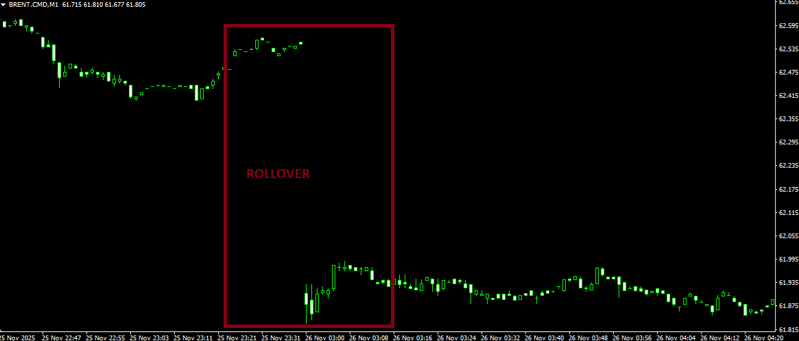

MT4 is decoded. 

**Notice:** The main branch is now locked. No further modifications will be made to the core codebase unless a critical bug is discovered, a significant feature is released, or an essential security announcement is required. New features are coming.

## Notice: Roll-over handling

Since some prices are based on CFD contract values (e.g., BRENT, LIGHT, etc.), they may need to be back-adjusted during rollovers, typically at a specific time each month. This is not currently supported, but I am actively working on a solution.

**The Synchronization Conflict: Adjusted vs. Broker Reality**

The challenge is more complex than a simple "rebuild and adjust" operation because MetaTrader 4 (MT4) does not support native back-adjustment. If we apply mathematical adjustments to the resampled CSVs to eliminate rollover gaps, the resulting data will no longer align with the "Broker Reality" shown on the MetaTrader platform.

So, likely, this will get implemented using a flag on the build commands, so you can optionally decide what version of output you want. The adjusted or the unadjusted one.

Implementing a reliable rollover mechanism is a medium-high priority task slated for completion by the end of the year - i still have some time left for the data part. The primary technical challenge lies in determining whether to source rollover dates from external schedules or to derive them programmatically.

A data-driven approach being considered involves monitoring volume trends: specifically, confirming a rollover after identifying two consecutive days of volume increase following a price/liquidity gap. This method would ensure the engine transitions when the bulk of market liquidity has shifted, rather than relying on arbitrary calendar dates.

**Technical Implementation**

Implementing this via the ```build-(csv|parquet).sh``` command allows for a clean separation of concerns:

- Source Data: Remains "Raw" (matches the broker). Majority first.
- Output Data: Optionally "Adjusted" (mathematically corrected for indicators).

Because we are dealing with multiple timeframes, triggering an adjusted build will likely involve resampling the raw data into a temporary state to ensure the mathematical shift is applied consistently from the 1-minute level up to the Daily/Weekly timeframes. This will take a few seconds per asset—likely implemented via a modifier ```:adjusted``` following the symbol name.

The assets primarily affected are those having ```CMD``` or ```TR``` suffixes - so this excludes Forex, Crypto, Equities - equities are a different kind of animal dividend/splits - since they are Spot/Cash based. Indices (e.g., USA30, USA500, DEU.IDX) roll quarterly.

Affected are - examples:

- BRENT.CMD-USD (Brent Crude Oil)
- LIGHT.CMD-USD (WTI Light Crude Oil)
- GAS.CMD-USD (Natural Gas)
- DIESEL.CMD-USD (Gasoil/Diesel)
- COPPER.CMD-USD (Copper)
- COTTON.CMD-USX (Cotton)
- OJUICE.CMD-USX (Orange Juice)
- SOYBEAN.CMD-USX (Soybeans)
- BUND.TR-EUR (German Bund Treasury Note)
- USTBOND.TR-USD (US Treasury Bond)

Example image


As illustrated in the Brent example above, the absence of native back-adjustment means that standard MetaTrader price history for these assets is fundamentally flawed, leading to distorted technical indicators and unreliable long-term backtesting results.

Our data currently matches Metatrader, to the bit.

```sh
2025-11-25 23:37:00,62.542,62.542,62.542,62.542,5.4e-05
2025-11-25 23:38:00,62.537,62.542,62.537,62.542,0.000378
2025-11-25 23:39:00,62.552,62.552,62.547,62.547,0.000144
2025-11-26 03:00:00,61.907,61.93,61.83,61.88,0.003438       << GAP of 0.6-ish
2025-11-26 03:01:00,61.89,61.93,61.84,61.855,0.00293
2025-11-26 03:02:00,61.86,61.92,61.86,61.905,0.001904
```

## Notice: Backfilling

Backfilling is not currently supported, as our pipeline processes data strictly forward. Because of this, historical data—particularly for illiquid pairs and at the highest granularity—may be skewed. Backfilling has been identified as a must-have feature.

We'll provide a script that should be executed once every seven days (run on saturdays). It will re-download the past week of data for all configured symbols and perform a full rebuild. This captures any backfills within that window, effectively addressing ~99.94-99.97% of all backfill issues.

For reference, running this on 26 symbols takes about five minutes (or around 2 minutes 30 seconds if you’re up to date and use the rebuild script)—a small price to pay for accuracy.

```python
Major FX         █░░░░░░░░░ 0.01%  (1 in 7,000-12,500 symbol-days)
Major Crosses    ███░░░░░░░ 0.05%
Illiquid FX      ██████████ 1.1%
Indices          ██░░░░░░░░ 0.09%
Major Crypto     ██████████ 1.3%
Altcoins         ████████████████ 3.5%
```

```sh
crontab -e
```
Add the following line, adjust path accordingly:

```sh
0 1 * * 6 cd /home/repos/bp.markets.ingest/dukascopy && ./rebuild-weekly.sh
```

This configuration triggers the rebuild script at 01:00 each Saturday. It will not conflict with the per-minute ./run.sh cron entry (due to locking). For additional assurance, you may choose to run it daily. Overall, the setup is now far more robust in terms of integrity.

>This is a universal challenge in market-data engineering. Even when working with top-tier, premium data vendors, the moment you download or extract data and begin using it, some portion of it may already be stale due to backfills. It’s an inherent property of financial datasets, not a limitation of this tool. There is no central log or official feed that reliably exposes all historical corrections, making automated detection non-trivial. As a result, every data pipeline—paid or free—must contend with this reality.

The quality of this dataset is on par with what you would receive from commercial providers. The difference is simply that this one is free.

