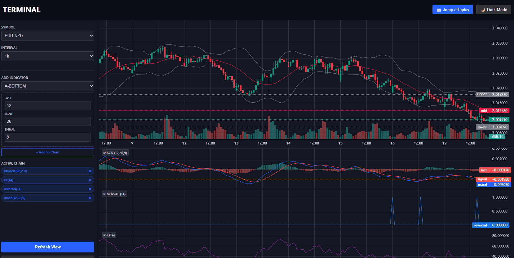
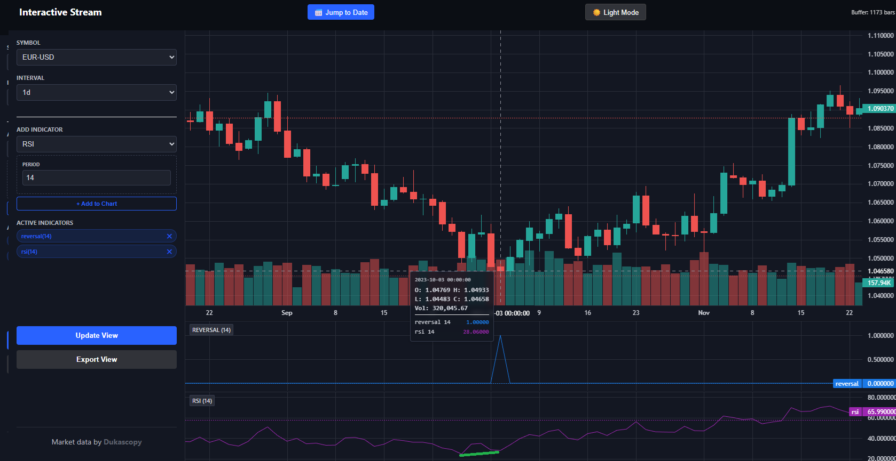
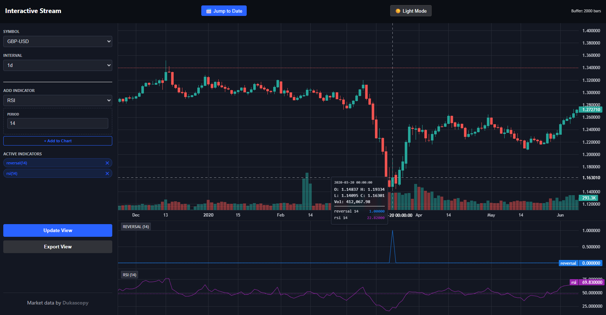
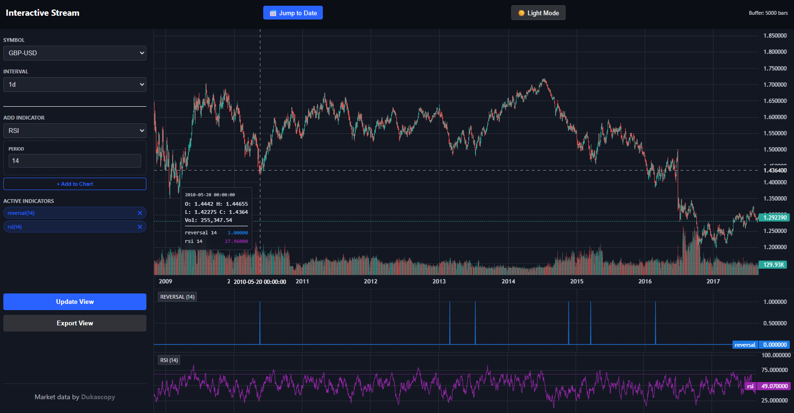
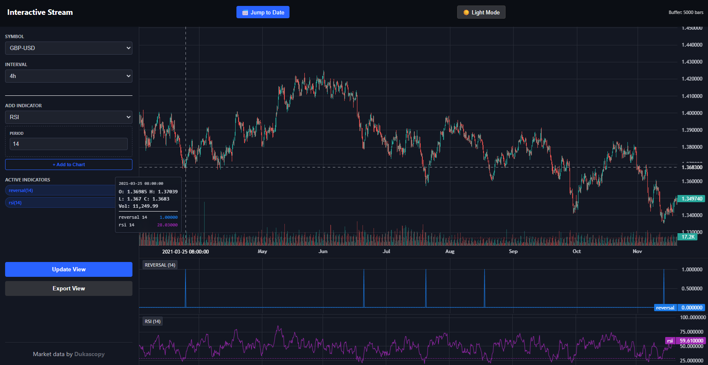

<u>MT4 is decoded.</u>

What's next?

- Replay/Market simulation
- Write-up

## **Notice:** Apex charts and serial execution

1. I have been looking into drawing functionalities. I am not happy with the current interface and i think charting/drawing options should get added. Also, the demo-replay, is a bitch glitchy and should have a rewrite/split to libraries. I am two days on an other mission but expect to be back at it on Friday.

It's a bit busy atm. I will remove the indicators from the repository that are not yet supported or were classified as "invalid"-those with verified:0 in the metadata.

Soon more updates.

2. While developing my own indicators i noticed i often was reliant on similar calculations performed by existing indicators. SMA's, RSI etc. I had to copy over the logic to my custom indicators. This is weird. So i came up with a solution. `?executionmode=serial`. This is not yet implemented but will be implemented soon. Basically pipelining inside of your HTTP request will get supported. See http.md for more information. This weekend it will be done. I have an indicator file of nearly 10KB. Thats no good. Fixing. 

## **Notice:** Functional replay mockup - 2025-01-19

For demonstration purposes, I’ve included a fully functional replay mockup in this repository. You can use it to run replays with your own assets, indicators, and configurations.

This is not the definitive replay implementation—the final version is significantly more advanced than what’s included here.

That said, feel free to explore and experiment with it. Since this was implemented and reviewed quickly, there may be minor glitches or rough edges.

The url and the script. `config/dukascopy/http-docs/replay.html`, copy it to `config.user/dukascopy/http-docs/`. After copying `http://localhost:8000/replay.html`. You will find a `Jump/Replay` button on the right topside.

**Note:** If you build lookahead bias in your indicators, this replay will just accept that. So make sure you develop your indicators right. If i have time i will build an example on how to implement a cross-asset indicator without losing too much performance. Not today. It will be a Pearson correlation between bond yield change and EURUSD price change over N bars.

**Note:** This is just a basic candlestick replay. It’s meant to show what can be built on top of it and to spark some imagination about what’s possible—and what’s coming next.

## **Notice:** Interface (bug-)fixes - 2025-01-19

**Note:** I updated the index.html **twice** today. Now its oke. I think. I hope. Update view works too. These are important changes in case developing custom indicators. When you press update view, you want to see the new indicators output immediately, without a shifting chart or any other "weird stuff". All that has been fixed. My JS skills are improving.

Copy over the new `config/dukascopy/http-docs/index.html` to your `config.user/dukascopy/http-docs/index.html`.

## **Notice: Endpoint issues - 503** - 2025-01-18

What's up?

A "Error from Cloudfront".  Because of the inconsistent behavior my best guess is technical issues.

**Update:** Issues have been resolved.

Monday is MLK (Martin Luther King Jr) day, being a major market holiday.

## Notice: hot-reload of CUSTOM indicators is now done - 2025-01-18

Hot-reload of custom indicators has now been implemented. No more webservice restarts needed if you ADD/CHANGE an indicator. Goal of these changes is to support "rapid prototyping", ease the developer experience. 

**Important:** Do not use `_`-underscore-in indicator file-names. If you need to seperate, use a `-`-dash- or a `.`-dot.

**Update:** The chart-web-UI has been updated to reload indicators on "Update view". So if you add/modify an indicator, press "Update view" to reload its settings/newly added indicators. `index.html` has changed once more, copy over the file manually to `config.user`. Note that it only works for CUSTOM indicators. The system ones will not be refreshed without a webservice restart. You shouldnt change them anyways.

**Note:** Sometimes with "dragging" the chart, it flips a bit. Use pagedown/pageup/end keys. Still needs some polishing. But is of later concern. I am not so great at frontend development. It's not so "strict" as backend. The asynchronous stuff with JSONP. Brrr. 

## Notice: been playing around with custom indicators - 2025-01-18

You can really write neat stuff using custom indicators. Positive divergence (bullish) example-with doji detection.

Honestly, its not flawless yet. But for a first attempt? Pretty good.

This is 100 percent without lookahead bias. 

Python for custom indicators? Pure gold.

## Notice: support for cache-only rebuilds - 2025-01-17

If the download endpoint is unavailable but you have a cache folder and want to modify timeframes and rebuild using those new timeframes, this is now supported. Before running any rebuild scripts, set `orchestrator.disable_downloads` to 1 in `config.user.yaml`.

Important is that your cache folder doesnt have any gaps. If you use an originally constructed cache-folder made by this application, this shouldnt be an existing issue. 

## Notice: buffered interface is now supported - 2025-01-17

I have updated the interface to not keep everything in memory when browsing history-this smooths the UX. It keeps a record of maximum 5000 bars. This is optimized for a laptop 1680x1050. If you have a "wider-screen" you might wanna set the bufferLimit higher in `config.user/dukascopy/http-docs/index.html` (you might need to copy over the new file). Just CTRL+F 5000 and change it to a value that matches your setup.
