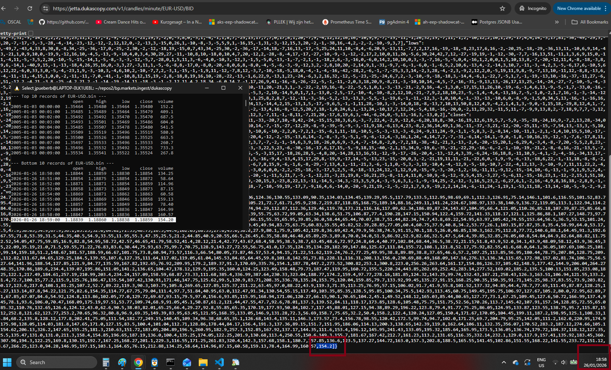

<u>MT4 is decoded.</u>

**Notice:** datafeeds are not updated at provider. They have stopped working since `2026-01-26 18:59:00  1.18839  1.18860  1.18838  1.18859  154.20`. I am monitoring the situation. Readded dump.py script. I will think of creating a warning system to report these `outages`. 

This datasource does not have an SLA. Perhaps its time to start reaching out in order to see if we can get paid access to these feeds, covered by an SLA. Likely a weekly-rebuild.sh will be needed when the source comes back. As a safety precaution. Will let you know.

It's the same error as before: "x-cache: Error from cloudfront". However, there is a difference this time. Data is actually downloadable by our engine. Like it's whitelisted or something, just not updated. Direct browser queries: fail. Private mode: fails. Curl without headers: fails. I am not going to look into further detail atm. I expect the datasource to come back online automatically. 

I am still in a development stage atm and my trading system is NOT YET required to have reliable feeds. When that turning point happens, i am going to pay for the feed in order to get stability. I will certainly reach out at that moment.

When are you ready? In about 2-3 months i am expected to have an automated private cash-ATM. I hope ;)

PS: tip. you can check here: https://www.dukascopy.com/swiss/english/marketwatch/charts/. when these update again, our engine will update as well.

>May the CloudFront caches clear, the origin servers wake up refreshed, and the minutes start flowing again like it's 2025 all over.
whispers to the ether; Blessed be the feed, may it resurrect swiftly and without drama. No more frozen candles at 18:59:00. Let the 1.18859 close become ancient history by morning. Quack quack, amen. 🦆🙏

---

What's next?

This moves to seperate (clean) repository by 31st of January.

I’ve merged the `clean-version` branch into `main`.

I’m currently building a powerful ML-driven bottom sniper. I’m still deciding whether to release it with this repository—features like this usually provide a real edge and are typically kept private. It’s an H4 bottom sniper; the H4 timeframe provides just enough data to train it effectively.

Until I’ve made a final decision, there’s an example included that demonstrates how such a sniper can be built. It’s only an example. An experienced quant should be able to infer how the general machine-learning workflow works by reviewing it. ML is essentially feature engineering followed by model construction. What’s critical is that the indicator delivers exactly the same feature set to the probe (prediction) routines as was used during training.

I’m relatively new to this area myself, but I’m getting up to speed quickly. When working with ML, make sure to implement proper safety gates. As confidence levels increase, additional validation logic should kick in—for example, confirmation using other assets or well-known candle patterns such as gravestones, shooting stars, long-legged dojis, iSHS, SHS, engulfings, and similar formations.

New tip: provide the formations as features to your ML models.

All of this can be implemented in a lightning-fast indicator on this platform. See the examples directory for introductory ML code.

Initially, I experimented with ML and concluded that it wasn’t particularly helpful on the D1 chart. That view changed once I moved to a lower timeframe.

Also, it has now become critical to start handling these rollover gaps in the binary format. This will become one of my primary development area's the upcoming days. Likely a data "side-track" approach will be chosen that automatically corrects on rollovers. The side-track approach basically tracks two seperate data-streams (yes, for rollover assets this will require twice as much storage but you will have access to both the corrected version as well as the "broker-live" version (a corrected set is just another dataset within the system)). The backadjusted set is being "live-tracked"/"incrementally tracked" just in the same way as the broker-live version. So a one minute candle being applied in the broker-live-version will also be applied in the backadjusted version. Resampling-included.

Rollover gaps are absolutely wrecking my indicators and ML models right now. They poison the data, distort the signals, and generally make everything unreliable—so fixing this mess has shot straight into my top-three priorities. I will take on the stocksplits as well. Its more or less the same logic.

I’ve completed an initial exploratory pass. The back-adjustment and stock-split fixes will impact the ETL layer of this engine. DuckDB is being removed. It served us well until it couldn’t efficiently fetch the first 100 records before a given date without a full table scan.

There’s only a small piece left where DuckDB is still in use—the Panama back-adjusted export in the builder component. It’s time to quack it out of existence in this repository.
