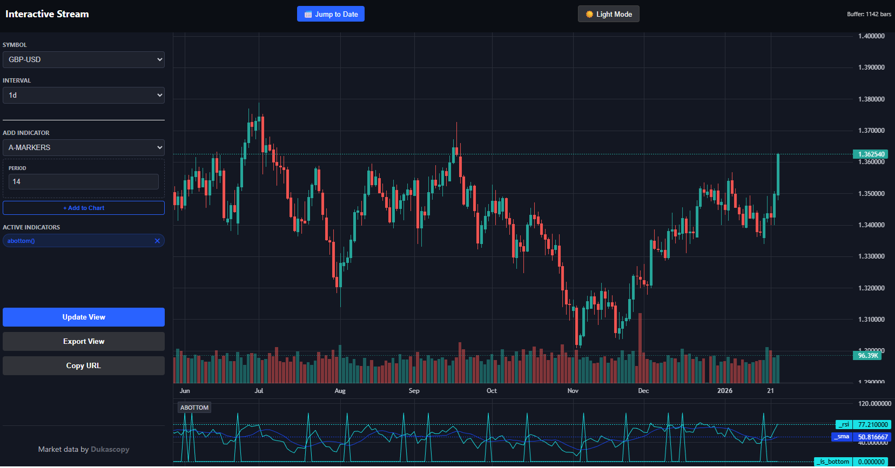

<u>MT4 is decoded.</u>

What's next?

- Final round of public development
- Stabilization
- Private and public version
- Replay/Market simulation
- Relaunch

### Notice: really have to say

Now I am really working on the prediction part, this is really insanely powerful. Especially the last version (not yet released). You can for example put moving averages over RSI, do interdata queries with indicators. And it all. stays. fast. 

You can do something like this on the new version:

```python
import pandas as pd
import numpy as np
from typing import List, Dict, Any
 
def description() -> str:
    return (
        "Bottom Sniper is a reversal-seeking indicator. It fires a signal when... "
    )

def meta() -> Dict:
    return {
        "author": "XXXGoogle Gemini",
        "version": 1.1,
        "panel": 1,
        "verified": 1 
    }

def warmup_count(options: Dict[str, Any]) -> int:
    # Requires 200 bars for EMA 200 stability
    return 600

def calculate(df: pd.DataFrame, options: Dict[str, Any]) -> pd.DataFrame:
    from util.api import get_data

    # Metadata & Data Fetching
    symbol, timeframe = df.iloc[0].symbol, df.iloc[0].timeframe
    after_ms, until_ms, limit = df.iloc[0].time_ms, df.iloc[-1].time_ms, len(df)
    
    rsi_setting = 'rsi_7'
    sma_window = 9
    streak_req = 4
    pip_req = 0.010 # 100 pips for EUR/USD or GBP/USD
    angle_req = 2.5 # Minimum RSI point jump for a "30 degree" sharp turn

    indicators = [rsi_setting]

    # Fetch our data
    ex_df = get_data(symbol, timeframe, after_ms, until_ms + 1, limit, "asc", indicators, {'disable_recursive_mapping': True})

    # Base Indicators
    ex_df['sma'] = ex_df[rsi_setting].rolling(window=sma_window).mean()
    rsi = ex_df[rsi_setting]
    sma = ex_df['sma']
    
    # Detect the "Crush" (Suppression + Pip Drop)
    is_below = rsi < sma
    
    # Track the start price of the RSI dip to measure the 100-pip drop
    is_start = is_below & (~is_below.shift(1).fillna(False))
    ex_df['anchor'] = np.where(is_start, ex_df['close'], np.nan)
    ex_df['anchor'] = ex_df['anchor'].ffill()
    ex_df['anchor'] = np.where(is_below, ex_df['anchor'], np.nan)
    
    price_drop = ex_df['anchor'] - ex_df['low']
    
    # Calculate consecutive bars below SMA
    streak = is_below.groupby((is_below != is_below.shift()).cumsum()).cumcount() + 1
    streak = np.where(is_below, streak, 0)

    # Check if this specific dip qualified as a "Momentum Crush"
    ex_df['crush_qualified'] = (streak >= streak_req) & (price_drop >= pip_req)
    
    # Use rolling max to remember the qualification for up to 20 bars
    # fillna(0).astype(bool) ensures we don't crash when comparing with &
    ex_df['has_history'] = ex_df['crush_qualified'].rolling(window=20, min_periods=1).max().fillna(0).astype(bool)

    # Mark the bar where RSI crosses ABOVE SMA
    crossed_above = (rsi > sma) & (rsi.shift(1) <= sma.shift(1))
    
    # Measure RSI Velocity (Angle)
    rsi_velocity = rsi - rsi.shift(1)
    strong_angle = rsi_velocity >= angle_req

    # We use .shift(1) on history because we want the history to be TRUE 
    # BEFORE the current crossover bar.
    is_bottom_signal = ex_df['has_history'].shift(1).fillna(False) & crossed_above & strong_angle

    # Result Mapping
    results_df = pd.DataFrame({
        'time_ms': ex_df['time_ms'],
        'rsi': rsi,
        'sma': sma,
        'is_bottom': np.where(is_bottom_signal, 100, 0)
    })

    final_res = df[['time_ms']].merge(results_df, on='time_ms', how='left').set_index(df.index)
    
    # Returning RSI and SMA will draw them as lines; is_bottom will draw markers
    return final_res[['rsi', 'sma', 'is_bottom']]
```

Result:



### Notice: clean-version is in the making

I am currently working on the clean-version. This version has undergone another major refactor. It now supports an internal API and performance was pushed even a little bit more. The price-only API has now latency of about 3-5ms(1m, random 2020 date, 1000 records). With 3 indicators-ema,sma,macd-it now pushes around 10ms. That is core-api call. Without the JSON response. Wall time. I will finish this off ASAP and launch it pretty soon. Max 2 weekends away.

Price-only API pushes now ~1.8 million bars per second. 10.000 in ~6ms. Without serialization. This is the max for Python.

### Bonus ML Example: Bottom Detection with Random Forest

this works not oke. building new one


