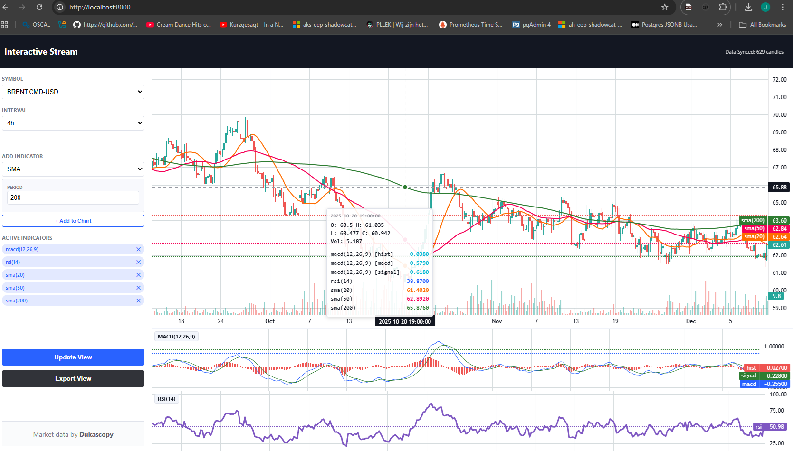

<u>MT4 is decoded.</u>

What’s next?

- Fix the browser lag when you stack indicators and browse more and more into history. \
Currently, no buffer is kept. All candles are stored in browser memory while not in view. \
Those not in view should be sliced an re-retrieved when needed.

- Pushed in: check panama with other source, minor effort. \
See if we can remove "beta state".

- Feature-rich market simulation \
Full high-performance replay functionality. <-- almost there, preconditions almost met :)


## Notice: API 1.1 added (sub-formats)

Because i also need to import stuff to other apps, various format requirements are needed. I have implemented 3 formats for JSON atm.

The most important ones are format 1 (default) and 3 (timeseries-optimized). 2 is an intermediate format.

You can specify the eg `?subformat=3` on the GET URL.

More formats may get added in the future.

## Notice: Release 0.6.6- 2026-01-15

I decided to release 0.6.6. This is a very powerful release. 

- New indicator.html interface allowing CSV exports with stacked indicator support
- New index.html charting interface with indicator support
- New API 1.1 with stacked indicator support
- Warmup issues in API 1.0 have been fixed
- Another round of performance updates on the API
- Increased API record-limit to 40000 (was 1440, then 20000, now 40000)
- Custom indicator support
- Removal of DuckDB

Note that upgrading to this main-branch will break any left-over text-mode installations. Do not upgrade if you wish to stay, for whatever reason, on text-mode. 

If you are still on text-mode and still using default settings, after update, `./setup-dukascopy.sh`, then `./rebuild-full.sh`. Wait for a few minutes. Then `./service.sh restart`. When it gives you a denied (error) `killall python3`, then retry.

Next, openup a browser: `http://localhost:8000/`

**Note:** If you have custom settings. Do not run `./setup-dukascopy.sh`, instead, copy-over the `config/dukascopy/http-docs/*` files to your `config.user/dukascopy/http-docs` directory.

Interactive chart:



**Note:** Before using an existing indicator for an export and making your own analysis with it, check in the `http://localhost:8000/indicator.html` if the indicator has set the meta-flag `verified` to 1. Select the indicator on the lefthand side and check the meta settings on the right hand side. If you see a verified:1, it has been checked by me and confirmed to work correctly.

### 📊 Performance Profiling Report

| Metric | Details |
| :--- | :--- |
| **Symbol** | EUR-USD |
| **Timeframe** | H4 (4-Hour) |
| **Date Range** | 2000 — Present |
| **Total Rows** | 32,821 |
| **Execution Time** | 542ms |
| **Export Size** | 5.8MB |
| **System Load** | 1 Core @ 90% |

---

### 🛠 Active Indicators (10)
* **MACD**: (12, 26, 9)
* **RSI**: (14)
* **Bollinger Bands**: (20, 2.0)
* **SMA**: 20, 50, 100, 200
* **Stochastic**: (14, 3)
* **EMA**: 50, 100 (Requires 300 warmup rows)

---

### ⚡️ Data Processing Efficiency
* **Total Datapoints**: 754,860
* **Throughput (ms)**: ~1,400 datapoints / ms
* **Throughput (sec)**: ~1.4 million datapoints / sec

---

### 📝 Key Takeaways
* **Performance**: Pretty decent for a singlethreaded webservice.
* **Technology**: Very decent for Python.
* **Scalability**: Can update record-limit to 100k.
* **Optimizable**: Yes, more performance can be extracted (later stage).

If you want very high performance, with the current state: Use kubernetes, shared storage (working on same binaries, mounted as read-only-many). Run one webservice per pod, memory 1024MB, assign each pod 1 CPU. Loadbalancing service on top. Loadbalancing protocol round-robin. This is one way of scaling this atm. If, for whatever reason, you might need it. That localhost thingy, if you know how to use kubernetes, then,.. etc.

Price-only data fetching is currently below 10ms for 2000 records. So indicators hit performance, which is perfectly normal. This is why i tried to use a process executor pool to distribute the calculations over the available cores. I found out that the dataframes indexes get misaligned during IPC, leading to shifts in data. I am looking into that but removed the experimental setting poolmode:process from the code-for now-since it would make users very unhappy. Cheers.

PS: to make this work with processpools i need to become somewhat of an Harry Potter. Playing with a magic wand and SHM (Shared memory). The gains will be impressive-once more-when this is done. Number of datapoint calculations are expected to increase from 1.4 million/sec to about 5-6 million/sec-for the above mentioned set. I need the API to be as fast as possible, in case a chained (replay) module queries data from the API.

## Notice: Panama backadjustment "Public beta" live

**Update:** Assuming the rollover values from the broker are correct, this is acceptable. I checked one year of BRENT data. In some cases, a gap remains because applying the broker-specified adjustment can leave a gap—October 2025 is an example—whereas November and September are superbly corrected. You can verify the rollover values in your ```data/rollover``` folder; those are the values being used. I still need to check it against an other datasource with continuous prices. eg to confirm the October one. If that one checks out, i will remove the "beta status".

I’ve implemented an initial version of the Panama backadjustment logic. It’s now available for you to try, although I’m still rigorously testing it myself. At the moment, rollover adjustments are supported for *-USD commodities, *-USX soft-commodities and *TR* bonds. I have tested it with:

- BRENT.CMD-USD
- GAS.CMD-USD
- LIGHT.CMD-USD
- DIESEL.CMD-USD

For these symbols, the adjustment works beautifully. Since Dukascopy applies rollovers at the end of the day, implementing this solution turned out to be much simpler than expected.

I cannot guarantee flawless performance for symbols outside of those tested, which is why the feature is currently in a “public beta” state.

Below is a general explanation of Panama backadjustment and why it is widely used by retail traders, generated with the help of AI:

Panama backadjustment is a method used mainly for futures contracts to create a continuous price series across contract rollovers. When one futures contract expires and trading moves to the next, there is often a price gap caused by differences in contract pricing, not real market movement. Panama backadjustment removes these artificial gaps by calculating the price difference at each rollover and applying cumulative offsets to historical prices.

This is important to traders because it produces clean, continuous charts that preserve true price action, trends, and technical indicator behavior. It is commonly used for technical analysis, backtesting trading strategies, risk modeling, and signal generation, where unadjusted rollover gaps would otherwise distort indicators, trigger false signals, or break historical comparisons.

**Note:** Panama backadjustment modifies the 1-minute base data and resamples all higher timeframes to ensure they align with the adjusted base. The process takes some time, but for most symbols it typically completes in under 30 seconds, depending on your hardware.

Examples:

```sh
./build-csv.sh --select BRENT.CMD-USD:panama/1m --output panama-test.csv
```

Before Panama


After Panama


Completely different perspective. As you can see.

**Note:** This only applies to futures traders. Commodities, Bonds, Indices. For Forex and Crypto it will just skip the logic if you specify it. The ```panama``` modifier will then only just print a warning - that you are trying to apply it for an instrument where its not necessary. 

**Note:** Panama-adjusted data may show negative prices in the distant past. This is normal and expected. Please ensure your backtesting framework can handle such values. If you want to know how to deal with this/when this is a problem, just copy the previous sentence to Gemini and it will guide you.

## Notice: Backfilling

Backfilling is not currently supported, as our pipeline processes data strictly forward. Because of this, historical data—particularly for illiquid pairs and at the highest granularity—may be skewed. Backfilling has been identified as a must-have feature.

We'll provide a script that should be executed once every seven days (run on saturdays). It will re-download the past week of data for all configured symbols and perform a full rebuild. This captures any backfills within that window, effectively addressing ~99.94-99.97% of all backfill issues.

For reference, running this on 26 symbols takes about five minutes (or around 2 minutes 30 seconds if you’re up to date and use the rebuild script)—a small price to pay for accuracy.

```python
Major FX         █░░░░░░░░░ 0.01%  (1 in 7,000-12,500 symbol-days)
Major Crosses    ███░░░░░░░ 0.05%
Illiquid FX      ██████████ 1.1%
Indices          ██░░░░░░░░ 0.09%
Major Crypto     ██████████ 1.3%
Altcoins         ████████████████ 3.5%
```

```sh
crontab -e
```
Add the following line, adjust path accordingly:

```sh
0 1 * * 6 cd /home/repos/bp.markets.ingest/dukascopy && ./rebuild-weekly.sh
```

This configuration triggers the rebuild script at 01:00 each Saturday. It will not conflict with the per-minute ./run.sh cron entry (due to locking). For additional assurance, you may choose to run it daily. Overall, the setup is now far more robust in terms of integrity.

>This is a universal challenge in market-data engineering. Even when working with top-tier, premium data vendors, the moment you download or extract data and begin using it, some portion of it may already be stale due to backfills. It’s an inherent property of financial datasets, not a limitation of this tool. There is no central log or official feed that reliably exposes all historical corrections, making automated detection non-trivial. As a result, every data pipeline—paid or free—must contend with this reality.

The quality of this dataset is on par with what you would receive from commercial providers. The difference is simply that this one is free.

## Notice: What about MT5?

There will be some exploratory research in January. Low priority.

## Notice: What about realtime? Second-level updates

Engine is capable of this. Creating a second-level aggregate file and then calling the incremental cascade every second. The resampling cascade (binary version), on a single-core, is able to push 20 years of EUR-USD data to 10 timeframes in just over 2 seconds. Speed is there. Incrementality is there. 

Hard number: 7844920 candles in 2.5 seconds = ~ 3 million candles/second

Why is it not there? Beyond scope of what i need this for atm. Perhaps in future version.

## Hall of Fame

List of the most "interesting stuff" encountered, during development of this project

**ASX is record holder**
- Monday-specific EPOCH-based candles only during day-session - resolved
- H4 candles spanning 6h10m - resolved
- 2020 severe DST/STD switch issues MT4-side \
  **The decision is:** We are going to replicate the (bug-) behavior through date-range bound, custom,  timeshift support in transform. There are changes for leap-years needed anyhow. The two complement each other.
- Sub-hourly intraday candle offsets at HH:51 and HH:10 - resolved

**SGD**
- Only in winter merge of a 11:51 candle, not in summer, while similar behavior - resolved
- Similarly to ASX, sub-hourly intraday candle at HH:51 - resolved

**MT4 general**
- Leap-year only lag of STD switch - unresolved (will solve in boundaries logic)
- Interesting DST/STD switch logic, based on NY DST state either GMT+2/GMT+3 - resolved
- 4x DST/STD annual switches per timezone-dependent asset - resolved

**Performance**
- Unexpected very high performance of Python in binary mode.

**AI**
- AI CANNOT be used for complex logic - it hallucinates and fails on edge cases
- AI CAN be used for docstring and inline commenting of code - it excels at that
- AI CAN be used for QA purposes - it actually found a bug that really mattered
- AI CAN be used for generic HTML and Javascript implementations - it excels at that
- AI CAN be really funny - especially Grok!

I think the solution came out really really well.

"In the intricate tapestry of apparent chaos, true mastery lies not in imposing order upon the unknown, but in patiently decoding its hidden patterns—until one day, with quiet revelation, we declare: the enigma is unveiled, and what was once obscure now illuminates the path for all."

Wishing you all a highly profitable 2026! 🚀


