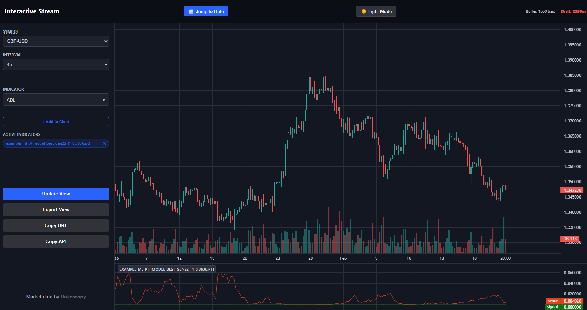
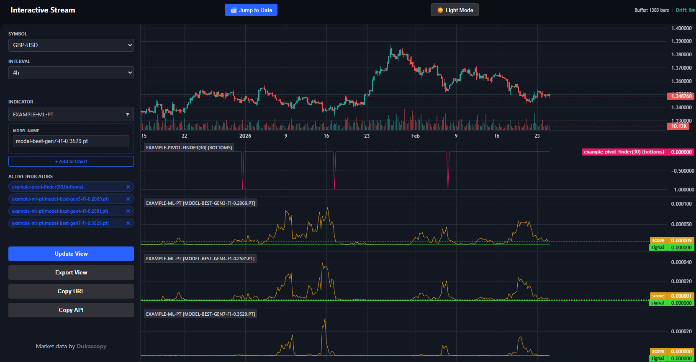
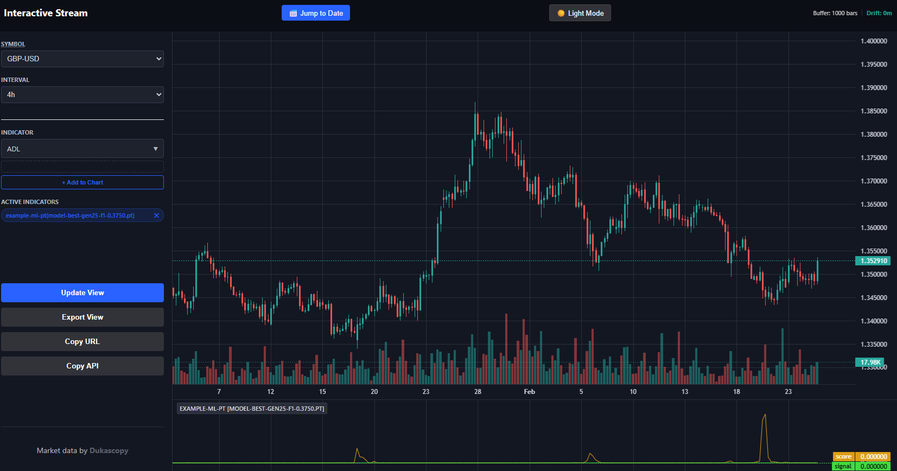

# ML

A beta "play-version" is released. You can find it in the ml folder. It's research-grade stuff and may be still a bit rough. You need a cuda-capable GPU to use this feature.

It's promising but serious work that (still) requires brutal validation.

At minimum this can be used as an additional "signal"-filter. I have something working with that and works pretty good.

This is the result of a trained model on EUR-USD, applied to GBP-USD. The data for training was strictly cutoff at 2025-12-31. It has never seen the 2026 data. No leakage. 

For "a first attempt" it's definately not bad.



I have build another "singularity" (evolution engine). This one seems to perform much better. Without Kinetics. I am restoring the Kenetics functionality for this version and then launch it. The models this "PulsarSingularity" produces look superior over previous versions. I am talking about the scoring. The signalling is still not optimal. Requires another iteration. 

Here you can see how the models evolve. You see that noise is getting more and more suppressed and the signals are becoming better each evolution. Note: still is not trained on 2026 data. 2026 is completely out-of-training. This is qua-10-times checked by now.

Again, GBP-USD with a model trained on EUR-USD. A lot of macro stuff is in the genes.



>For own reference: models generated by the locked-down Andromeda universe.

Note: it doesnt have to fire on all pivots. I want it to fire only when its a high RR signal. Thats what i am configuring this for. I could build a carpet bomber but that misses the whole point. 

Adding macro data and divergence between certain assets increased reliability. But again: still research, still requires massive validation.

I will share one of my universes-i got like 10-later so you can try this yourself (validate my screenshots).

Before the new release i will also add support for "factory overrides" so that every part of the system can be overridden through your `config.user` directory. So the core doesnt break any custom implementations.

So far, the model was right on that latest GBPUSD bottom. GBP about to breakout.

Also, if you are testing this stuff. Dont just look at the highest F1 models. The lower ones might actually be more valuable.



It creates incredibly tiny signals. Signals in the order of e-9 but "flatline" is at e-20. This needs to improve before i can release the new version. It's (likely) calibration. Not a flaw in the code. It marks correctly, macro genes are the main driver.

I will be doing a real replay test with a model soon. This week. When the signalling is fixed.

Tbh this is "too perfect". 25 percent 2-3 candles before low (forming stage), 50 percent 1 bar before and 25 percent at the actual low. It is too perfect almost. Raises suspicion. Thats why this test, soon now. This model is stored safely. Just in case it might be "the real thing"

To be continued,...

# 🚀 Release Update: Developer UX & Surgical Maintenance

This project is a high-performance market research and analysis tool focused on feature engineering. While optimized for **"mechanical sympathy"** at the hardware level, these latest additions focus on improving the daily workflow for developers and researchers.

---

## 🖥️ Interface & DX Improvements

We have applied several targeted improvements to the web interface to streamline the developer experience (DX) and speed up cross-asset configuration:

* **Indicator Tooltips:** You can now hover over any indicator in the selection box to see its specific description and parameter requirements.
* **`Copy API` Button:** A new utility to instantly translate your current chart state (Symbol, Timeframe, visible window, and active indicators) into a ready-to-use internal Python API call.
* **Quick Symbol Copy:** Clicking the "Symbol" label directly above the selector now copies the symbol name to your clipboard. This is designed to speed up correlation studies or the configuration of benchmark indicators (e.g., Pearson correlation).

> [!IMPORTANT]
> To enable these features, you must copy the latest files from `config/dukascopy/http-docs` to your `config.user/dukascopy/http-docs` directory.

### Example `Copy API` Output
The following string is generated based on your current viewport and indicator stack:

```python
get_data('AAPL.US-USD', '1h', after_ms=1767362400000, limit=1000, order="asc",
  indicators=["aroon_14","bbands_20_2.0","feature-mad_20_close_sma",
              "feature-nprice_14_close_log","feature-natr_14_0","feature-vzscore_20_log"], 
  options={**options, "return_polars": True})
```

## 🛠️ Surgical Maintenance Tools

The rebuild logic has been optimized to support targeted operations. This allows you to repair or update specific instruments without performing a "scorched-earth" rebuild of the entire data warehouse.

### 1. Targeted Full Rebuilds
You can now rebuild specific symbols and their associated aliases (Sidetracked/Adjusted sets) across all layers (**transform**, **aggregate**, **resample**):

**Bash**
```bash
./rebuild-full.sh --symbol BRENT.CMD-USD --symbol AAPL.US-USD
```

You can also use this when you have just added a new symbol `./rebuild-full.sh --symbol NEWSYMBOL`.

### 2. Targeted Weekly "Safety-Net"
For instruments dealing with illiquid data or those requiring regular backfill maintenance (where brokers often retroactively change the last few days of data), `rebuild-weekly.sh` now supports the same targeted syntax:

**Bash**
```bash
./rebuild-weekly.sh --symbol ETH-USD
```

### ⚠️ Important Notes

* **Back-Adjusted Sets:** When rebuilding adjusted sets (e.g., `BRENT.CMD-USD-PANAMA`), ensure you specify the origin (source) symbol.
* **Naming:** Always ensure adjusted sets are prefixed with the original symbol (e.g., `SYMBOL-RR`).
* **Performance:** A targeted rebuild of a symbol with two aliases takes approximately **25 seconds**. Most of this time is spent scanning for missing data to ensure integrity, but I/O is strictly limited to the specified instruments.

---

### 📚 New & Updated Documentation

We have added several deep-dive guides to help you leverage the latest performance and adjustment features:

* **[Adjustments.md](adjustments.md)** – Implementation guide for Panama rolls, Dividends, and Multiplicative splits.
* **[Templates.md](templates.md)** – Guidelines for "God-tier" indicator performance using Polars/Rust to bypass the Python GIL.
* **[Code Examples](../config/plugins/indicators/)** – Direct reference for plugin and indicator development.


