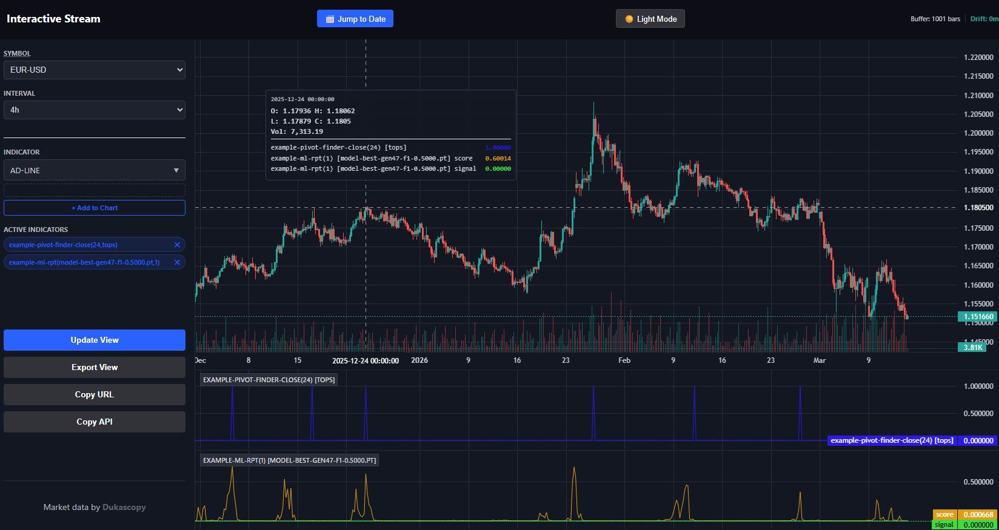
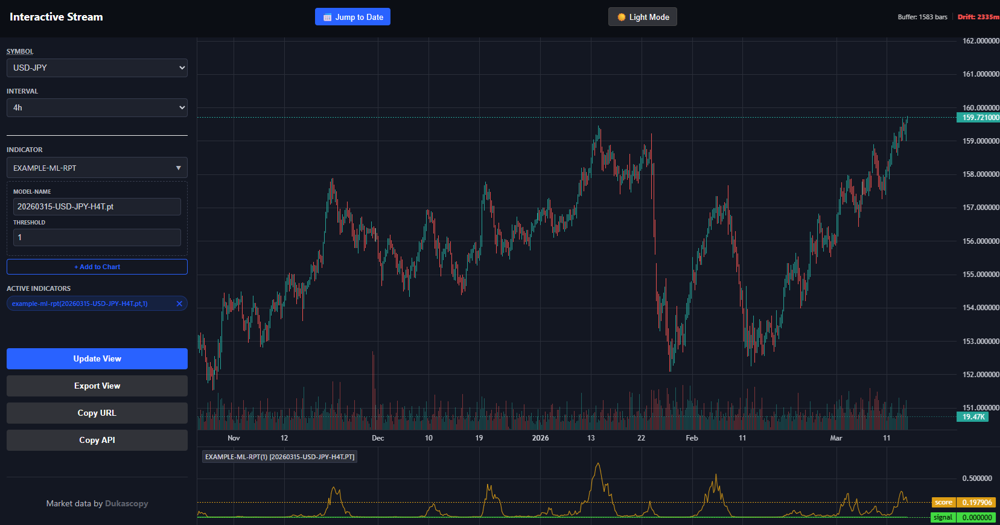

## ML

**Note:** To release at least something atm, i have decided to put an "experimental/rpulsar" branch up. The branch contains an example configuration for the RPulsar and detecting USD-JPY H4 tops. However, read the important notices below.

There is still work to do. Some bottoms are V-shapes, others are consolidating for some time. For even better detection some additional changes are needed. 

I am currently looking into the works of 

- ~~Prof. Terry Lyons (Oxford)~~
- Bai, Kolter, Koltun, 2018
- Perry Kaufman and
- John Ehlers

to solve the final issues.

Sorry this takes a bit. It's advanced. 

Update: getting really really close now. Rough path was not the solution. The solution seems to be in an other path (Macro-stencil CNN).

This is with a DEFAULT SET of features and FULLY OOS. Never seen data. Works on live edge. Almost tradeable. Almost. One of the tops is missed. The biggest one. It frontruns it. Seems a feature-issue. So am re-adding macro-features.

I have released an experimental branch. Note that this branch required Python 3.9 and a GPU. 

It contains an example configuration for the RPulsar and detecting USD-JPY H4 tops. It is signalling that a potential top may be in atm but with this war-stuff going on it may be incorrect. Japan is heavily import-net dependent on oil. Currently not a safe-haven. Yen could crash all the way to 165. Historically, the BOJ intervened when Yen became too weak, around USDJPY 160 (the BOJ psychological barrier). Extra caveat for Yen: the whole retail world is shorting USD-JPY atm, so there is a nice liquidity pool on the upside (stoplosses). Sentiment is over 80 percent short. Which is a huge warning flag to not yet short this.

This is a perfect example of why tops-detection cannot fully work in "special contexts".

If you use this stuff. Be aware of this. 

Final note: higher F1 does not mean better model. For USDJPY my best model is actually F1 0.1333.

## 🚀 Release Update: Developer UX & Surgical Maintenance

This project is a high-performance market research and analysis tool focused on feature engineering. While optimized for **"mechanical sympathy"** at the hardware level, these latest additions focus on improving the daily workflow for developers and researchers.

