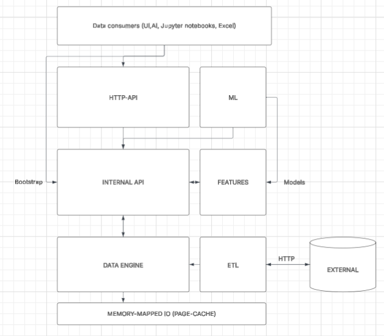
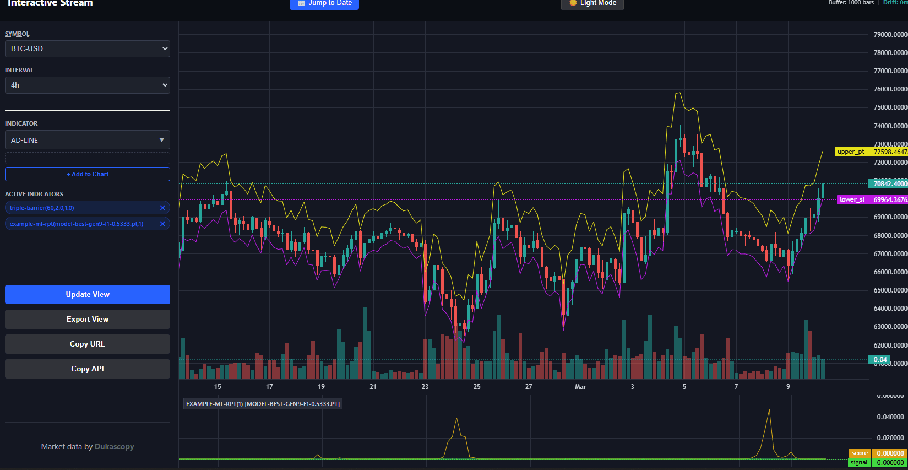

## HL 

Because i need to give a demo tomorrow. Here is a high-level overview of this architecture.

Stays public. No worries.

## Less updates

There have been a bit less updates and fixes. I was "completely into the transformers" for days. Now I have eliminated them-they are just not suitable for this, extended the default engine with temporal lookback features and after initial tests shown to be very promising I am back on the original track. Back to earth :)

## New Python and Polars version

I have upgraded to a newer Python and a newer version of Polars. I saw that the unit-tests are broken and a lot of stuff has become deprecated. Only now i find out that stuff breaks on a newer Python version. 

I am fixing it. I will launch these fixes together with the new RPulsar engine. Somewhere this week.

I will add update instructions.

## ML

Maybe a breakthrough. Standard transformers are very hard to use for very sparse events. The problem is the loss function. When you have only 1.3 percent of events it is very easy for a model to just predict 0 since it gives ~99 percent accuracy. I tried many things to get transformers to work, focal loss functions, additional penalties for being wrong, dynamic penalties, gaussian blur to make bottoms a multicandle event, sliding OOS windows to prevent it from memorizing timestamps and so on and on and on. The architecture complexity increased by magnitudes, so i decided to abandon the transformers.

Instead i extended the neuro-evolution with lookback properties. The new engine "can see in the past". It can detect "certain moves" in indicators leading up to the event. 

It may be a first breakthrough but I am heavily testing this first. 

Next on the list is regime detection.

What are you trying to achieve? Find rare precursor patterns before reversals. Exploit them.

What is the current focus of the research? Temporal pattern recognition across a broad search space. I will soon start the "killer-search". Still writing features for that.

One interesting observation is that, with this R(ecurrent)Pulsar, the models are way more transferable. I will post animated gifs soon of this.

This is what I am working on. Signals are currently still faint-scaling issue-but we are getting closer. This works on the live-edge.

>Note: this is an non-optimized run. I just threw a random set of features at it. Imagine when i execute tailored features at it.... (still building). What is most interesting is that it also "seems to work" for a reverse pair (USD-JPY). So it really found market structure.

It is not great (yet) but slowly, bit-by-bit, getting there. This is a lot of work, a lot of research and measure and "inventing".

Note: 2026 is unseen data for this model. So everything you see is completely OOS (Out-of-sample). Regime detection needs to be added.

Why do you share this? Because it goes in a very promising direction? The secret is not in the engine. The secret is in the features. See it like this: There is a pond of fish, i give you the rod. It's up to you what weights and material you use on the hook.

## 🚀 Release Update: Developer UX & Surgical Maintenance

This project is a high-performance market research and analysis tool focused on feature engineering. While optimized for **"mechanical sympathy"** at the hardware level, these latest additions focus on improving the daily workflow for developers and researchers.

