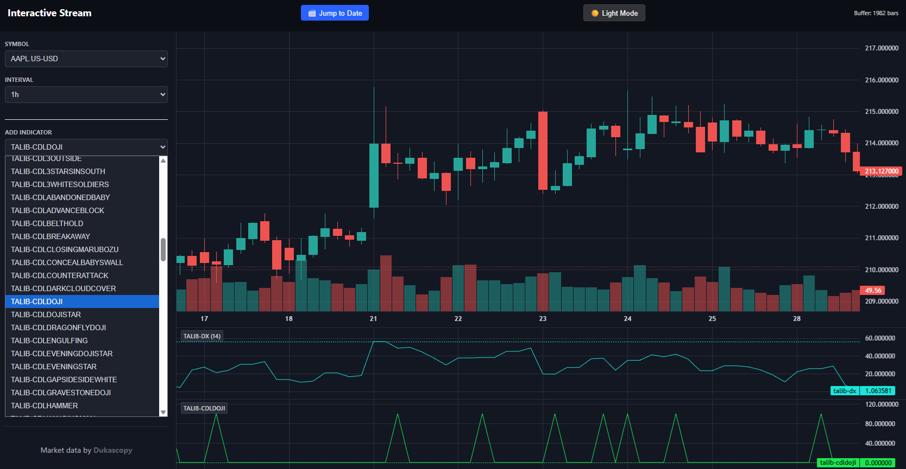

**TA-lib indicators**

In order to ensure quality I have tested some indicators against TA-lib, implemented through a unit-test. Users having Python ta-lib installed will be able to run the test. When TA-lib is not installed the unit-test will skip.

These have been checked and are-now-compliant to TA-lib:

- ADX
- AROON
- ATR
- ATRP
- BBANDS
- CCI
- CHAIKIN
- CMO
- EMA
- EOM
- MACD
- MIDPOINT
- MFI
- OBV
- PSAR
- ROC
- RSI
- SMA
- STOCHASTIC
- STDDEV
- UO
- WILLIAMSR

**Note:** It can be "a bit difficult" (under WSL2) to install ta-lib for Python. https://pypi.org/project/TA-Lib/

**Note:** If you have Python TA-lib v0.6x installed, you can now generate all indicators for this project. `python3 generators/talib-indicators.py`. For `power users` that already have TA-lib installed, you can run it already. For users that cannot just simply `pip install TA-lib` and are getting compile errors, please have a bit of patience. Documentation on how to do this [is coming](talib-indicators.md). I did a quick validation round and it looks actually very good. Also a search-box is coming in the interface. Also the annoying refresh and reset to ADL as soon as you add anything or change timeframe will get resolved. 

Auto-LLM: The signals are validated as correct (ofcourse they are, it's an industry standard lib).

**Note**: some are (not yet) working. I had issues with the ht_period etc before. The ones that dont work (just a few) are known to me and will get fixed. Lastly Sunday all will work. There are now about 140 indicators in the system. Note that the indicators will get converted to pure polars eventually but this is a tedious job and the current talib-approach gives already good results. Especially the candle-pattern detections are a very nice add-on-i am writing these myself too (need them normalized). 

Because the talib-indicators are generated in the config.user directory you may decide to keep all talib-ones, even when they are converted to polars-direct. From time-to-time I will perform conversions. Another bulk-conversion is planned for Sunday.



**Good practice advice when you are building your own indicators**

Since there is currently no "run-time" protection for recursion loops caused by custom indicators, i have added a unit-test which does the checking for recursivity loops. This is a V1 version of the recursion guard, a V2 is coming. The V1 version does not yet take the indicator options into account. Eg first loop you call test-sma_20 and second recursive call you call test-sma_50... this is currently caught as an unlimited loop call when calling with same timeframe and symbol. 

How to test your indicators? Simple. Just run `./run-tests.sh` regularly when developing complex recursive indicators.

Eg this is covered now: 

```python
# this indicator name = test-sma, we call it with EUR-USD/1m
def calculate(df: pd.DataFrame, options: Dict[str, Any]) -> pd.DataFrame:
    """
    High-performance vectorized Simple Moving Average (SMA).
    """
    # This will error after the second recursive call 1m->5m->5m->error
    df = get_data( \
        timeframe="5m", symbol="EUR-USD", \
        after_ms=0, until_ms=132896743634786, limit=1000, \
        indicators=['test-sma'] \
    )

    # This will error after first call 1m->1m->error
    df = get_data_auto(df, indicators=['test-sma'])

    ...

```

Hope this helps a bit to keep your indicator/feature stack and the engine a bit safe.

**19 new indicators**

19 new indicators were added. These were "quick-wins".

- **Fast Indicators**: Most use pure Polars vectorization
- **Recursive Indicators**: McGinley, Kalman, SuperTrend use Python loops
- **Heavy Indicators**: Volume/Market Profile use O(n²) histograms

I will have another quality pass on them soon.

**Performance fixes**

Performance fixes have been applied. Update entails:

- Hybrid Polars/Pandas indicator engine
- Native Polars dataframe support from get_data API
- All system indicators have been converted
- Performance +12.5x on 1 million with 55 indicators. Polars only indicators. With return_polars=True ~520ms.
- Performance +8-10x on 1 million with 55 indicators. Mix of high perf hybrids. Without return_polars=True ~730ms.
- Cleaning up here and there.

Profiling showed that >90 percent of time is now going to Polars high-perf rust engine.

I think we have now maxed out what is possible for this stack. There was one more performance update added. Batched execution of Polars expressions (to prevent graph explosion on very wide column data) plus we keep the original fp64 precision intact (no rounding). Rounding is now up to the caller's discretion. Some may need 4 decimals, others 8, fixed rounding at 6 inside the engine was a bad idea anyhow.

I tried the most crazy configurations you can think of and profiled them all. I can't find anything more to tune. This should be the solid performance-base to build the rest on-top. I calculated that it's achieving over 4GB/s in memory bandwidth. That's really impressive for a laptop ryzen 7 nvme combo.

Have a great day.

Current Laptop: ~4.7 GB/s (Impressive).

Ryzen 9 9950X: ~14 GB/s (AVX-512 is the game changer, testing with this setup soon).

Threadripper: ~25 GB/s (Unlocks "Wide" datasets with 10k+ columns).

CPU is maximally saturated at 80 percent. Higher is not possible since the FPU units are fully allocated. I have 16 threads but "only" 8 FPU's. 2 threads share one FPU. So when one thread is using a FPU for 100 percent, the other thread is in wait state, idle. This gives the "illusion" we are not maxing out the cores. There is a term for this SMT-wait/SMT-contention/Execution unit saturation. 

**Next**

Hardening, quality. Then. Splitting up ETL to make more modular-more kubernetes friendly, retaking performance there-and adding a high-speed comm-layer.

**Status: feeds have returned to operational**

Feeds are back online. No further actions required.

Update: I’ve been in contact with Dukascopy, and they’ve confirmed that the technical hiccups were on their side—they’ve since been fixed. Carry on was the message i read from it.


**List of ta-lib custom indicators**

```sh
Registered plugin config.user/plugins/indicators/talib-ad.py succesfully.
Registered plugin config.user/plugins/indicators/talib-add.py succesfully.
Registered plugin config.user/plugins/indicators/talib-adosc.py succesfully.
Registered plugin config.user/plugins/indicators/talib-adxr.py succesfully.
Registered plugin config.user/plugins/indicators/talib-apo.py succesfully.
Registered plugin config.user/plugins/indicators/talib-aroonosc.py succesfully.
Registered plugin config.user/plugins/indicators/talib-atan.py succesfully.
Registered plugin config.user/plugins/indicators/talib-avgprice.py succesfully.
Registered plugin config.user/plugins/indicators/talib-beta.py succesfully.
Registered plugin config.user/plugins/indicators/talib-bop.py succesfully.
Registered plugin config.user/plugins/indicators/talib-cdl2crows.py succesfully.
Registered plugin config.user/plugins/indicators/talib-cdl3blackcrows.py succesfully.
Registered plugin config.user/plugins/indicators/talib-cdl3inside.py succesfully.
Registered plugin config.user/plugins/indicators/talib-cdl3linestrike.py succesfully.
Registered plugin config.user/plugins/indicators/talib-cdl3outside.py succesfully.
Registered plugin config.user/plugins/indicators/talib-cdl3starsinsouth.py succesfully.
Registered plugin config.user/plugins/indicators/talib-cdl3whitesoldiers.py succesfully.
Registered plugin config.user/plugins/indicators/talib-cdlabandonedbaby.py succesfully.
Registered plugin config.user/plugins/indicators/talib-cdladvanceblock.py succesfully.
Registered plugin config.user/plugins/indicators/talib-cdlbelthold.py succesfully.
Registered plugin config.user/plugins/indicators/talib-cdlbreakaway.py succesfully.
Registered plugin config.user/plugins/indicators/talib-cdlclosingmarubozu.py succesfully.
Registered plugin config.user/plugins/indicators/talib-cdlconcealbabyswall.py succesfully.
Registered plugin config.user/plugins/indicators/talib-cdlcounterattack.py succesfully.
Registered plugin config.user/plugins/indicators/talib-cdldarkcloudcover.py succesfully.
Registered plugin config.user/plugins/indicators/talib-cdldoji.py succesfully.
Registered plugin config.user/plugins/indicators/talib-cdldojistar.py succesfully.
Registered plugin config.user/plugins/indicators/talib-cdldragonflydoji.py succesfully.
Registered plugin config.user/plugins/indicators/talib-cdlengulfing.py succesfully.
Registered plugin config.user/plugins/indicators/talib-cdleveningdojistar.py succesfully.
Registered plugin config.user/plugins/indicators/talib-cdleveningstar.py succesfully.
Registered plugin config.user/plugins/indicators/talib-cdlgapsidesidewhite.py succesfully.
Registered plugin config.user/plugins/indicators/talib-cdlgravestonedoji.py succesfully.
Registered plugin config.user/plugins/indicators/talib-cdlhammer.py succesfully.
Registered plugin config.user/plugins/indicators/talib-cdlhangingman.py succesfully.
Registered plugin config.user/plugins/indicators/talib-cdlharami.py succesfully.
Registered plugin config.user/plugins/indicators/talib-cdlharamicross.py succesfully.
Registered plugin config.user/plugins/indicators/talib-cdlhighwave.py succesfully.
Registered plugin config.user/plugins/indicators/talib-cdlhikkake.py succesfully.
Registered plugin config.user/plugins/indicators/talib-cdlhikkakemod.py succesfully.
Registered plugin config.user/plugins/indicators/talib-cdlhomingpigeon.py succesfully.
Registered plugin config.user/plugins/indicators/talib-cdlidentical3crows.py succesfully.
Registered plugin config.user/plugins/indicators/talib-cdlinneck.py succesfully.
Registered plugin config.user/plugins/indicators/talib-cdlinvertedhammer.py succesfully.
Registered plugin config.user/plugins/indicators/talib-cdlkicking.py succesfully.
Registered plugin config.user/plugins/indicators/talib-cdlkickingbylength.py succesfully.
Registered plugin config.user/plugins/indicators/talib-cdlladderbottom.py succesfully.
Registered plugin config.user/plugins/indicators/talib-cdllongleggeddoji.py succesfully.
Registered plugin config.user/plugins/indicators/talib-cdllongline.py succesfully.
Registered plugin config.user/plugins/indicators/talib-cdlmarubozu.py succesfully.
Registered plugin config.user/plugins/indicators/talib-cdlmatchinglow.py succesfully.
Registered plugin config.user/plugins/indicators/talib-cdlmathold.py succesfully.
Registered plugin config.user/plugins/indicators/talib-cdlmorningdojistar.py succesfully.
Registered plugin config.user/plugins/indicators/talib-cdlmorningstar.py succesfully.
Registered plugin config.user/plugins/indicators/talib-cdlonneck.py succesfully.
Registered plugin config.user/plugins/indicators/talib-cdlpiercing.py succesfully.
Registered plugin config.user/plugins/indicators/talib-cdlrickshawman.py succesfully.
Registered plugin config.user/plugins/indicators/talib-cdlrisefall3methods.py succesfully.
Registered plugin config.user/plugins/indicators/talib-cdlseparatinglines.py succesfully.
Registered plugin config.user/plugins/indicators/talib-cdlshootingstar.py succesfully.
Registered plugin config.user/plugins/indicators/talib-cdlshortline.py succesfully.
Registered plugin config.user/plugins/indicators/talib-cdlspinningtop.py succesfully.
Registered plugin config.user/plugins/indicators/talib-cdlstalledpattern.py succesfully.
Registered plugin config.user/plugins/indicators/talib-cdlsticksandwich.py succesfully.
Registered plugin config.user/plugins/indicators/talib-cdltakuri.py succesfully.
Registered plugin config.user/plugins/indicators/talib-cdltasukigap.py succesfully.
Registered plugin config.user/plugins/indicators/talib-cdlthrusting.py succesfully.
Registered plugin config.user/plugins/indicators/talib-cdltristar.py succesfully.
Registered plugin config.user/plugins/indicators/talib-cdlunique3river.py succesfully.
Registered plugin config.user/plugins/indicators/talib-cdlupsidegap2crows.py succesfully.
Registered plugin config.user/plugins/indicators/talib-cdlxsidegap3methods.py succesfully.
Registered plugin config.user/plugins/indicators/talib-ceil.py succesfully.
Registered plugin config.user/plugins/indicators/talib-correl.py succesfully.
Registered plugin config.user/plugins/indicators/talib-cos.py succesfully.
Registered plugin config.user/plugins/indicators/talib-cosh.py succesfully.
Registered plugin config.user/plugins/indicators/talib-dema.py succesfully.
Registered plugin config.user/plugins/indicators/talib-div.py succesfully.
Registered plugin config.user/plugins/indicators/talib-dx.py succesfully.
Registered plugin config.user/plugins/indicators/talib-exp.py succesfully.
Registered plugin config.user/plugins/indicators/talib-floor.py succesfully.
Registered plugin config.user/plugins/indicators/talib-ht_dcperiod.py succesfully.
Registered plugin config.user/plugins/indicators/talib-ht_dcphase.py succesfully.
Registered plugin config.user/plugins/indicators/talib-ht_phasor.py succesfully.
Registered plugin config.user/plugins/indicators/talib-ht_sine.py succesfully.
Registered plugin config.user/plugins/indicators/talib-ht_trendline.py succesfully.
Registered plugin config.user/plugins/indicators/talib-ht_trendmode.py succesfully.
Registered plugin config.user/plugins/indicators/talib-kama.py succesfully.
Registered plugin config.user/plugins/indicators/talib-linearreg.py succesfully.
Registered plugin config.user/plugins/indicators/talib-linearreg_angle.py succesfully.
Registered plugin config.user/plugins/indicators/talib-linearreg_intercept.py succesfully.
Registered plugin config.user/plugins/indicators/talib-linearreg_slope.py succesfully.
Registered plugin config.user/plugins/indicators/talib-ln.py succesfully.
Registered plugin config.user/plugins/indicators/talib-log10.py succesfully.
Registered plugin config.user/plugins/indicators/talib-ma.py succesfully.
Registered plugin config.user/plugins/indicators/talib-macdext.py succesfully.
Registered plugin config.user/plugins/indicators/talib-macdfix.py succesfully.
Registered plugin config.user/plugins/indicators/talib-mama.py succesfully.
Registered plugin config.user/plugins/indicators/talib-mavp.py succesfully.
Registered plugin config.user/plugins/indicators/talib-max.py succesfully.
Registered plugin config.user/plugins/indicators/talib-maxindex.py succesfully.
Registered plugin config.user/plugins/indicators/talib-medprice.py succesfully.
Registered plugin config.user/plugins/indicators/talib-midprice.py succesfully.
Registered plugin config.user/plugins/indicators/talib-min.py succesfully.
Registered plugin config.user/plugins/indicators/talib-minindex.py succesfully.
Registered plugin config.user/plugins/indicators/talib-minmax.py succesfully.
Registered plugin config.user/plugins/indicators/talib-minmaxindex.py succesfully.
Registered plugin config.user/plugins/indicators/talib-minus_di.py succesfully.
Registered plugin config.user/plugins/indicators/talib-minus_dm.py succesfully.
Registered plugin config.user/plugins/indicators/talib-mom.py succesfully.
Registered plugin config.user/plugins/indicators/talib-mult.py succesfully.
Registered plugin config.user/plugins/indicators/talib-natr.py succesfully.
Registered plugin config.user/plugins/indicators/talib-plus_di.py succesfully.
Registered plugin config.user/plugins/indicators/talib-plus_dm.py succesfully.
Registered plugin config.user/plugins/indicators/talib-ppo.py succesfully.
Registered plugin config.user/plugins/indicators/talib-rocp.py succesfully.
Registered plugin config.user/plugins/indicators/talib-rocr.py succesfully.
Registered plugin config.user/plugins/indicators/talib-rocr100.py succesfully.
Registered plugin config.user/plugins/indicators/talib-sar.py succesfully.
Registered plugin config.user/plugins/indicators/talib-sarext.py succesfully.
Registered plugin config.user/plugins/indicators/talib-sin.py succesfully.
Registered plugin config.user/plugins/indicators/talib-sinh.py succesfully.
Registered plugin config.user/plugins/indicators/talib-sqrt.py succesfully.
Registered plugin config.user/plugins/indicators/talib-stddev.py succesfully.
Registered plugin config.user/plugins/indicators/talib-stochf.py succesfully.
Registered plugin config.user/plugins/indicators/talib-stochrsi.py succesfully.
Registered plugin config.user/plugins/indicators/talib-sub.py succesfully.
Registered plugin config.user/plugins/indicators/talib-sum.py succesfully.
Registered plugin config.user/plugins/indicators/talib-t3.py succesfully.
Registered plugin config.user/plugins/indicators/talib-tan.py succesfully.
Registered plugin config.user/plugins/indicators/talib-tanh.py succesfully.
Registered plugin config.user/plugins/indicators/talib-tema.py succesfully.
Registered plugin config.user/plugins/indicators/talib-trange.py succesfully.
Registered plugin config.user/plugins/indicators/talib-trima.py succesfully.
Registered plugin config.user/plugins/indicators/talib-trix.py succesfully.
Registered plugin config.user/plugins/indicators/talib-tsf.py succesfully.
Registered plugin config.user/plugins/indicators/talib-typprice.py succesfully.
Registered plugin config.user/plugins/indicators/talib-var.py succesfully.
Registered plugin config.user/plugins/indicators/talib-wclprice.py succesfully.
Registered plugin config.user/plugins/indicators/talib-wma.py succesfully.
```


