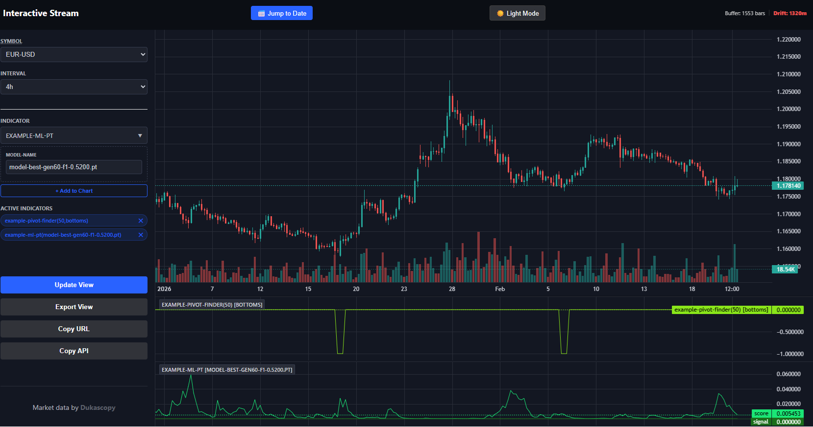

# ML

Update: Am applying some magic to it. Out-of-the-box ideas. Lets see what this overnight run brings.

Update: I have been playing with this for a couple of days now. Its not the golden egg. It comes close at times,... but on OOS tests precision drops on average 10-25 percent. It is usable but it needs a lot of additional PNL testing, other asset testing and so on. I am building a robust "universe"-alike version of this atm. Will be merged when ready. Perhaps with more and better indicators precision can stabilize on OOS. Perhaps addition of macro-economic data will help too. 

Note: its not horrible but also not 100 percent reliable.

Here is a screenshot of an 100% OOS test. Trained 2022-2025. OOS on 2026 (it has never seen the data):



As you can see i widened the bottom-signals to decrease "sparsity". Also my new "extension"-class now includes 3 extra columns per feature column for strength, direction and another thing ;) indication.

Running it overnight again.

**Important:** This is a research project focusing on biometric feature discovery rather than public price action; it treats the GPU as a reactor to mine high-order, non-linear confluences that remain invisible to standard arbitrage. By discarding raw OHLCV data in favor of an evolved genomic population of indicators, the system generates unique "Genesis Blocks" of alpha that are statistically anchored to market physics.


This is a different method of backtesting. Normally you have an idea and you test it. In this method you add your custom signal generators, feed it into an engine and have it evolve together with all indicators and have IT find a strategy for you, eg with a > 80 percent precision. This code has (attempted) protection against overfitting (using rolling windows,master holdout, precision bias) but i am still researching, optimizing and testing it. This part will become the cathedral of this project if tests checkout. This is (one of) the original idea(s) behind this project.

It's serious work but requires brutal validation.

# 🚀 Release Update: Developer UX & Surgical Maintenance

This project is a high-performance market research and analysis tool focused on feature engineering. While optimized for **"mechanical sympathy"** at the hardware level, these latest additions focus on improving the daily workflow for developers and researchers.

---

## 🖥️ Interface & DX Improvements

We have applied several targeted improvements to the web interface to streamline the developer experience (DX) and speed up cross-asset configuration:

* **Indicator Tooltips:** You can now hover over any indicator in the selection box to see its specific description and parameter requirements.
* **`Copy API` Button:** A new utility to instantly translate your current chart state (Symbol, Timeframe, visible window, and active indicators) into a ready-to-use internal Python API call.
* **Quick Symbol Copy:** Clicking the "Symbol" label directly above the selector now copies the symbol name to your clipboard. This is designed to speed up correlation studies or the configuration of benchmark indicators (e.g., Pearson correlation).

> [!IMPORTANT]
> To enable these features, you must copy the latest files from `config/dukascopy/http-docs` to your `config.user/dukascopy/http-docs` directory.

### Example `Copy API` Output
The following string is generated based on your current viewport and indicator stack:

```python
get_data('AAPL.US-USD', '1h', after_ms=1767362400000, limit=1000, order="asc",
  indicators=["aroon_14","bbands_20_2.0","feature-mad_20_close_sma",
              "feature-nprice_14_close_log","feature-natr_14_0","feature-vzscore_20_log"], 
  options={**options, "return_polars": True})
```

## 🛠️ Surgical Maintenance Tools

The rebuild logic has been optimized to support targeted operations. This allows you to repair or update specific instruments without performing a "scorched-earth" rebuild of the entire data warehouse.

### 1. Targeted Full Rebuilds
You can now rebuild specific symbols and their associated aliases (Sidetracked/Adjusted sets) across all layers (**transform**, **aggregate**, **resample**):

**Bash**
```bash
./rebuild-full.sh --symbol BRENT.CMD-USD --symbol AAPL.US-USD
```

You can also use this when you have just added a new symbol `./rebuild-full.sh --symbol NEWSYMBOL`.

### 2. Targeted Weekly "Safety-Net"
For instruments dealing with illiquid data or those requiring regular backfill maintenance (where brokers often retroactively change the last few days of data), `rebuild-weekly.sh` now supports the same targeted syntax:

**Bash**
```bash
./rebuild-weekly.sh --symbol ETH-USD
```

### ⚠️ Important Notes

* **Back-Adjusted Sets:** When rebuilding adjusted sets (e.g., `BRENT.CMD-USD-PANAMA`), ensure you specify the origin (source) symbol.
* **Naming:** Always ensure adjusted sets are prefixed with the original symbol (e.g., `SYMBOL-RR`).
* **Performance:** A targeted rebuild of a symbol with two aliases takes approximately **25 seconds**. Most of this time is spent scanning for missing data to ensure integrity, but I/O is strictly limited to the specified instruments.

---

### 📚 New & Updated Documentation

We have added several deep-dive guides to help you leverage the latest performance and adjustment features:

* **[Adjustments.md](adjustments.md)** – Implementation guide for Panama rolls, Dividends, and Multiplicative splits.
* **[Templates.md](templates.md)** – Guidelines for "God-tier" indicator performance using Polars/Rust to bypass the Python GIL.
* **[Code Examples](../config/plugins/indicators/)** – Direct reference for plugin and indicator development.


