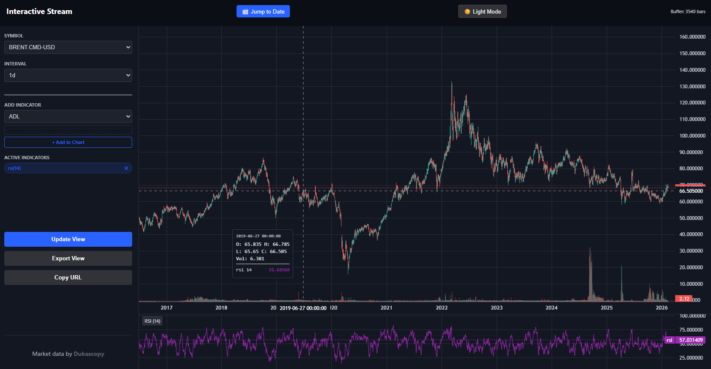
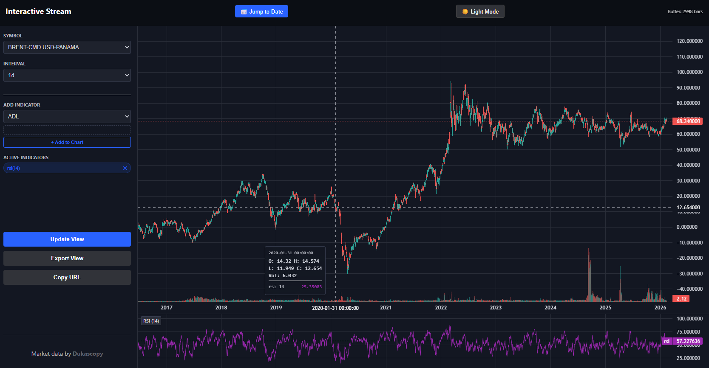
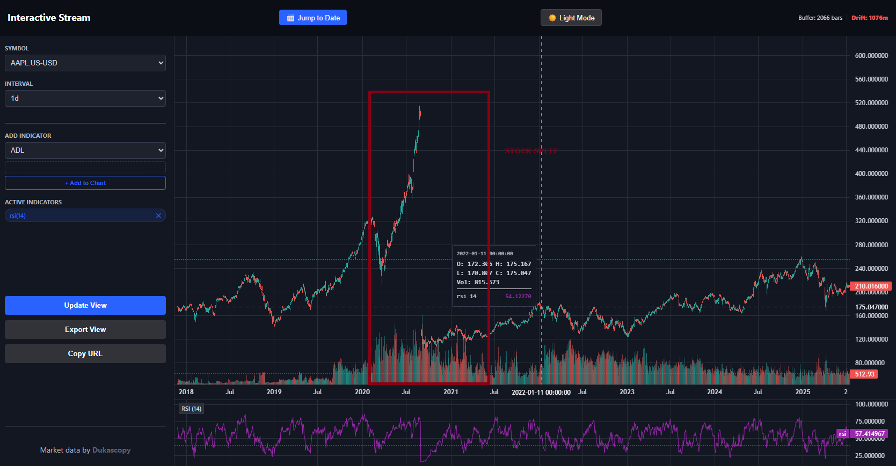
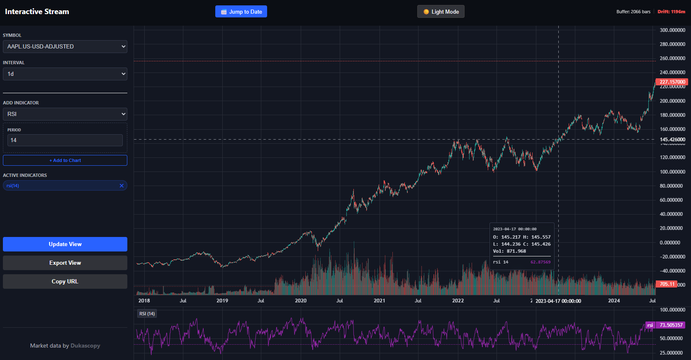

Market research- and analysis tool, feature-engineering, but you can do so much more with it, if you are a bit "handy".

## **Panama config building available - Regular Panama and the Return Ratio method**

**Note:** Documentation on how to write your own custom extensions is coming. Tbh this is the most-complex stuff for an user to learn about this pipeline. So, i will look into a generic approach for stocks. No promises though.

For future-rolls, i have implemented the config generator. It seems to be fine so i decided to release it. However, next week I am starting to use this myself. If issues are found, they will get fixed immediately. Use the Dukascopy one for CMD with rollovers.

List to be used with the `generators.sidetracking.extensions.dukascopy.DukascopyPanamaStrategy` or `generators.sidetracking.extensions.dukascopy.DukascopyPanamaStrategyRR` class:

```sh
BRENT.CMD-USD
BUND.TR-EUR
COCOA.CMD-USD
COFFEE.CMD-USX
COPPER.CMD-USD
COTTON.CMD-USX
DIESEL.CMD-USD
DOLLAR.IDX-USD
GAS.CMD-USD
IND.IDX-USD
LIGHT.CMD-USD
OJUICE.CMD-USX
PLN.IDX-PLN
SOA.IDX-ZAR
SOYBEAN.CMD-USX
SUGAR.CMD-USD
UKGILT.TR-GBP
USTBOND.TR-USD
VOL.IDX-USD
XPD.CMD-USD
XPT.CMD-USD
```

**Note:** If your symbol is not in this list, it is not sensitive to price adjustments. eg DAX, US30 etc not in this list, so no rolls. More info [here](https://www.dukascopy.com/swiss/english/marketwatch/calendars/cfd-price-adjustment-calendar/)

**Important!** Make sure the symbols exist in your symbols.user.txt AND make sure not to use `/` (slashes) in the symbol name. Replace slashes with `-` (dash).

```sh
mkdir -p config.user/dukascopy/sidetracking

# BRENT EXAMPLE - NORMAL PANAMA (NEGATIVE PRICES)
./build-sidetracking-config.sh --symbol BRENT.CMD-USD-PANAMA --source BRENT.CMD-USD \
--class generators.sidetracking.extensions.dukascopy.DukascopyPanamaStrategy \
--output config.user/dukascopy/sidetracking/BRENT.CMD-USD-PANAMA.yaml

# OR

# BRENT EXAMPLE - RETURN RATIO (NO NEGATIVE PRICES)
./build-sidetracking-config.sh --symbol BRENT.CMD-USD-RR --source BRENT.CMD-USD \
--class generators.sidetracking.extensions.dukascopy.DukascopyPanamaStrategyRR \
--output config.user/dukascopy/sidetracking/BRENT.CMD-USD-RR.yaml

# WTI EXAMPLE - NORMAL PANAMA (NEGATIVE PRICES)
./build-sidetracking-config.sh --symbol LIGHT.CMD-USD-PANAMA --source LIGHT.CMD-USD \
--class generators.sidetracking.extensions.dukascopy.DukascopyPanamaStrategy \
--output config.user/dukascopy/sidetracking/LIGHT.CMD-USD-PANAMA.yaml

# OR 

# WTI EXAMPLE - RETURN RATIO (NO NEGATIVE PRICES)
./build-sidetracking-config.sh --symbol LIGHT.CMD-USD-RR --source LIGHT.CMD-USD \
--class generators.sidetracking.extensions.dukascopy.DukascopyPanamaStrategyRR \
--output config.user/dukascopy/sidetracking/LIGHT.CMD-USD-RR.yaml

# AAPL EXAMPLE - EXPERIMENTAL - NORMAL PANAMA (NEGATIVE PRICES)
./build-sidetracking-config.sh --symbol AAPL.US-USD-PANAMA --source AAPL.US-USD \
--class generators.sidetracking.extensions.stocks.apple.AppleCorporateActionsStrategy \
--output config.user/dukascopy/sidetracking/AAPL.US-USD-PANAMA.yaml

# OR

# AAPL EXAMPLE - EXPERIMENTAL - RETURN RATIO (NO NEGATIVE PRICES)
./build-sidetracking-config.sh --symbol AAPL.US-USD-RR --source AAPL.US-USD \
--class generators.sidetracking.extensions.stocks.apple.AppleCorporateActionsStrategyRR \
--output config.user/dukascopy/sidetracking/AAPL.US-USD-RR.yaml

```

**Note:** You can test all of them to see what the differences are. Make sure you have `AAPL.US-USD` configured if you decide to run the AAPL one too.

**Note:** For the AAPL example you need to do a `pip install -r requirements.txt` (needs "BeautifulSoup") and you need the AAPL.US-USD symbol configured.

Then open `config.user.yaml`:

```yaml
# Below you will find the configuration for the transform.py script. 
transform:
  time_shift_ms: 7200000              # How many milliseconds should we shift (0=UTC, 7200000=GMT+2 (eg MT4 Dukascopy) )
  round_decimals: 8                   # Number of decimals to round OHLCV to
  fsync: false                        # Force flush to disk after each transformation
  fmode: binary                       # Only binary is supported from v0.6.6 onward
  validate: false                     # Force validation of OHLCV values
  paths:
    data: data/transform/1m           # Output directory for transform
    historic: cache                   # Historical downloads
    live: data/temp                   # Live downloads
  timezones:
    includes:
    - config.user/dukascopy/timezones/*.yaml
  symbols:
    includes:
    - config.user/dukascopy/processing.yaml
    - config.user/dukascopy/sidetracking/*.yaml # <!-- add this line
```

Then: `./rebuild-full.sh && ./service.sh restart`

It will create a sidetracking symbol named `BRENT.CMD-USD-PANAMA` that is backadjusted.

Original symbol (BRENT):



Sidetracked symbol (BRENT):



Example corporate actions (AAPL):

Original symbol (AAPL):



Sidetracked symbol (AAPL):



**Note:** Negative prices are "normal" in default Paname backadjusted data. If you don't want negative prices, use the RR method. Your adjusted sets will run side-by-side with the broker-live version. I will add an option to "hide" sets from the interface. Later.

**Note:** The panama sets are "live-tracked" in a similar way as the regular symbols. Incrementally updated.

## **Server kindness**

Re-iterating to be nice to the backend servers. After your initial sync, you can slow down your requests. Even when updating every minute (when you really need that). Implement a spreading/limit when in-sync.

Example config:

```yaml
# Below you will find the configuration for the download.py script. 
download:
  max_retries: 10                     # Number of retries before downloader raises
  backoff_factor: 1.2                 # Exponential backoff factor (wait time)
  timeout: 10                         # Request timeout
  rate_limit_rps: 1                   # Protect end-point (number of cores * rps = requests/second)
  mode: http2                         # DownloadWorker-type: requests or http2
  jitter: 5.0                         # Add a random jitter up to this amount (seconds)
  paths:
    historic: cache                   # Historical downloads
    live: data/temp                   # Live downloads
```

This will spread a sync for +/- 40 symbols over 30 seconds. More than enough time to stay "realtime", well within the 1 minute opportunity/sync window. You are lagging anyhow at minimum 1 minute compared to real realtime since the 1m candles are added when they are closed.

## **Security**

Oh yes! Security 🙈 Will get added too (especially flight). Security has been of "later concern" since this is a local-first private research tool that is supposed to run on a local-machine, tightly secured to 127.0.0.1. Clones, however, show that this is definately not only used on 127.0.0.1. 

I promise it will be taken care of when i rewrite the ingestion layer. If i will go as far as including a OAuth2 layer, i don't know yet. Needs to be lightweight. Performance-first.

TLS will be implemented as a minimum. Raw Public Key (RPK) Authentication will be implemented as a minimum.

## **HTTP-STATUS 400 is now "transient"**

I forgot to mention but this was implemented already a "few" commits back. Status-code 400 is now transient. That means when the ingestion encounters a 400 state, it will retry. This makes ingestion a bit more robust. Play with the number of `retries`, `jitter`, the `backoff_factor` and the `timeout` if you are having issues syncing up. Don't overdo it on the `rate_limit_rps` setting though.

Preliminary conclusion, since 3 weekends in a row: 400 errors? it's likely maintenance. When you are in-sync and somehow use this for 24/7 trading purposes, monitor your BTC-1m-candles closely (in the weekend). I will provide that `is-stale` counter-part to `is-open` soon.


