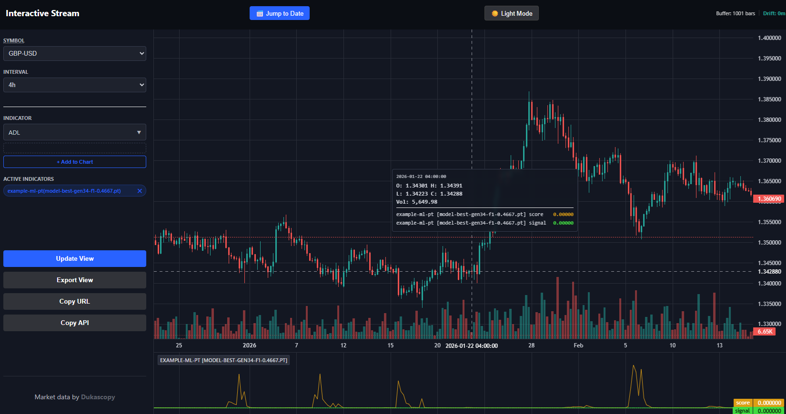
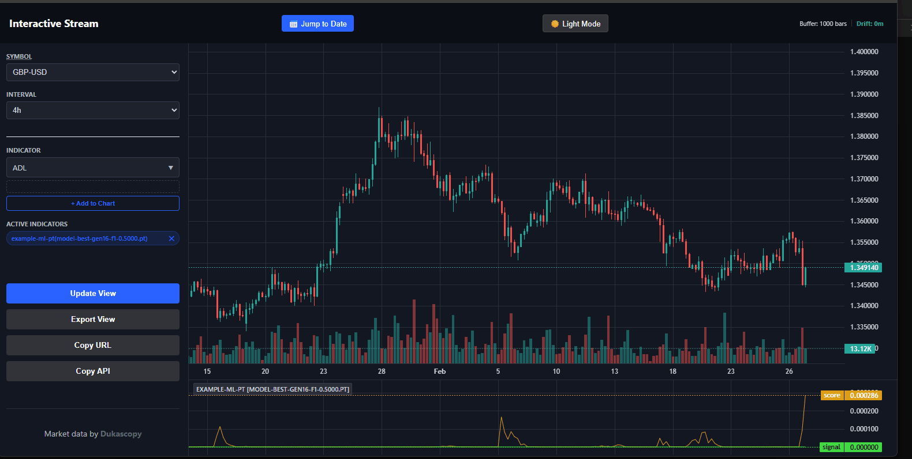

# Alerting System

The alerting system isn’t live yet, but it has been moved up in priority. I’ve started gradually integrating it into my workflow.

Today: Finalizing the ML component — improving modularity, increasing decoupling, and running final checks.

Tomorrow: Building the forward-testing tooling for the ML models.

Sunday: Running both forward tests and candle-by-candle tests on Model 3750.

This model is outperforming my expectations by a wide margin, so I need to evaluate how it behaves in a “semi-live” environment. That should provide valuable new insights.

Two weeks ago, I didn’t know anything about machine learning.

Regarding the scaling issue: it’s identified. One feature in the dataset is disproportionately strong — it effectively overwhelms the neurons, causing the model to default to low-confidence outputs rather than acting decisively. I’m revisiting the transferability aspect again to address this properly.

It’s a busy phase.

# ML

A beta "play-version" is released. You can find it in the ml folder. It's research-grade stuff and may be still a bit rough. You need a cuda-capable GPU to use this feature.

It's promising but serious work that (still) requires brutal validation.

At minimum this can be used as an additional "signal"-filter. I have something working with that and works pretty good.

This is the result of a trained model on EUR-USD, applied to GBP-USD. The data for training was strictly cutoff at 2025-12-31. It has never seen the 2026 data. No leakage. 


Note: it's an animated gif since i am battling scaling issues. The signals are tiny 1e-9 vs 1e-20 noise. Seeing how i can fix that but for today i am done. Ending the day with a remarkable result. This model is almost completely-inter asset-divergence and macro-inter asset- driven. No price information. Pure indicators.

So what remains is a real forward test-trying to do this week-on this model. The model works for all *USD pairs. I have looked at the genes and they are completely sensible. It checks on DXY compression, risk-on/risk-off sentiment and some volatility stuff. This is the main driver for scoring for this model.

I am currently treating the model's output like this:

This is not a trade trigger.
This is a permission system.

“If this fires, I am allowed to look.”

That alone is alpha-if confirmed ok.

I did not include the Andromeda config, but the milkyway one instead. The frontrunner. The below example is made with the default shared indicators. If you run the MilkyWay example, and have done the `./setup-dukascopy.sh` you should get models, that, when queried. Should give something like this. Note: the default indicators are not optimal. You need to put a bit of your own secret-sauce into it. "Simple fixes on the shared indicators are needed".



I have merged the latest code. Although the signals are "scale minimum", you can increase it by applying eg 1e10 in the `example-mt-pl` indicator. This is for now a workaround.

**Why a cosmic theme?**
It’s a fair question. Over the course of my professional career, I’ve stared at an endless sea of dull, lifeless log messages. At some point, I decided to do things differently. Instead of sterile outputs, I wanted something with character—something that tells a story. The cosmic theme adds a human, narrative layer to the system, turning raw mechanics into a journey rather than just another stream of logs.

**Update** Live edge example

On that last red-candle close, the signal becomes 0.000009 (from 0.0), on the live candle its 0.000029. Would i have traded the signal? Likely (support, potential double bottom, volume, positive divergence, must retrace. tight stop). But this gives a glimpse on how this works on the live-edge. Still: it is not the ONLY signal you should trade on. Thats why: permission filter. Signal? -> go look.



PS I updated the example-ml-pt connector with repaint prevention using is-open in the subcall. Now its oke.


# 🚀 Release Update: Developer UX & Surgical Maintenance

This project is a high-performance market research and analysis tool focused on feature engineering. While optimized for **"mechanical sympathy"** at the hardware level, these latest additions focus on improving the daily workflow for developers and researchers.

---

## 🖥️ Interface & DX Improvements

We have applied several targeted improvements to the web interface to streamline the developer experience (DX) and speed up cross-asset configuration:

* **Indicator Tooltips:** You can now hover over any indicator in the selection box to see its specific description and parameter requirements.
* **`Copy API` Button:** A new utility to instantly translate your current chart state (Symbol, Timeframe, visible window, and active indicators) into a ready-to-use internal Python API call.
* **Quick Symbol Copy:** Clicking the "Symbol" label directly above the selector now copies the symbol name to your clipboard. This is designed to speed up correlation studies or the configuration of benchmark indicators (e.g., Pearson correlation).

> [!IMPORTANT]
> To enable these features, you must copy the latest files from `config/dukascopy/http-docs` to your `config.user/dukascopy/http-docs` directory.

### Example `Copy API` Output
The following string is generated based on your current viewport and indicator stack:

```python
get_data('AAPL.US-USD', '1h', after_ms=1767362400000, limit=1000, order="asc",
  indicators=["aroon_14","bbands_20_2.0","feature-mad_20_close_sma",
              "feature-nprice_14_close_log","feature-natr_14_0","feature-vzscore_20_log"], 
  options={**options, "return_polars": True})
```

## 🛠️ Surgical Maintenance Tools

The rebuild logic has been optimized to support targeted operations. This allows you to repair or update specific instruments without performing a "scorched-earth" rebuild of the entire data warehouse.

### 1. Targeted Full Rebuilds
You can now rebuild specific symbols and their associated aliases (Sidetracked/Adjusted sets) across all layers (**transform**, **aggregate**, **resample**):

**Bash**
```bash
./rebuild-full.sh --symbol BRENT.CMD-USD --symbol AAPL.US-USD
```

You can also use this when you have just added a new symbol `./rebuild-full.sh --symbol NEWSYMBOL`.

### 2. Targeted Weekly "Safety-Net"
For instruments dealing with illiquid data or those requiring regular backfill maintenance (where brokers often retroactively change the last few days of data), `rebuild-weekly.sh` now supports the same targeted syntax:

**Bash**
```bash
./rebuild-weekly.sh --symbol ETH-USD
```

### ⚠️ Important Notes

* **Back-Adjusted Sets:** When rebuilding adjusted sets (e.g., `BRENT.CMD-USD-PANAMA`), ensure you specify the origin (source) symbol.
* **Naming:** Always ensure adjusted sets are prefixed with the original symbol (e.g., `SYMBOL-RR`).
* **Performance:** A targeted rebuild of a symbol with two aliases takes approximately **25 seconds**. Most of this time is spent scanning for missing data to ensure integrity, but I/O is strictly limited to the specified instruments.

---

### 📚 New & Updated Documentation

We have added several deep-dive guides to help you leverage the latest performance and adjustment features:

* **[Adjustments.md](adjustments.md)** – Implementation guide for Panama rolls, Dividends, and Multiplicative splits.
* **[Templates.md](templates.md)** – Guidelines for "God-tier" indicator performance using Polars/Rust to bypass the Python GIL.
* **[Code Examples](../config/plugins/indicators/)** – Direct reference for plugin and indicator development.


