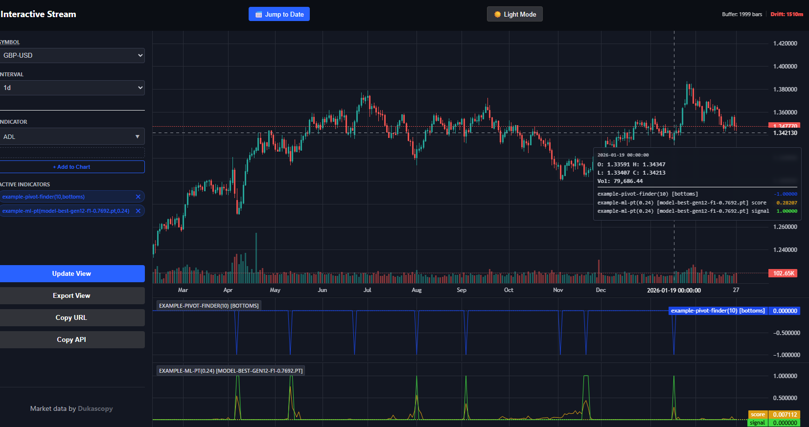

# ML

**Update**: First diagnostics results are in for EUR-USD and model 3750. This is a REAL candle by candle walkforward test performed on never-seen-before 2026 data. See [here](../ml/logs/diagnostics1.txt) and the visual representation [here](../images/diagnostics1.png). More tests will be done. You can check the program used for testing [here](../ml/diag/forensics.py). Note: this is a first test. Will be busy with this almost all day. This first result gives me the confidence to continue testing. This is not a bad result. Preliminary conclusion: **YES, usable**.

First take: The model signals before the bottom, not at it. This is predictive, not reactive.

Second take: the model is more accurate than the label-finder. it correctly discarded those misses.

---

A beta "play-version" is released. You can find it in the ml folder. It's research-grade stuff and may be still a bit rough. You need a cuda-capable GPU to use this feature.

It's promising but serious work that (still) requires brutal validation.

See [here](../ml/readme.MD) for more information on deep-learning/machine-learning/neuro-evolution for sparse event detection. Bottom hunting.

What i have learned, after having generated and evaluated many models, is that this is extremely useful for detecting the end of a downtrend. 

BUT: it is not the golden-egg (yet). I am planning to add (deep) diagnostic tooling to this layer tomorrow so i can actually estimate where in my personal pipeline this should get integrated. 

I didnt make it to finish up the Andromeda singularity. Tomorrow first the tooling and when time-left, i will take on Andromeda. Andromeda is nothing more than a decoupled MilkyWay universe. Eg make you able to train on a different machine than where your data stuff resides. It does not have the highest priority. Diagnostic tooling is way more important at this moment.

- Walk forward tests
- Candle-by-candle forward test

Been testing a lot. Best is to build a sniper for the daily chart. Example GBPUSD (example is included in config, universe GBP-Galaxy):



I cancelled the run but likely it would have even gone higher, more recall under same precision.

Corresponding real candle-by-candle walkforward test (2025-NOW) results: [here](../ml/logs/diagnostics3.txt).

Guaranteed no peeking in future [here](../ml/diag/forensics2.py).

Will do same for Yen and a few indices tomorrow.


# 🚀 Release Update: Developer UX & Surgical Maintenance

This project is a high-performance market research and analysis tool focused on feature engineering. While optimized for **"mechanical sympathy"** at the hardware level, these latest additions focus on improving the daily workflow for developers and researchers.

---

## 🖥️ Interface & DX Improvements

We have applied several targeted improvements to the web interface to streamline the developer experience (DX) and speed up cross-asset configuration:

* **Indicator Tooltips:** You can now hover over any indicator in the selection box to see its specific description and parameter requirements.
* **`Copy API` Button:** A new utility to instantly translate your current chart state (Symbol, Timeframe, visible window, and active indicators) into a ready-to-use internal Python API call.
* **Quick Symbol Copy:** Clicking the "Symbol" label directly above the selector now copies the symbol name to your clipboard. This is designed to speed up correlation studies or the configuration of benchmark indicators (e.g., Pearson correlation).

> [!IMPORTANT]
> To enable these features, you must copy the latest files from `config/dukascopy/http-docs` to your `config.user/dukascopy/http-docs` directory.

### Example `Copy API` Output
The following string is generated based on your current viewport and indicator stack:

```python
get_data('AAPL.US-USD', '1h', after_ms=1767362400000, limit=1000, order="asc",
  indicators=["aroon_14","bbands_20_2.0","feature-mad_20_close_sma",
              "feature-nprice_14_close_log","feature-natr_14_0","feature-vzscore_20_log"], 
  options={**options, "return_polars": True})
```

## 🛠️ Surgical Maintenance Tools

The rebuild logic has been optimized to support targeted operations. This allows you to repair or update specific instruments without performing a "scorched-earth" rebuild of the entire data warehouse.

### 1. Targeted Full Rebuilds
You can now rebuild specific symbols and their associated aliases (Sidetracked/Adjusted sets) across all layers (**transform**, **aggregate**, **resample**):

**Bash**
```bash
./rebuild-full.sh --symbol BRENT.CMD-USD --symbol AAPL.US-USD
```

You can also use this when you have just added a new symbol `./rebuild-full.sh --symbol NEWSYMBOL`.

### 2. Targeted Weekly "Safety-Net"
For instruments dealing with illiquid data or those requiring regular backfill maintenance (where brokers often retroactively change the last few days of data), `rebuild-weekly.sh` now supports the same targeted syntax:

**Bash**
```bash
./rebuild-weekly.sh --symbol ETH-USD
```

### ⚠️ Important Notes

* **Back-Adjusted Sets:** When rebuilding adjusted sets (e.g., `BRENT.CMD-USD-PANAMA`), ensure you specify the origin (source) symbol.
* **Naming:** Always ensure adjusted sets are prefixed with the original symbol (e.g., `SYMBOL-RR`).
* **Performance:** A targeted rebuild of a symbol with two aliases takes approximately **25 seconds**. Most of this time is spent scanning for missing data to ensure integrity, but I/O is strictly limited to the specified instruments.

---

### 📚 New & Updated Documentation

We have added several deep-dive guides to help you leverage the latest performance and adjustment features:

* **[Adjustments.md](adjustments.md)** – Implementation guide for Panama rolls, Dividends, and Multiplicative splits.
* **[Templates.md](templates.md)** – Guidelines for "God-tier" indicator performance using Polars/Rust to bypass the Python GIL.
* **[Code Examples](../config/plugins/indicators/)** – Direct reference for plugin and indicator development.


