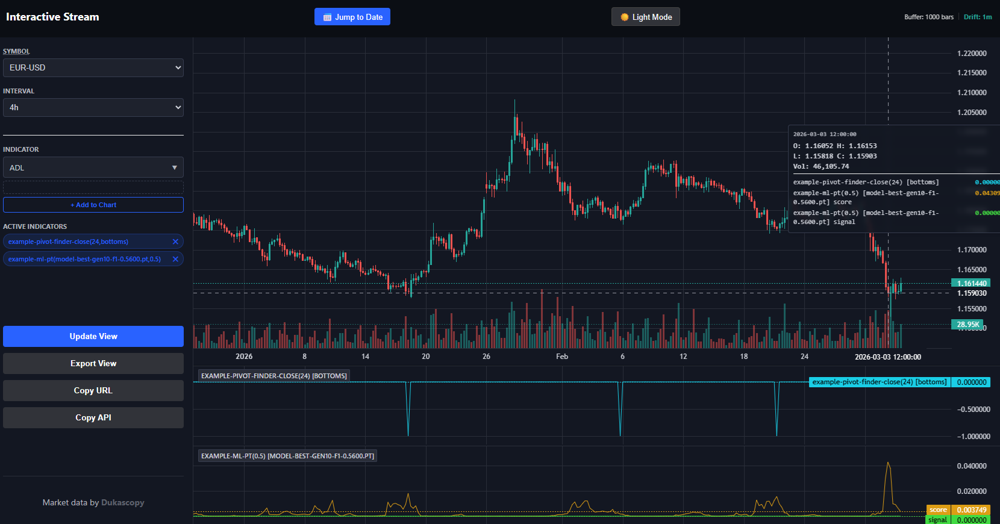

# Update

I’m currently working on the second model implementation—Model 2 of 3. This one is a causal transformer–based machine learning model. The third model will be an RNN (Recurrent Neural Network)–based implementation. All three models will support auto-tuning, which means manual tuning will largely disappear. Once this phase is complete, most of the configuration will be removed.

With the transformer model, I’m already seeing F1 scores that are close to those produced by the first model (the MLP neural network).

This is complex work and definitely not easy, but I’m confident I’ll reach the results I’m aiming for.

I don’t have detailed accuracy statistics for the transformer yet, but I expect those by the weekend. Next week is dedicated to implementing the RNN model.

In the end, we’ll have three very different models, each producing its own predictions. Two of them—the RNN and the transformer—can look into the causal past, while the current implementation only evaluates the present candle.

I also need to improve the abstraction between flights and singularities. At the moment, singularities (the models) are tightly coupled to the flights (training loops). The goal is for a flight to be able to handle any model.

This looks like a very promising direction for what I’m trying to achieve: detecting potential reversals just ahead of time. It likely won’t work for major geopolitical events, but for normal market conditions it should be effective. That said, everything is still highly experimental at this stage.

The current model is already capable. Not flawless, but capable.

Weekend will be another coding frenzy.

Also: i am borrowing some techniques from [here](https://osf.io/preprints/osf/uabjg_v1). eg the gaussian blur for these binary events <!-- **this is pure gold**

# Alerts

**THIS MAY BREAK YOUR SETUP IF YOUR CONFIG IS INVALID. UPDATE WITH CARE. THE ETL IS SAFE. IT USES ITS OWN SCHEMA.JSON FILE. THE API, ML AND ALERTS ARE AFFECTED ONLY**

A "first-version" of alerting is implemented. Its a beta-version and is currently being tested. 

See [here](../ml/alerts/readme.MD) for more information.

You can specify indicators, a timeframe, a symbol and some basic rules. When it alerts, it can post to a webhook or send an email using gmail (or if you have a local smtp server, to localhost).

Its very simplistic but covers the intension pretty well.

I needed automated alerts for models upon completion of daily candles. 

Note: since i have added schema json checking to the main config loader, this could break systems that have invalid config settings. It's a good thing to have the config matched up to the standards.

Test your config by either running `./run-ml.sh` with a universe or `./run-alerts.sh`. The latter checks immediately, no additional arguments needed.

This can also be used for other indicators than models. Basically the whole set is supported.

Example configuration:

```yaml
# Top-level configuration block named "EUR"
# This likely represents a strategy or schedule related to EUR (Euro)
EUR:

  # Days of week when the strategy is allowed to run
  # 0–6 typically represent Sunday–Saturday (depending on implementation)
  weekdays: [0,1,2,3,4,5,6]  # Run every day of the week

  # Time of day when the process should execute (HH:MM:SS format)
  # Use * as a wildcard. Eg run every 30 minutes, runat: *:30:00
  run-at: 00:00:00  # Run at midnight (left out = runs at every cron execution time)

  # Start date from which this configuration becomes active
  # Format: 'YYYY-MM-DD HH:MM:SS'
  from_date: '2000-01-01'  # Active starting January 1, 2000

  # End date when this configuration stops being active
  to_date: '3000-05-14'  # Active until May 14, 3000

  # Actions to perform when rules/conditions are satisfied
  actions:

    # Email notification configuration
    email:
      type: gmail  # Email provider type (Gmail SMTP assumed)
      address: destination_account@outlook.com  # Recipient email address
      subject: EUR-USD signal reached  # Subject line of the notification email
      username: mygmail@gmail.com  # Gmail account used to send the email
      password: <see below>  # Password or app-specific password for authentication

    # Webhook notification configuration
    webhook:
      type: webhook  # Indicates this action triggers a webhook
      method: POST  # HTTP method used for the request
      uri: http://localhost:8000/logme  # Endpoint that will receive the webhook call

  # Trading or signal rules
  rules:

  # First rule definition (named rule-1)
  - rule-1:

      # Financial instrument symbol being monitored
      symbol: EUR-USD  # Euro vs US Dollar currency pair

      # Timeframe for market data
      timeframe: 1d  # 1-day candles

      # Indicators used in this rule
      indicators:
      - example-ml-pt_model-best-gen95-f1-0.8235.pt_1  # Machine learning model output indicator
      - rsi_14  # 14-period RSI (Relative Strength Index)

      # Conditions that must be satisfied to trigger actions
      conditions:

      # Condition 1: ML model score threshold
      - gt_threshold:
          column: example-ml-pt_model-best-gen95-f1-0.8235.pt_1__score  # Column containing model score
          operator: '>='  # Greater than or equal comparison
          value: 0.23  # Threshold value

      # Condition 2: RSI filter condition
      - rsi_14:
          column: rsi_14  # RSI indicator column
          operator: '<='  # Less than or equal comparison
          value: 60  # RSI must be 60 or below
```

Update: I have now 10 models under the monitor. Lets see how they perform upcoming weeks. Development will continue meanwhile.

Will be interesting to see if the models find the "war-bottoms". The switch from risk-off to risk-on.

Have been doing some research on the 3-4 model committee approach. This should solve the fp issues. Expected recall of 70-85 percent. Expected precision 90 percent-ish. Fp per year per asset 1.5-4. Leadtime 1-6 bars (one of the main goals, want to know a bit before the bottom is in). I have played with TFT. The current abstraction is wellenough suited to implement both RNN and TFT. I will first implement it truly side-by-side and then optimize for performance.

So ML will stay in experimental stage for now. Alerting is running on the existing models. They were optimized once more with a moee "loose configuration", shouldnt be overfitted anymore. So the waitgame is in. Consider this: garbage in == garbage out. Label properly!

# ML

Update: it kind of works but I am not happy with the signalling yet. Here is an example of the H4 eur-usd "sniper". It did alert, since i gave it a very low confidence level to trigger on.



Note: clearly, there is more work todo. The committee will need to get build. This could be a temporary consolidation zone. We will see when US opens up. Given the nice recovery of US stocks yesterday, fear could be out-of-the-market. Donald has said that he will guide ships through the strait of Hormuz, when needed. Watch Brent and Gold.


Update: starting to trust the models a tiny bit more. Seeing if they work the other way around too. Tops-hunting.

Tip: if you are using this ML stuff. Make SURE that you configure the pivot finder correctly. This is the most important thing for training. If you label wrongly you will get wrong models. I am writing it up but for those experimenting already, this is one of the KEY rules. Every timeframe asset combo has its own optimal pivot window setting (period). If your pivot finder marks noise, the model will fit to that and become inaccurate.

Lesson: Fix the ground truth, and the neuro-evo suddenly starts behaving like it understands macro regime turns instead of fitting noise.

## 🚀 Release Update: Developer UX & Surgical Maintenance

This project is a high-performance market research and analysis tool focused on feature engineering. While optimized for **"mechanical sympathy"** at the hardware level, these latest additions focus on improving the daily workflow for developers and researchers.


