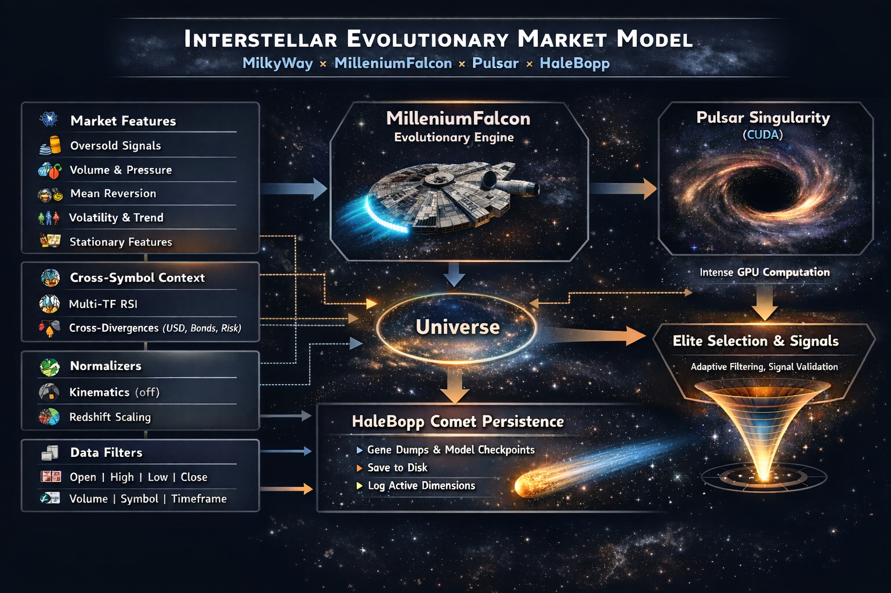

## ML Experiment

**Note upfront:** I have tested CPU mode. CPU actually works already. But the conclusion: It's not doable. Not with a 1000 population and 50 epochs configuration. To give an indication:

- CPU-mode, 1000 population, 50 epochs: 264.2 seconds
- CUDA-mode, 1000 population, 50 epochs: 6.5 seconds

**Conclusion? This is not suitable for CPU-only environments. YOU NEED A GPU!**

Why so extreme?

- Neuro-evolution is compute-heavy: population of 1000 small nets × 50 epochs of gradient descent per individual × batched matrix ops (forward/backward passes, gene selection, crossover/mutation).

- PulsarSingularity is GPU-optimized (CUDA kernels for bmm/scatter_add_, vectorized vitality scoring, etc.). CPU falls back to slow PyTorch CPU paths — no parallelism at the same level.

Also, a GPU, like an RTX3070, is more than sufficient (without Kinematics). It will render usable, testeable, models in a matter of minutes. Only Kinematics enablement will make it grind longer because the dimensionality expands x4. Kinematics is broken atm. It will be reintroduced soon but is highly experimental.

# Singularities

**Open-source neuroevolution forge for discovering high-conviction, sparse market signals — without raw price or volume.**

A hardened, GPU-accelerated system that evolves small neural networks purely from technical indicators + derived **Market Kinetics** (velocity, acceleration, presence).

**Limits:** strictly excludes raw OHLCV to force discovery of higher-order, physics-like confluences.

**Why?** I see the markets as a physics-alike system and don't want (to risk) memorization on prices.

**Benefit?** Models will work inter-asset. Which already is proven to be a correct thought.

**Current focus?** detecting asymmetric market bottoms on 4h timeframes (~0.3–0.6% density).

---

**Status (February 2026):**  

- Observed forward F1 in the 0.46–0.59 range on sparse (~0.3–0.6%) asymmetric event detection, depending on model and market regime.
- Models are transferable, not locked into a single asset
- Still rough but nearing real-beta rapidly
- Neuroevolution outperforms RandomForest quite dramatically
- One observed behavior appears highly promising but requires prolonged forward validation (see [signals.gif](../images/signals.gif)).
- Currently have 11 universes of which 3 are generating very promising models
- One model frontruns the actual bottoms by 2-5 H4 candles consistently, which is interesting.
- Supports Out of sample testing. Another repo has real walkforward testing but is currently unstable.
  It is too advanced for my current knowledge but this is increasing at lightspeed.
- Currently only GELU and Sigmoid activation functions but others are explored (Relu, leaky Relu and others)
- System is not yet fully overloadable with custom classes, it misses overloading for lenses functions (will soon be in)
- Default MilkyWay is optimized for a 8GB RTX3070 GPU
- Elites on F1 and Precision are persistently stored in slot 0 and 1 and always survive.
- **Advice:** for a card having more VRAM, tune GPU chunk and population. Monitor with nvtop.
- **Advice:** Lower-F1 models often exhibit lower signal density, better regime stability, and reduced overfitting, which can outperform high-F1 models out of sample. Check using `example-ml-pt` indicator.
- **Advice:** watch your temps if running on laptop. I regret it that i didnt build temperature protection before. Now its in.

**Important:** Still **research-grade** — requires brutal validation. Do not trust it blindly!

**Not yet a plug-and-play money printer.**

**Signals as a permission filter. If signals, go look at the chart. Know that a bottom is soon in. Like that.**

**Non-goal:** This project is not intended to compete with high-frequency or microstructure-based systems. It explicitly targets medium-horizon structural asymmetries where sparsity and precision dominate.

## What's next

- Amazing model 3750 forward validation
- Diagnostic tools to evaluate/confirm performance
- Diagnostic walk-forward backtest -> report
- Perhaps, if have time: PNL testing (first want to see the walkforward test)
- Currently cosmic-themed logs. Will add string-table to support boring "enterprise" log-messages.
- CPU support
- Split up of the massive singularities class
- Configurable destination directories for checkpoints/logs (parameterizing HaleBopp)
- Degrade Voyager and EventHorizon (MilleniumFalcon and Pulsar outperform, use these two)

What else? see [todo.md](../docs/todo.md) document.

## Core Principles

- Markets as physical systems with hidden non-linear laws  
- Real alpha in **indicator confluences**, not price memorization  
- **No raw OHLCV** — only derived indicators + macro proxies  
- Extreme sparsity + precision bias → rare, high-R:R signals  
- Out of sample testing
- Open forge: extend with your macro, COT, order-flow, gravitational/flow theories

## Features

- Strict indicator-only input (raw price/volume filtered out)   
- Configurable Out Of Sample testing (default 30% is out of sample)
- Pessimistic robust scoring (`min` F1 across windows)  
- Precision-biased fitness (`prec^exp` ramp)
- Extreme penalization of bad-precision population
- Density/recall floors + hard reject logic  
- Leakage smoke test (`assert` early when F1 > 0.30)  
- Radiation injection (40% fresh DNA) on stagnation  
- Mass extinction (100% reset) on prolonged stagnation  
- GPU thermal throttling (park if >87 °C)  
- Async persistence (Hale-Bopp comet)  
- Champion/Elite deployment (full-history retrain + saved normalization)  
- YAML-configurable + factory pattern extensibility  
- Cosmic-themed observability (logs, vitality ranks, reject %, weight stats)

## Quick Start

YOU NEED A CUDA CAPABLE GPU! 

```sh
pip install -r ml/requirements.txt
```

This install will take a while.

Then you can add your own universes. See `config/ml/universes/*.yaml` for an example.

You can run this stuff from the root `./run-ml.sh --universe MilkyWay` (or whatever you called your universe).

Checkpoints (models) are currently written, fixed, in the dukascopy/checkpoints directory.

When models have been generated you can evaluate performance using the `example-ml-pt` indicator in your interface. It needs the model filename as input.

You can use it to generate models, used for additional filtering on your existing signals.

It is "decent" in its current state, but its ongoing research item of me.

Results of the past are by no means predictive of the future. 

## IMPORTANT

Your models will be extremely flawed if any indicator peeks into the future. Generally these are indicators that use rolling(center=True) or use any other next-bar information. So before you jump off your chair when you reach an F1 > 0.5, triple-check, no, quadruple check your features for leakage!

## IMPORTANT

When you are running this on a laptop, make sure your hotness_max and hotness_min are configured properly. Running this stuff `hot` for a longer period is VERY BAD (trust me) for your VRMs and VRAM chips. I was a bit sad over a week ago because i didnt pay attention to this.

## IMPORTANT (DONT USE, MAY BE BROKEN ATM - FIX SOON)

The Kinematics normalizer explodes every indicator value into 4 dimensions. Velocity, Direction, Acceleration and magnitude. Use a high gene count if you enable this. Typically one third of the total number of dimensions. Use high powered GPU as well if you want to grind through 300 + dimensions. Kinematics looks very promising but i am still grinding. I will make this stuff multigpu capable, later.

Expect it to grind for a couple of days before it returns something really useful. 

**For now: dont use kinematics. Try first with normal indicator values.**

## Transferrable models

To create transferable models—models that can be trained on one asset (like EUR-USD) and successfully traded on another (like GBP-USD) without falling into "Predictive Paralysis"—you must ensure that your features are stationary and asset-agnostic.

When a model is "anchored" to the specific price levels of its training data, it becomes a prisoner of that regime. If you move from a 1.08 price environment to a 1.34 environment, the model sees a "Black Swan" outlier rather than a tradable opportunity.

Here is how to ensure your models possess "Universal Physics":

**Purge Absolute Price Levels**

The most common mistake is using indicators that return raw price values.

The Trap: Indicators like standard VWAP, Donchian Channels, or Moving Averages return the price where the line sits (e.g., 1.0850).

The Result: When you move to an asset at 1.34, the normalizer calculates a Z-score of 6.0+, which saturates the neural network's activation layers and mutes the signal.

The Fix: Always convert these to Percentage Deviations or Ratios. Use (Price - VWAP) / VWAP instead of the VWAP price itself to ensure the model sees "0.5% above average" regardless of the asset's scale.

**Avoid Cumulative "Running Totals"**

Features that accumulate value over time create a "scale-clash" between assets with different liquidity.

The Trap: On-Balance Volume (OBV) and Accumulation/Distribution (ADL) grow indefinitely based on the specific volume of the asset.

The Result: A high-volume pair like EUR-USD will produce millions in OBV, while a lower-volume pair will produce thousands. The model will fail to recognize the pattern because the magnitudes don't match.

The Fix: Use bounded volume oscillators like Chaikin Money Flow (CMF) or MFI, which normalize flow into a fixed range.

**Use Dimensionless Ratios and Oscillators**

The most transferable features are those that mathematically cancel out the underlying price scale.

Volatility Ratios: Instead of using absolute ATR (which is in pips), use the Volatility Ratio (Bollinger Width / Keltner Width). This produces a stationary value (e.g., 0.95 for a "squeeze") that looks the same on every chart.

Quality Indices: Use indicators like VQI, which divides price change by True Range. This creates a dimensionless "trend vs. noise" score that is perfectly asset-agnostic.

## Lower timeframes?

This system is also quite interesting to run on the 1h timeframe.

However, as you move to lower timeframes, memory requirements increase significantly. The reason is simple:
more bars × number of feature dimensions = more tensors in VRAM.

GPU memory is fragile. It fills up quickly when you increase historical depth or dimensionality.

You can monitor VRAM usage with:

```sh
sudo apt install nvtop
nvtop
```

If memory consumption becomes critical:

- Immediately stop the run (CTRL+C)

- Reduce either gpu_chunk or population_size

**Note:** some systems may have "shared GPU memory". Shared GPU memory is normal RAM that is outside of the GPU-subsystem and is MUCH slower. As soon as you see consumption of "shared GPU memory", consider it equally as an out-of-memory event. If you don't, performance will degrade dramatically. Try to target 80-90 percent NVRAM consumption.  

Recommendation:

Lower gpu_chunk first. Avoid changing population_size unless absolutely necessary.

What does gpu_chunk do?

gpu_chunk splits the population into smaller batches processed sequentially on the GPU.

**Example:**

population_size = 1000

gpu_chunk = 200

A single generation will execute in 5 chunked passes instead of one large pass.

This reduces peak VRAM usage at the cost of slightly longer generation time.

## Extending the code

The code can be easily extended by just specifying your own classes in a java-alike notation witin the config-file.

`config.user.ml.comets.Halley` (Example is present in config directory)

Extensions are possible for:

- comets
- flights
- normalizers
- singularities
- universes

Note: custom classes need to extend the specific baseclasses.

Note: additional abstractions will be added soon

## Structure

```sh
Universe (ABC)                  ← Defines the "environment" (data + features)
  └── MilkyWay (concrete)       ← Specific implementation (EUR-USD/4h, config-driven)
  └── Andromeda (experimental)  ← Experimental (not in repo, milkyway works well)

Comet (ABC)                     ← Async persistence / data transport
  └── HaleBopp (concrete)       ← Disk-based logger/checkpointer
  └── Halley (example)          ← Example in `config.user/ml/comets.py`

Normalizer (ABC)                ← Feature scaling
  └── Redshift (concrete)       ← Z-score normalizer
  └── Kinematics (concrete)     ← Establishes laws like velocity, direction, magnitude,.. \

Lens (ABC)                      ← Loss function
  └── GravitationalLens (concrete) ← Focal loss with alpha/gamma

Singularity (ABC)               ← Core computational engine (the "reactor")
  └── EventHorizonSingularity (concrete) ← Population-based neuroevolution + hardening (deprecated)
  └── PulsarSingularity (concrete) ← Population-based neuroevolution

Flight (ABC)                    ← Orchestration / training loop
  └── Voyager (concrete)        ← The main runner (warp, thermal management, extinction) (deprecated)
  └── MilleniumFalcon (concrete) ← Hardened main runner (warp, thermal management, extinction)

```

## Fancy image (just for fun)



## What is Andromeda

Andromeda is an "advanced" MilkyWay that has support for all the various API methods (HTTP, bootstrapped and files). So you can decouple the ML from your data ingestion layer. Currently MilkyWay is coupled to the bootstrapped API. Andromeda is a more clean and more modular universe. It will be added but currently still developing. Tomorrow, development of Andromeda continues.


## Deep Dive: Model 3750 (Transferability Analysis)

I performed a deep evaluation of model 3750 to understand why it is significantly more transferable than other models from the same evolutionary run.

**Key insight:**

Only 3 out of 24 features are EUR-USD specific — and all three have low importance.

Instead, the model’s signal formation is dominated by global macro dynamics:

- Dollar Index behavior

- Risk-on / risk-off rotation (equities vs volatility)

- Rate differential signals (bonds)

- Safe-haven flows (gold, CHF)

**Conclusion:**

This model is not trading EUR-USD directly. It is observing the global macro state and inferring when USD regime pressure is about to reverse.

That macro-first perspective explains its strong cross-asset transferability. Roughly ~85% of the model behaves as a macro model,~15% pair-context anchoring.

**Additional Insight**

Model selection should incorporate transferability screening, not just in-sample F1.

For example:

- Validate signals across EURUSD, NZDUSD, GBPUSD

- Evaluate average F1 across multiple USD pairs

- Prefer models that retain structure under cross-asset exposure

Transferability appears to be a strong proxy for structural robustness.

**Next Steps**

Build standard tooling for and publish results:

- Walk-forward validation

- Candle-by-candle forward feed evaluation

Results of these tests will be published by Sunday.